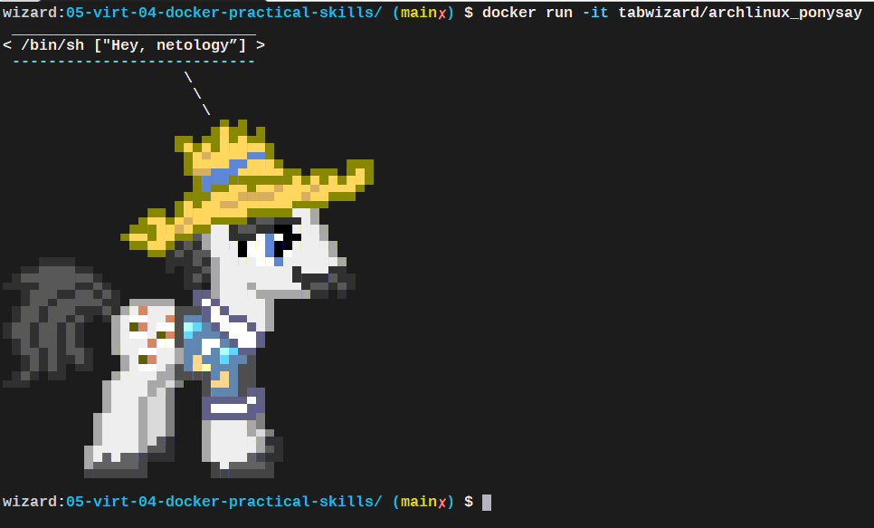

# Домашняя работа к занятию "5.4. Практические навыки работы с Docker"

## Задача 1 

В данном задании вы научитесь изменять существующие Dockerfile, адаптируя их под нужный инфраструктурный стек.

Измените базовый образ предложенного Dockerfile на Arch Linux c сохранением его функциональности.

```text
FROM ubuntu:latest

RUN apt-get update && \
    apt-get install -y software-properties-common && \
    add-apt-repository ppa:vincent-c/ponysay && \
    apt-get update
 
RUN apt-get install -y ponysay

ENTRYPOINT ["/usr/bin/ponysay"]
CMD ["Hey, netology”]
```

Для получения зачета, вам необходимо предоставить:
- Написанный вами Dockerfile
- Скриншот вывода командной строки после запуска контейнера из вашего базового образа
- Ссылку на образ в вашем хранилище docker-hub  

__ОТВЕТ:__ Делаем Dokerfile. Пакет `ponysay` присутствует в репозитории `community`, поэтому все про установку пакета `software-properties-common` и добавление репозитория `vincent-c/ponysay` убираем и просто ставим пакет с обновлением реп.

```bash
cat Dockerfile_1
FROM archlinux:latest

RUN pacman -Sy --noconfirm ponysay

ENTRYPOINT ["/usr/bin/ponysay"]
CMD ["Hey, netology”]%                                   
```
```bash
docker build -t tabwizard/archlinux_ponysay -f Dockerfile_1 .                                 [12:56:21]
Sending build context to Docker daemon   7.68kB
Step 1/4 : FROM archlinux:latest
latest: Pulling from library/archlinux
f0a2fdfa458e: Pull complete
1ca3d6a4dde7: Pull complete
Digest: sha256:e69ed3167ce0fb5d6a22ab58ced6015afdceaa962cd826c63a8ef851985abad6
Status: Downloaded newer image for archlinux:latest
 ---> 1f90233ad36d
Step 2/4 : RUN pacman -Sy --noconfirm ponysay
 ---> Running in eecf651a7b89
:: Synchronizing package databases...
 core downloading...
 extra downloading...
 community downloading...
resolving dependencies...
looking for conflicting packages...

Packages (4) gdbm-1.19-2  libnsl-1.3.0-2  python-3.9.5-3  ponysay-3.0.3-4

Total Download Size:   29.57 MiB
Total Installed Size:  87.61 MiB

:: Proceed with installation? [Y/n]
:: Retrieving packages...
 gdbm-1.19-2-x86_64 downloading...
 libnsl-1.3.0-2-x86_64 downloading...
 python-3.9.5-3-x86_64 downloading...
 ponysay-3.0.3-4-any downloading...
checking keyring...
checking package integrity...
loading package files...
checking for file conflicts...
:: Processing package changes...
installing gdbm...
installing libnsl...
installing python...
Optional dependencies for python
    python-setuptools
    python-pip
    sqlite [installed]
    mpdecimal: for decimal
    xz: for lzma [installed]
    tk: for tkinter
installing ponysay...
:: Running post-transaction hooks...
(1/1) Arming ConditionNeedsUpdate...
Removing intermediate container eecf651a7b89
 ---> 0fbe29732ec1
Step 3/4 : ENTRYPOINT ["/usr/bin/ponysay"]
 ---> Running in b9807aff4fb4
Removing intermediate container b9807aff4fb4
 ---> 3fa91d331781
Step 4/4 : CMD ["Hey, netology”]
 ---> Running in 16b36bcbeb08
Removing intermediate container 16b36bcbeb08
 ---> ee0c32063762
Successfully built ee0c32063762
Successfully tagged tabwizard/archlinux_ponysay:latest
```  
[](./2021-06-23_13-02-42_wizard.png)  
Запушили образ [tabwizard/archlinux_ponysay](https://hub.docker.com/repository/docker/tabwizard/archlinux_ponysay) в docker-hub.

## Задача 2 

В данной задаче вы составите несколько разных Dockerfile для проекта Jenkins, опубликуем образ в `dockerhub.io` и посмотрим логи этих контейнеров.

- Составьте 2 Dockerfile:

    - Общие моменты:
        - Образ должен запускать [Jenkins server](https://www.jenkins.io/download/)
        
    - Спецификация первого образа:
        - Базовый образ - [amazoncorreto](https://hub.docker.com/_/amazoncorretto)
        - Присвоить образу тэг `ver1` 
    
    - Спецификация второго образа:
        - Базовый образ - [ubuntu:latest](https://hub.docker.com/_/ubuntu)
        - Присвоить образу тэг `ver2` 

- Соберите 2 образа по полученным Dockerfile
- Запустите и проверьте их работоспособность
- Опубликуйте образы в своём dockerhub.io хранилище

Для получения зачета, вам необходимо предоставить:
- Наполнения 2х Dockerfile из задания
- Скриншоты логов запущенных вами контейнеров (из командной строки)
- Скриншоты веб-интерфейса Jenkins запущенных вами контейнеров (достаточно 1 скриншота на контейнер)
- Ссылки на образы в вашем хранилище docker-hub

## Задача 3 

В данном задании вы научитесь:
- объединять контейнеры в единую сеть
- исполнять команды "изнутри" контейнера

Для выполнения задания вам нужно:
- Написать Dockerfile: 
    - Использовать образ https://hub.docker.com/_/node как базовый
    - Установить необходимые зависимые библиотеки для запуска npm приложения https://github.com/simplicitesoftware/nodejs-demo
    - Выставить у приложения (и контейнера) порт 3000 для прослушки входящих запросов  
    - Соберите образ и запустите контейнер в фоновом режиме с публикацией порта

- Запустить второй контейнер из образа ubuntu:latest 
- Создайть `docker network` и добавьте в нее оба запущенных контейнера
- Используя `docker exec` запустить командную строку контейнера `ubuntu` в интерактивном режиме
- Используя утилиту `curl` вызвать путь `/` контейнера с npm приложением  

Для получения зачета, вам необходимо предоставить:
- Наполнение Dockerfile с npm приложением
- Скриншот вывода вызова команды списка docker сетей (docker network cli)
- Скриншот вызова утилиты curl с успешным ответом

---

### Как оформить ДЗ?

Выполненное домашнее задание пришлите ссылкой на .md-файл в вашем репозитории.

---
