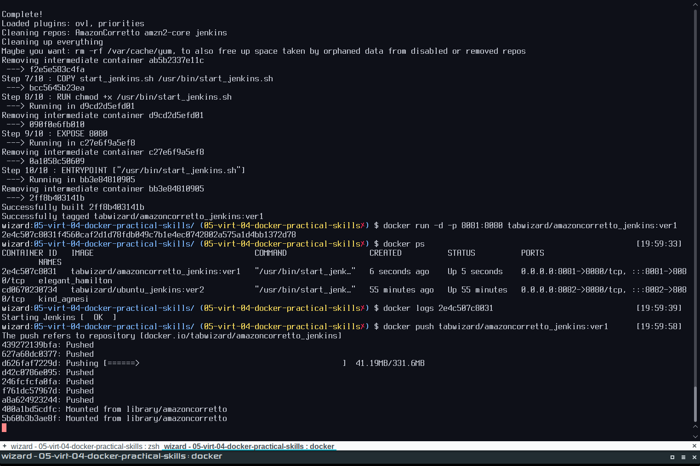
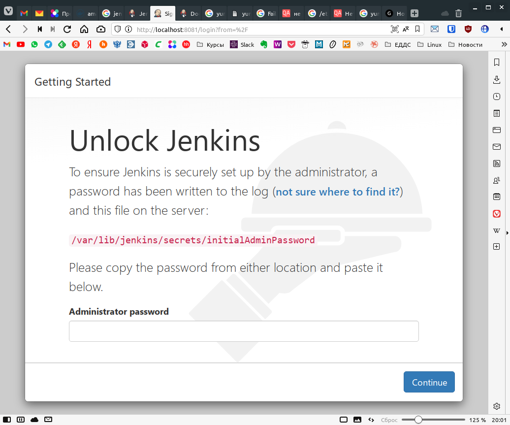
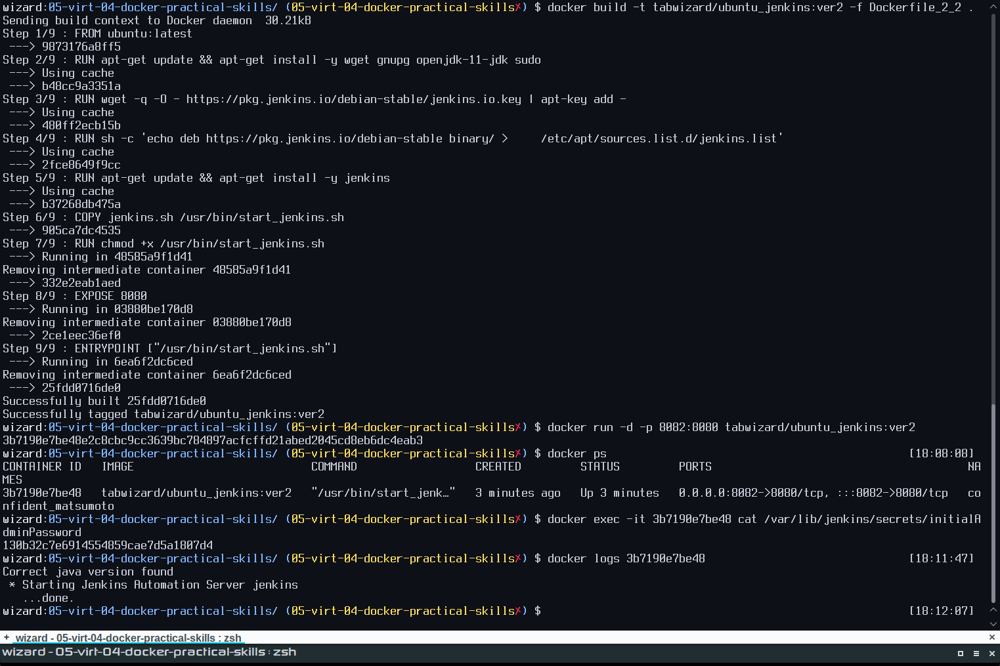
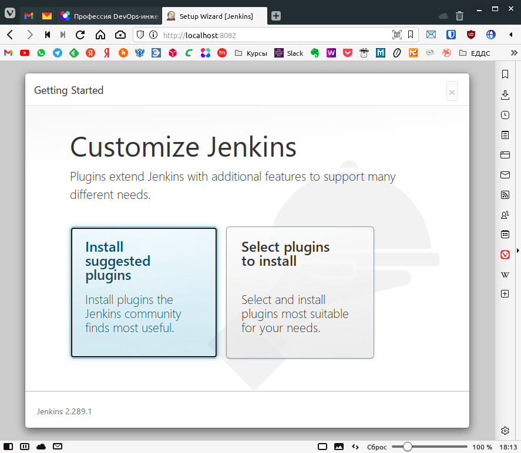
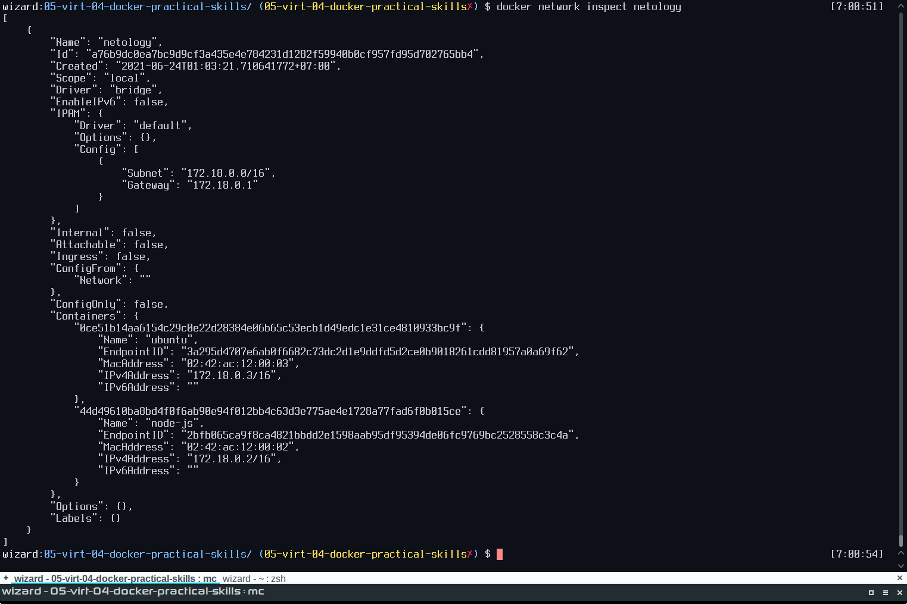
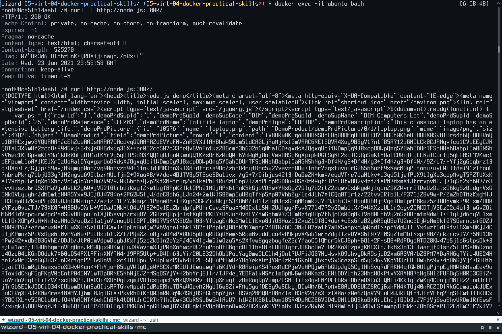

# Домашняя работа к занятию "5.4. Практические навыки работы с Docker"

## Задача 1

В данном задании вы научитесь изменять существующие Dockerfile, адаптируя их под нужный инфраструктурный стек.

Измените базовый образ предложенного Dockerfile на Arch Linux c сохранением его функциональности.

```text
FROM ubuntu:latest

RUN apt-get update && \
    apt-get install -y software-properties-common && \
    add-apt-repository ppa:vincent-c/ponysay && \
    apt-get update
 
RUN apt-get install -y ponysay

ENTRYPOINT ["/usr/bin/ponysay"]
CMD ["Hey, netology”]
```

Для получения зачета, вам необходимо предоставить:

- Написанный вами Dockerfile
- Скриншот вывода командной строки после запуска контейнера из вашего базового образа
- Ссылку на образ в вашем хранилище docker-hub  

__ОТВЕТ:__ Делаем Dokerfile. Пакет `ponysay` присутствует в репозитории `community`, поэтому убираем всё про установку пакета `software-properties-common` и добавление репозитория `vincent-c/ponysay` тоже убираем и просто ставим пакет с обновлением реп.

```bash
wizard:05-virt-04-docker-practical-skills/ $ cat Dockerfile_1
FROM archlinux:latest

RUN pacman -Sy --noconfirm ponysay

ENTRYPOINT ["/usr/bin/ponysay"]
CMD ["Hey, netology”]%                                   
```

```bash
wizard:05-virt-04-docker-practical-skills/ $ docker build -t tabwizard/archlinux_ponysay -f Dockerfile_1
Sending build context to Docker daemon   7.68kB
Step 1/4 : FROM archlinux:latest
latest: Pulling from library/archlinux
f0a2fdfa458e: Pull complete
1ca3d6a4dde7: Pull complete
Digest: sha256:e69ed3167ce0fb5d6a22ab58ced6015afdceaa962cd826c63a8ef851985abad6
Status: Downloaded newer image for archlinux:latest
 ---> 1f90233ad36d
Step 2/4 : RUN pacman -Sy --noconfirm ponysay
 ---> Running in eecf651a7b89
:: Synchronizing package databases...
 core downloading...
 extra downloading...
 community downloading...
resolving dependencies...
looking for conflicting packages...

Packages (4) gdbm-1.19-2  libnsl-1.3.0-2  python-3.9.5-3  ponysay-3.0.3-4

Total Download Size:   29.57 MiB
Total Installed Size:  87.61 MiB

:: Proceed with installation? [Y/n]
:: Retrieving packages...
 gdbm-1.19-2-x86_64 downloading...
 libnsl-1.3.0-2-x86_64 downloading...
 python-3.9.5-3-x86_64 downloading...
 ponysay-3.0.3-4-any downloading...
checking keyring...
checking package integrity...
loading package files...
checking for file conflicts...
:: Processing package changes...
installing gdbm...
installing libnsl...
installing python...
Optional dependencies for python
    python-setuptools
    python-pip
    sqlite [installed]
    mpdecimal: for decimal
    xz: for lzma [installed]
    tk: for tkinter
installing ponysay...
:: Running post-transaction hooks...
(1/1) Arming ConditionNeedsUpdate...
Removing intermediate container eecf651a7b89
 ---> 0fbe29732ec1
Step 3/4 : ENTRYPOINT ["/usr/bin/ponysay"]
 ---> Running in b9807aff4fb4
Removing intermediate container b9807aff4fb4
 ---> 3fa91d331781
Step 4/4 : CMD ["Hey, netology”]
 ---> Running in 16b36bcbeb08
Removing intermediate container 16b36bcbeb08
 ---> ee0c32063762
Successfully built ee0c32063762
Successfully tagged tabwizard/archlinux_ponysay:latest
```  

[](./2021-06-23_13-02-42_wizard.png)  
Запушили образ [tabwizard/archlinux_ponysay](https://hub.docker.com/repository/docker/tabwizard/archlinux_ponysay) в docker-hub.

## Задача 2

В данной задаче вы составите несколько разных Dockerfile для проекта Jenkins, опубликуем образ в `dockerhub.io` и посмотрим логи этих контейнеров.

- Составьте 2 Dockerfile:

  - Общие моменты:
    - Образ должен запускать [Jenkins server](https://www.jenkins.io/download/)

  - Спецификация первого образа:
    - Базовый образ - [amazoncorretto](https://hub.docker.com/_/amazoncorretto)
    - Присвоить образу тэг `ver1`

  - Спецификация второго образа:
    - Базовый образ - [ubuntu:latest](https://hub.docker.com/_/ubuntu)
    - Присвоить образу тэг `ver2`

- Соберите 2 образа по полученным Dockerfile
- Запустите и проверьте их работоспособность
- Опубликуйте образы в своём dockerhub.io хранилище

Для получения зачета, вам необходимо предоставить:

- Наполнения 2х Dockerfile из задания
- Скриншоты логов запущенных вами контейнеров (из командной строки)
- Скриншоты веб-интерфейса Jenkins запущенных вами контейнеров (достаточно 1 скриншота на контейнер)
- Ссылки на образы в вашем хранилище docker-hub  

__ОТВЕТ amazoncorretto:__  
Dockerfile Dockerfile_2_1:

```dockerfile
FROM amazoncorretto
RUN yum update –y && yum install -y wget initscripts ; yum clean all
RUN wget -O /etc/yum.repos.d/jenkins.repo \
    https://pkg.jenkins.io/redhat-stable/jenkins.repo
RUN rpm --import https://pkg.jenkins.io/redhat-stable/jenkins.io.key
RUN yum upgrade
RUN yum install jenkins java-1.8.0-openjdk-devel -y; yum clean all
COPY start_jenkins.sh /usr/bin/start_jenkins.sh
RUN chmod +x /usr/bin/start_jenkins.sh
EXPOSE 8080
ENTRYPOINT ["/usr/bin/start_jenkins.sh"]
```

Пусковой файл start_jenkins.sh:

```bash
#!/bin/bash
/etc/init.d/jenkins start
while [ $(pgrep -U jenkins -f jenkins.war | grep -c .) -gt 0 ]
do
  sleep 1
done
```

[](./Screenshot_20210623_200145.png)  
[](./Screenshot_20210623_200107.png)  
Запушили образ [tabwizard/amazoncorretto_jenkins](https://hub.docker.com/repository/docker/tabwizard/amazoncorretto_jenkins) в docker-hub.  

__ОТВЕТ ubuntu:latest:__  
Dockerfile Dockerfile_2_2:

```dockerfile
FROM ubuntu:latest
RUN apt-get update && apt-get install -y wget gnupg openjdk-11-jdk sudo && apt-get clean; rm -rf /var/lib/{apt,dpkg,cache,log}/
RUN wget -q -O - https://pkg.jenkins.io/debian-stable/jenkins.io.key | apt-key add -
RUN sh -c 'echo deb https://pkg.jenkins.io/debian-stable binary/ > \
    /etc/apt/sources.list.d/jenkins.list'
RUN apt-get update && apt-get install -y jenkins && apt-get clean; rm -rf /var/lib/{apt,dpkg,cache,log}/
COPY ubuntu_jenkins.sh /usr/bin/start_jenkins.sh
RUN chmod +x /usr/bin/start_jenkins.sh
EXPOSE 8080
ENTRYPOINT ["/usr/bin/start_jenkins.sh"]
```

Пусковой файл start_jenkins.sh:

```bash
#!/bin/bash
/etc/init.d/jenkins start
while [ $(pgrep -U jenkins -f jenkins.war | grep -c .) -gt 0 ]
do
  sleep 1
done
```

[](./Screenshot_20210623_181557.png)  
[](./Screenshot_20210623_180902.png)  
Запушили образ [tabwizard/ubuntu_jenkins](https://hub.docker.com/repository/docker/tabwizard/ubuntu_jenkins) в docker-hub.

## Задача 3

В данном задании вы научитесь:

- объединять контейнеры в единую сеть
- исполнять команды "изнутри" контейнера

Для выполнения задания вам нужно:

- Написать Dockerfile:
  - Использовать образ <https://hub.docker.com/_/node> как базовый
  - Установить необходимые зависимые библиотеки для запуска npm приложения <https://github.com/simplicitesoftware/nodejs-demo>
  - Выставить у приложения (и контейнера) порт 3000 для прослушки входящих запросов  
  - Соберите образ и запустите контейнер в фоновом режиме с публикацией порта

- Запустить второй контейнер из образа ubuntu:latest
- Создайть `docker network` и добавьте в нее оба запущенных контейнера
- Используя `docker exec` запустить командную строку контейнера `ubuntu` в интерактивном режиме
- Используя утилиту `curl` вызвать путь `/` контейнера с npm приложением  

Для получения зачета, вам необходимо предоставить:

- Наполнение Dockerfile с npm приложением
- Скриншот вывода вызова команды списка docker сетей (docker network cli)
- Скриншот вызова утилиты curl с успешным ответом  

__ОТВЕТ:__  
Dockerfile Dockerfile_3:

```dockerfile
FROM node
RUN apt-get update && apt-get install git
RUN cd && git clone https://github.com/simplicitesoftware/nodejs-demo.git
WORKDIR /root/nodejs-demo
RUN npm install
ENV VCAP_APP_HOST=0.0.0.0
ENV VCAP_APP_PORT=3000
EXPOSE 3000
ENTRYPOINT ["npm", "start"]
```

```bash
wizard:~/ $ docker run --rm --name node-js -p 3000:3000 -d tabwizard/node
7a5bd1862088ad8698460d05565cca1d35fc9cbf55b8fc7f9872de6306d8bac6
wizard:~/ $ docker run --rm --name ubuntu -d ubuntu:latest sleep 3600
3d70229bce803826dd8dbf5810131e30457a689a0065501f705592d299ebc931
wizard:~/ $ docker network create netology
a76b9dc0ea7bc9d9cf3a435e4e784231d1282f59940b0cf957fd95d702765bb4
wizard:~/ $ docker network connect netology node-js
wizard:~/ $ docker network connect netology ubuntu
wizard:~/ $ docker network inspect netology
```

[](./Screenshot_20210624_070104.png)

```bash
wizard:~/ $ docker exec -it ubuntu bash
root@3d70229bce80:/# apt-get update > /dev/null && apt-get install curl -y > /dev/null
debconf: delaying package configuration, since apt-utils is not installed
root@3d70229bce80:/# curl -I http://node-js:3000/
HTTP/1.1 200 OK
Cache-Control: private, no-cache, no-store, no-transform, must-revalidate
Expires: -1
Pragma: no-cache
Content-Type: text/html; charset=utf-8
Content-Length: 525270
ETag: W/"803d6-HlhbzEnK+QROaij+oayqJ/pRx+E"
Date: Thu, 24 Jun 2021 00:04:13 GMT
Connection: keep-alive
Keep-Alive: timeout=5
```

[](./Screenshot_20210624_065946.png)

---

### Как оформить ДЗ?

Выполненное домашнее задание пришлите ссылкой на .md-файл в вашем репозитории.

---
