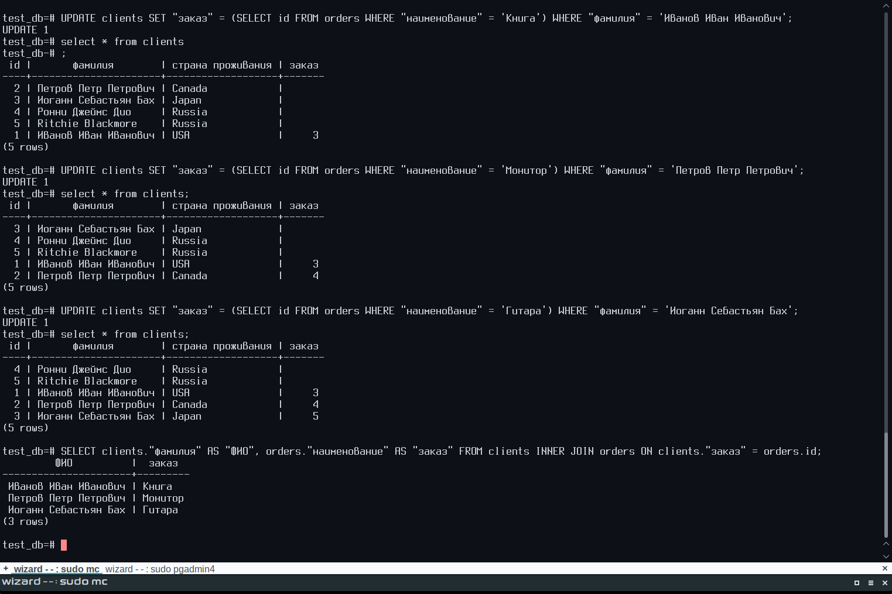

# Домашняя работа к занятию "6.2. SQL"

## Введение

Перед выполнением задания вы можете ознакомиться с
[дополнительными материалами](https://github.com/netology-code/virt-homeworks/tree/master/additional/README.md).

## Задача 1

Используя docker поднимите инстанс PostgreSQL (версию 12) c 2 volume,
в который будут складываться данные БД и бэкапы.

Приведите получившуюся команду или docker-compose манифест.  

__ОТВЕТ:__

```bash
sudo docker run --rm --name pgdocker -e POSTGRES_PASSWORD=password -e POSTGRES_USER=wizard -e POSTGRES_DB=wizard -d -p 5432:5432 -v /var/db/postgresql:/var/lib/postgresql/data -v /var/db/postgresql_backup:/var/lib/postgresql/backup postgres:12
```

## Задача 2

В БД из задачи 1:

- создайте пользователя test-admin-user и БД test_db
- в БД test_db создайте таблицу orders и clients (спeцификация таблиц ниже)
- предоставьте привилегии на все операции пользователю test-admin-user на таблицы БД test_db
- создайте пользователя test-simple-user  
- предоставьте пользователю test-simple-user права на SELECT/INSERT/UPDATE/DELETE данных таблиц БД test_db

Таблица orders:

- id (serial primary key)
- наименование (string)
- цена (integer)

Таблица clients:

- id (serial primary key)
- фамилия (string)
- страна проживания (string, index)
- заказ (foreign key orders)

Приведите:

- итоговый список БД после выполнения пунктов выше,
- описание таблиц (describe)
- SQL-запрос для выдачи списка пользователей с правами над таблицами test_db
- список пользователей с правами над таблицами test_db  

__ОТВЕТ:__

```bash
wizard=# \l
List of databases
Name      | Owner  | Encoding |  Collate   |   Ctype    |      Access privileges       
----------+--------+----------+------------+------------+------------------------------
postgres  | wizard | UTF8     | en_US.utf8 | en_US.utf8 | 
template0 | wizard | UTF8     | en_US.utf8 | en_US.utf8 | =c/wizard                   +
          |        |          |            |            | wizard=CTc/wizard
template1 | wizard | UTF8     | en_US.utf8 | en_US.utf8 | =c/wizard                   +
          |        |          |            |            | wizard=CTc/wizard
test_db   | wizard | UTF8     | en_US.utf8 | en_US.utf8 | =Tc/wizard                  +
          |        |          |            |            | wizard=CTc/wizard           +
          |        |          |            |            | "test-admin-user"=CTc/wizard
wizard    | wizard | UTF8     | en_US.utf8 | en_US.utf8 |
(5 rows)

test_db=# \d orders
                               Table "public.orders"
    Column    |  Type   | Collation | Nullable |              Default
--------------+---------+-----------+----------+------------------------------------
 id           | integer |           | not null | nextval('orders_id_seq'::regclass)
 наименование | text    |           |          |
 цена         | integer |           |          |
Indexes:
    "orders_pkey" PRIMARY KEY, btree (id)
Referenced by:
    TABLE "clients" CONSTRAINT "clients_заказ_fkey" FOREIGN KEY ("заказ") REFERENCES orders(id)

test_db=# \d clients
                                  Table "public.clients"
      Column       |  Type   | Collation | Nullable |               Default
-------------------+---------+-----------+----------+-------------------------------------
 id                | integer |           | not null | nextval('clients_id_seq'::regclass)
 фамилия           | text    |           |          |
 страна проживания | text    |           |          |
 заказ             | integer |           |          |
Indexes:
    "clients_pkey" PRIMARY KEY, btree (id)
    "clients_country_idx" btree ("страна проживания")
Foreign-key constraints:
    "clients_заказ_fkey" FOREIGN KEY ("заказ") REFERENCES orders(id)

test_db=# SELECT table_catalog, table_schema, table_name, grantee, privilege_type FROM information_schema.table_privileges WHERE grantee = 'test-admin-user' OR grantee = 'test-simple-user';
 table_catalog | table_schema | table_name |     grantee      | privilege_type
---------------+--------------+------------+------------------+----------------
 test_db       | public       | orders     | test-admin-user  | INSERT
 test_db       | public       | orders     | test-admin-user  | SELECT
 test_db       | public       | orders     | test-admin-user  | UPDATE
 test_db       | public       | orders     | test-admin-user  | DELETE
 test_db       | public       | orders     | test-admin-user  | TRUNCATE
 test_db       | public       | orders     | test-admin-user  | REFERENCES
 test_db       | public       | orders     | test-admin-user  | TRIGGER
 test_db       | public       | orders     | test-simple-user | INSERT
 test_db       | public       | orders     | test-simple-user | SELECT
 test_db       | public       | orders     | test-simple-user | UPDATE
 test_db       | public       | orders     | test-simple-user | DELETE
 test_db       | public       | clients    | test-admin-user  | INSERT
 test_db       | public       | clients    | test-admin-user  | SELECT
 test_db       | public       | clients    | test-admin-user  | UPDATE
 test_db       | public       | clients    | test-admin-user  | DELETE
 test_db       | public       | clients    | test-admin-user  | TRUNCATE
 test_db       | public       | clients    | test-admin-user  | REFERENCES
 test_db       | public       | clients    | test-admin-user  | TRIGGER
 test_db       | public       | clients    | test-simple-user | INSERT
 test_db       | public       | clients    | test-simple-user | SELECT
 test_db       | public       | clients    | test-simple-user | UPDATE
 test_db       | public       | clients    | test-simple-user | DELETE
(22 rows)

test_db=# \du
List of roles
Role name        |                         Attributes                         | Member of 
-----------------+------------------------------------------------------------+-----------
test-admin-user  |                                                            | {}
test-simple-user |                                                            | {}
wizard           | Superuser, Create role, Create DB, Replication, Bypass RLS | {}
```

## Задача 3

Используя SQL синтаксис - наполните таблицы следующими тестовыми данными:

Таблица orders

|Наименование|цена|
|------------|----|
|Шоколад| 10 |
|Принтер| 3000 |
|Книга| 500 |
|Монитор| 7000|
|Гитара| 4000|

Таблица clients

|ФИО|Страна проживания|
|------------|----|
|Иванов Иван Иванович| USA |
|Петров Петр Петрович| Canada |
|Иоганн Себастьян Бах| Japan |
|Ронни Джеймс Дио| Russia|
|Ritchie Blackmore| Russia|

Используя SQL синтаксис:

- вычислите количество записей для каждой таблицы
- приведите в ответе:
  - запросы
  - результаты их выполнения.  

__ОТВЕТ:__

```bash
test_db=# INSERT INTO orders ("наименование","цена") VALUES ('Шоколад', 10), ('Принтер', 3000), ('Книга', 500), ('Монитор', 7000), ('Гитара', 4000);
INSERT 0 5

test_db=# INSERT INTO clients ("фамилия","страна проживания") VALUES ('Иванов Иван Иванович', 'USA'), ('Петров Петр Петрович', 'Canada'), ('Иоганн Себастьян Бах', 'Japan'), ('Ронни Джеймс Дио', 'Russia'), ('Ritchie Blackmore', 'Russia');
INSERT 0 5

test_db=# SELECT COUNT(*) AS CountOrders FROM orders;
countorders
-------------
5
(1 row)

test_db=# SELECT COUNT(*) AS CountClients FROM clients;
countclients
--------------
5
(1 row)
```

## Задача 4

Часть пользователей из таблицы clients решили оформить заказы из таблицы orders.

Используя foreign keys свяжите записи из таблиц, согласно таблице:

|ФИО|Заказ|
|------------|----|
|Иванов Иван Иванович| Книга |
|Петров Петр Петрович| Монитор |
|Иоганн Себастьян Бах| Гитара |

Приведите SQL-запросы для выполнения данных операций.

Приведите SQL-запрос для выдачи всех пользователей, которые совершили заказ, а также вывод данного запроса.

Подсказк - используйте директиву `UPDATE`.  

__ОТВЕТ:__

```bash
test_db=# UPDATE clients SET "заказ" = (SELECT id FROM orders WHERE "наименование" = 'Книга') WHERE "фамилия" = 'Иванов Иван Иванович';
UPDATE 1

test_db=# UPDATE clients SET "заказ" = (SELECT id FROM orders WHERE "наименование" = 'Монитор') WHERE "фамилия" = 'Петров Петр Петрович';
UPDATE 1

test_db=# UPDATE clients SET "заказ" = (SELECT id FROM orders WHERE "наименование" = 'Гитара') WHERE "фамилия" = 'Иоганн Себастьян Бах';
UPDATE 1

test_db=# SELECT clients."фамилия" AS "ФИО", orders."наименование" AS "заказ" FROM clients INNER JOIN orders ON clients."заказ" = orders.id;
ФИО                  |  заказ
---------------------+---------
Иванов Иван Иванович | Книга
Петров Петр Петрович | Монитор
Иоганн Себастьян Бах | Гитара
(3 rows)
```

[](./Screenshot_20210629_221846.png)  

## Задача 5

Получите полную информацию по выполнению запроса выдачи всех пользователей из задачи 4
(используя директиву EXPLAIN).

Приведите получившийся результат и объясните что значат полученные значения.  

__ОТВЕТ:__

```bash
test_db=# EXPLAIN SELECT clients."фамилия" AS "ФИО", orders."наименование" AS "заказ" FROM clients INNER JOIN orders ON clients."заказ" = orders.id;
QUERY PLAN
-----------------------------------------------------------------------
Hash Join  (cost=37.00..57.24 rows=810 width=64)
  Hash Cond: (clients."заказ" = orders.id)
  ->  Seq Scan on clients  (cost=0.00..18.10 rows=810 width=36)
  ->  Hash  (cost=22.00..22.00 rows=1200 width=36)
        ->  Seq Scan on orders  (cost=0.00..22.00 rows=1200 width=36)
(5 rows)
```

- `cost=37.00..57.24`:
  - `37.00` - Приблизительная стоимость запуска. Это время, которое проходит, прежде чем начнётся этап вывода данных, например для сортирующего узла это время сортировки.
  - `57.24` - Приблизительная общая стоимость. Она вычисляется в предположении, что узел плана выполняется до конца, то есть возвращает все доступные строки. На практике родительский узел может досрочно прекратить чтение строк дочернего.
- `rows=810` - Ожидаемое число строк, которое должен вывести этот узел плана. При этом так же предполагается, что узел выполняется до конца.
- `width=64` - Ожидаемый средний размер строк, выводимых этим узлом плана (в байтах).
- `Hash Join` - план соединения по хешу,
- `Hash Cond` - условие соединения по хешу,
- `Seq Scan on clients` - план простого последовательного сканирования таблицы `clients` в результате которого
- `Hash` - строки таблицы `clients` записываются в хеш-таблицу в памяти
- `Seq Scan on orders` - план простого последовательного сканирования таблицы `orders`

## Задача 6

Создайте бэкап БД test_db и поместите его в volume, предназначенный для бэкапов (см. Задачу 1).

Остановите контейнер с PostgreSQL (но не удаляйте volumes).

Поднимите новый пустой контейнер с PostgreSQL.

Восстановите БД test_db в новом контейнере.

Приведите список операций, который вы применяли для бэкапа данных и восстановления.

---

### Как оформить ДЗ?

Выполненное домашнее задание пришлите ссылкой на .md-файл в вашем репозитории.

---
