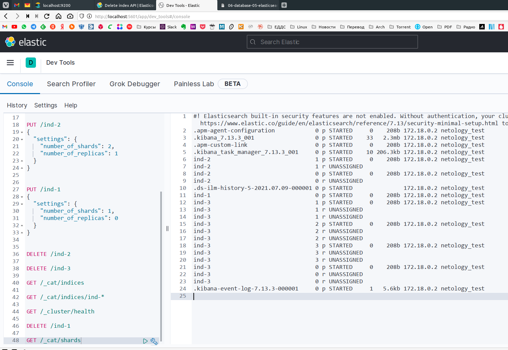

# Домашняя работа к занятию "6.5. Elasticsearch"

## Задача 1

В этом задании вы потренируетесь в:

- установке elasticsearch
- первоначальном конфигурировании elastcisearch
- запуске elasticsearch в docker

Используя докер образ [centos:7](https://hub.docker.com/_/centos) как базовый и
[документацию по установке и запуску Elastcisearch](https://www.elastic.co/guide/en/elasticsearch/reference/current/targz.html):

- составьте Dockerfile-манифест для elasticsearch
- соберите docker-образ и сделайте `push` в ваш docker.io репозиторий
- запустите контейнер из получившегося образа и выполните запрос пути `/` c хост-машины

Требования к `elasticsearch.yml`:

- данные `path` должны сохраняться в `/var/lib`
- имя ноды должно быть `netology_test`

В ответе приведите:

- текст Dockerfile манифеста
- ссылку на образ в репозитории dockerhub
- ответ `elasticsearch` на запрос пути `/` в json виде

Подсказки:

- возможно вам понадобится установка пакета perl-Digest-SHA для корректной работы пакета shasum
- при сетевых проблемах внимательно изучите кластерные и сетевые настройки в elasticsearch.yml
- при некоторых проблемах вам поможет docker директива ulimit
- elasticsearch в логах обычно описывает проблему и пути ее решения

Далее мы будем работать с данным экземпляром elasticsearch.  

__ОТВЕТ:__

```bash
wizard:06-db-05-elasticsearch/ (main✗) $ cat Dockerfile
FROM centos:7
RUN yum update -y -q -e 0 && yum install -y -q -e 0 wget tar; \
yum clean all && rm -rf /var/cache/yum
RUN cd /usr/share; \
wget -q https://artifacts.elastic.co/downloads/elasticsearch/elasticsearch-7.13.3-linux-x86_64.tar.gz; \
tar -xzf elasticsearch-7.13.3-linux-x86_64.tar.gz; \
rm elasticsearch-7.13.3-linux-x86_64.tar.gz; \
adduser elastic; \
chown elastic -R /usr/share/elasticsearch-7.13.3;\
mkdir /var/lib/nodes; \
chown elastic -R /var/lib/nodes
WORKDIR /usr/share/elasticsearch-7.13.3
COPY elasticsearch.yml ./config/
EXPOSE 9300 9200
ENV HOSTNAME=netology_test
USER elastic
CMD ./bin/elasticsearch

wizard:06-db-05-elasticsearch/ (main✗) $ docker run --rm --name elastic -d -p 9300:9300 -p 9200:9200 tabwizard/elastic
a33c5acb2d6fdf7320173108d31a41fc0d6e073527b4bf046c8dca91192c81fd

wizard:06-db-05-elasticsearch/ (main✗) $ curl http://localhost:9200/
{
  "name" : "netology_test",
  "cluster_name" : "netology",
  "cluster_uuid" : "9_mhkmrFRwq-WRD-xS0tAQ",
  "version" : {
    "number" : "7.13.3",
    "build_flavor" : "default",
    "build_type" : "tar",
    "build_hash" : "5d21bea28db1e89ecc1f66311ebdec9dc3aa7d64",
    "build_date" : "2021-07-02T12:06:10.804015202Z",
    "build_snapshot" : false,
    "lucene_version" : "8.8.2",
    "minimum_wire_compatibility_version" : "6.8.0",
    "minimum_index_compatibility_version" : "6.0.0-beta1"
  },
  "tagline" : "You Know, for Search"
}
```

Ссылка на [образ](https://hub.docker.com/repository/docker/tabwizard/elastic) в репозитории dockerhub.

## Задача 2

В этом задании вы научитесь:

- создавать и удалять индексы
- изучать состояние кластера
- обосновывать причину деградации доступности данных

Ознакомтесь с [документацией](https://www.elastic.co/guide/en/elasticsearch/reference/current/indices-create-index.html)
и добавьте в `elasticsearch` 3 индекса, в соответствии со таблицей:

| Имя | Количество реплик | Количество шард |
|-----|-------------------|-----------------|
| ind-1| 0 | 1 |
| ind-2 | 1 | 2 |
| ind-3 | 2 | 4 |

Получите список индексов и их статусов, используя API и **приведите в ответе** на задание.

Получите состояние кластера `elasticsearch`, используя API.

Как вы думаете, почему часть индексов и кластер находится в состоянии yellow?

Удалите все индексы.

**Важно**

При проектировании кластера elasticsearch нужно корректно рассчитывать количество реплик и шард,
иначе возможна потеря данных индексов, вплоть до полной, при деградации системы.  

__ОТВЕТ:__ Для проверки, наглядности и контроля работы с API будем дополнительно использовать docker kibana.

```bash
wizard:06-db-05-elasticsearch/ (main✗) $ docker network create elastic_kibana
78ebce662819a21fdc130db26ecad21d326b0398e808c664e5c09d359430d443

wizard:06-db-05-elasticsearch/ (main✗) $ docker run --rm --name elastic --net elastic_kibana -d -p 9300:9300 -p 9200:9200 tabwizard/elastic
017043d111782bf84b634ee6438e762e6a574477cf99231b921a2b7169db7f45

wizard:06-db-05-elasticsearch/ (main✗) $ docker run -d --name kibana --net elastic_kibana -p 5601:5601 -e "ELASTICSEARCH_HOSTS=http://elastic:9200" kibana:7.13.3
9314ca1d7781b9abf7297fb79db4dbdd204a81f89e39d28c0678597f8fa4cebf

wizard:06-db-05-elasticsearch/ (main✗) $ curl -XPUT "http://localhost:9200/ind-1" -H 'Content-Type: application/json' -d'{"settings":{"number_of_shards":1,"number_of_replicas":0}}'
{"acknowledged":true,"shards_acknowledged":true,"index":"ind-1"}% 

wizard:06-db-05-elasticsearch/ (main✗) $ curl -XPUT "http://localhost:9200/ind-2" -H 'Content-Type: application/json' -d'{"settings":{"number_of_shards":2,"number_of_replicas":1}}'
{"acknowledged":true,"shards_acknowledged":true,"index":"ind-2"}% 

wizard:06-db-05-elasticsearch/ (main✗) $ curl -XPUT "http://localhost:9200/ind-3" -H 'Content-Type: application/json' -d'{"settings":{"number_of_shards":4,"number_of_replicas":2}}'
{"acknowledged":true,"shards_acknowledged":true,"index":"ind-3"}% 

wizard:06-db-05-elasticsearch/ (main✗) $ curl  'localhost:9200/_cat/indices?v'                                               [20:30:40]
health status index                           uuid                   pri rep docs.count docs.deleted store.size pri.store.size
green  open   .kibana_7.13.3_001              bzmLCi4GTEOYEhu-rgkTHw   1   0         29           13      2.1mb          2.1mb
green  open   .apm-custom-link                adVjIeL8Rm6iw7ur2HUXUw   1   0          0            0       208b           208b
green  open   .kibana-event-log-7.13.3-000001 zMFXuxyARtOBSh9K-e893w   1   0          1            0      5.6kb          5.6kb
green  open   .apm-agent-configuration        lVvEIwr5Q7CFHR1xsGKYlQ   1   0          0            0       208b           208b
green  open   ind-1                           cFND0g-9SEWu8yT_jxmGwQ   1   0          0            0       208b           208b
yellow open   ind-3                           rSaqWPObTy2c0vQ1g1NqYg   4   2          0            0       832b           832b
yellow open   ind-2                           vFvERF1aT3qXyZkGnOxdzA   2   1          0            0       416b           416b
green  open   .kibana_task_manager_7.13.3_001 _ZSMQJU9Sv-sOmT2Gg6ECg   1   0         10          622    120.8kb        120.8kb

wizard:06-db-05-elasticsearch/ (main✗) $ curl  'localhost:9200/_cat/health?v'
epoch      timestamp cluster  status node.total node.data shards pri relo init unassign pending_tasks max_task_wait_time active_shards_percent
1625837746 13:35:46  netology yellow          1         1     13  13    0    0       10             0                  -                 56.5%

wizard:06-db-05-elasticsearch/ (main✗) $ curl 'localhost:9200/_cluster/health/'|json_pp
% Total    % Received % Xferd  Average Speed   Time    Time     Time  Current
Dload  Upload   Total   Spent    Left  Speed
100   400  100   400    0     0   109k      0 --:--:-- --:--:-- --:--:--  130k
{
"active_primary_shards" : 13,
"active_shards" : 13,
"active_shards_percent_as_number" : 56.5217391304348,
"cluster_name" : "netology",
"delayed_unassigned_shards" : 0,
"initializing_shards" : 0,
"number_of_data_nodes" : 1,
"number_of_in_flight_fetch" : 0,
"number_of_nodes" : 1,
"number_of_pending_tasks" : 0,
"relocating_shards" : 0,
"status" : "yellow",
"task_max_waiting_in_queue_millis" : 0,
"timed_out" : false,
"unassigned_shards" : 10
}

wizard:06-db-05-elasticsearch/ (main✗) $ curl -XDELETE http://localhost:9200/ind-1
{"acknowledged":true}%
wizard:06-db-05-elasticsearch/ (main✗) $ curl -XDELETE http://localhost:9200/ind-2
{"acknowledged":true}%
wizard:06-db-05-elasticsearch/ (main✗) $ curl -XDELETE http://localhost:9200/ind-3
{"acknowledged":true}% 
```

Некоторые индексы и кластер находятся в состоянии Yellow потому что кластер у нас в One-node, реплики некуда девать и они в состоянии UNASSIGNED:

```bash
wizard:06-db-05-elasticsearch/ (06-db-05-elasticsearch✗) $ curl  'localhost:9200/_cat/shards?v'
index                               shard prirep state      docs   store ip         node
.apm-agent-configuration            0     p      STARTED       0    208b 172.18.0.2 netology_test
.kibana_7.13.3_001                  0     p      STARTED      33   2.3mb 172.18.0.2 netology_test
.apm-custom-link                    0     p      STARTED       0    208b 172.18.0.2 netology_test
.kibana_task_manager_7.13.3_001     0     p      STARTED      10 300.3kb 172.18.0.2 netology_test
ind-2                               1     p      STARTED       0    208b 172.18.0.2 netology_test
ind-2                               1     r      UNASSIGNED
ind-2                               0     p      STARTED       0    208b 172.18.0.2 netology_test
ind-2                               0     r      UNASSIGNED
.ds-ilm-history-5-2021.07.09-000001 0     p      STARTED                 172.18.0.2 netology_test
ind-1                               0     p      STARTED       0    208b 172.18.0.2 netology_test
ind-3                               1     p      STARTED       0    208b 172.18.0.2 netology_test
ind-3                               1     r      UNASSIGNED
ind-3                               1     r      UNASSIGNED
ind-3                               2     p      STARTED       0    208b 172.18.0.2 netology_test
ind-3                               2     r      UNASSIGNED
ind-3                               2     r      UNASSIGNED
ind-3                               3     p      STARTED       0    208b 172.18.0.2 netology_test
ind-3                               3     r      UNASSIGNED
ind-3                               3     r      UNASSIGNED
ind-3                               0     p      STARTED       0    208b 172.18.0.2 netology_test
ind-3                               0     r      UNASSIGNED
ind-3                               0     r      UNASSIGNED
.kibana-event-log-7.13.3-000001     0     p      STARTED       1   5.6kb 172.18.0.2 netology_test
```

[](./Screenshot_20210709_213426.png)

## Задача 3

В данном задании вы научитесь:

- создавать бэкапы данных
- восстанавливать индексы из бэкапов

Создайте директорию `{путь до корневой директории с elasticsearch в образе}/snapshots`.

Используя API [зарегистрируйте](https://www.elastic.co/guide/en/elasticsearch/reference/current/snapshots-register-repository.html#snapshots-register-repository)
данную директорию как `snapshot repository` c именем `netology_backup`.

**Приведите в ответе** запрос API и результат вызова API для создания репозитория.

Создайте индекс `test` с 0 реплик и 1 шардом и **приведите в ответе** список индексов.

[Создайте `snapshot`](https://www.elastic.co/guide/en/elasticsearch/reference/current/snapshots-take-snapshot.html)
состояния кластера `elasticsearch`.

**Приведите в ответе** список файлов в директории со `snapshot`ами.

Удалите индекс `test` и создайте индекс `test-2`. **Приведите в ответе** список индексов.

[Восстановите](https://www.elastic.co/guide/en/elasticsearch/reference/current/snapshots-restore-snapshot.html) состояние
кластера `elasticsearch` из `snapshot`, созданного ранее.

**Приведите в ответе** запрос к API восстановления и итоговый список индексов.

Подсказки:

- возможно вам понадобится доработать `elasticsearch.yml` в части директивы `path.repo` и перезапустить `elasticsearch`

---

### Как оформить ДЗ?

Выполненное домашнее задание пришлите ссылкой на .md-файл в вашем репозитории.

---
