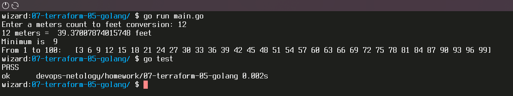

# Домашнее задание к занятию "7.5. Основы golang"

С `golang` в рамках курса, мы будем работать не много, поэтому можно использовать любой IDE.
Но рекомендуем ознакомиться с [GoLand](https://www.jetbrains.com/ru-ru/go/).  

## Задача 1. Установите golang

1. Воспользуйтесь инструкций с официального сайта: [https://golang.org/](https://golang.org/).
2. Так же для тестирования кода можно использовать песочницу: [https://play.golang.org/](https://play.golang.org/).

## Задача 2. Знакомство с gotour

У Golang есть обучающая интерактивная консоль [https://tour.golang.org/](https://tour.golang.org/).
Рекомендуется изучить максимальное количество примеров. В консоли уже написан необходимый код,
осталось только с ним ознакомиться и поэкспериментировать как написано в инструкции в левой части экрана.  

## Задача 3. Написание кода

Цель этого задания закрепить знания о базовом синтаксисе языка. Можно использовать редактор кода
на своем компьютере, либо использовать песочницу: [https://play.golang.org/](https://play.golang.org/).

1. Напишите программу для перевода метров в футы (1 фут = 0.3048 метр). Можно запросить исходные данные у пользователя, а можно статически задать в коде.  
    Для взаимодействия с пользователем можно использовать функцию `Scanf`:

    ```go
    package main

    import "fmt"

    func main() {
        fmt.Print("Enter a meters count: ")
        var input float64
        fmt.Scanf("%f", &input)

        output := input * 0.3048

        fmt.Println(input "meters = " output "futs")    
    }
    ```

1. Напишите программу, которая найдет наименьший элемент в любом заданном списке, например:

    ```go
    x := []int{48,96,86,68,57,82,63,70,37,34,83,27,19,97,9,17,}
    ```

1. Напишите программу, которая выводит числа от 1 до 100, которые делятся на 3. То есть `(3, 6, 9, …)`.

В виде решения ссылку на код или сам код.  

**ОТВЕТ:**  [main.go:](./main.go)  

```go
package main
import "fmt"
  
func main() {
  fmt.Print("Enter a meters count to feet conversion: ")
  var input float64
  fmt.Scanf("%f", &input)
  
  fmt.Println(input, "meters = ", MtoF(input), "feet") 
  
  fmt.Println("Minimum is ", Min([]int{48,96,86,68,57,82,63,70,37,34,83,27,19,97,9,17,}))
  
  fmt.Println("From 1 to 100:  ", DelThree(1, 100))
}
  
func MtoF(m float64) (f float64) {
  f = m / 0.3048
  return
}
  
func Min(x []int) (min int) {
  min = x[0]
  for i := 1; i < len(x); i++ {
    if min > x[i] {
      min = x[i]
    }
  }
  return
}
  
func DelThree (x int, y int) (out []int) {
  for i := x; i <= y; i++ {
    if i%3 == 0 {
      out = append(out, i)
    }
  }
  return
}
```

## Задача 4. Протестировать код (не обязательно)

Создайте тесты для функций из предыдущего задания.  

**ОТВЕТ:**  [main_test.go:](./main_test.go)

```go
package main
import (
  "testing"
  "reflect"
)

func TestMtoF(t *testing.T)  {
  v := MtoF(30.48)
  if v != 100 {
    t.Error("Expected 100, got ", v)
  }
}

func TestMin(t *testing.T)  {
  v := Min([]int{48,96,86,68,57,82,63,70,37,34,83,27,19,97,9,17,})
  if v != 9 {
    t.Error("Expected 9, got ", v)
  }
}

func TestDelThree(t *testing.T)  {
  v := DelThree(1, 50)
  w := []int{3,6,9,12,15,18,21,24,27,30,33,36,39,42,45,48}
  if reflect.DeepEqual(v, w) == false {
    t.Error("Expected ", w, ",\n got ", v)
  }
}
```  

[](./Screenshot_20210810_144958.png)

---

### Как оформить ДЗ?

Выполненное домашнее задание пришлите ссылкой на .md-файл в вашем репозитории.

---
