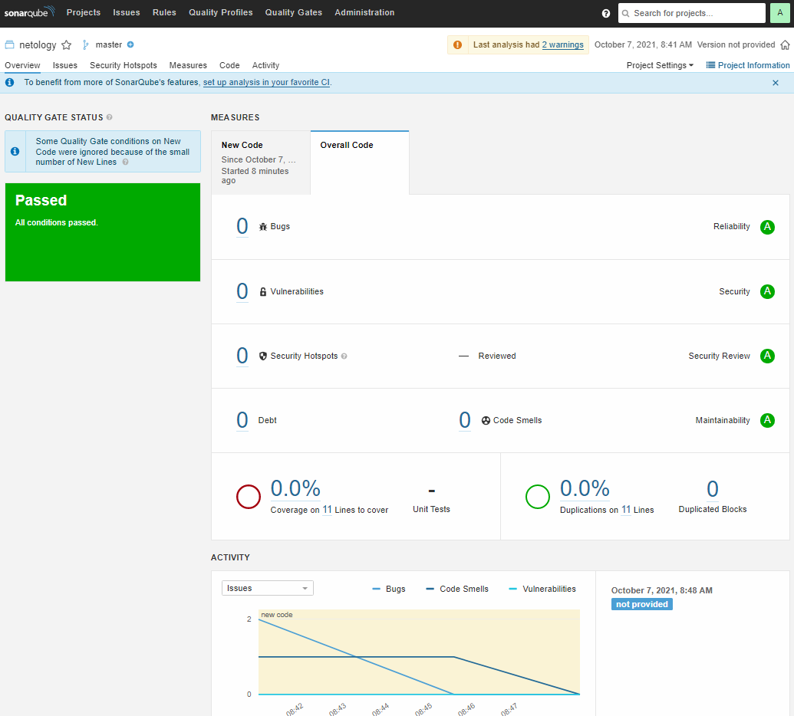

# Домашняя работа к занятию "09.03 CI\CD"

## Подготовка к выполнению

1. Создаём 2 VM в yandex cloud со следующими параметрами: 2CPU 4RAM Centos7(остальное по минимальным требованиям)
2. Прописываем в [inventory](./infrastructure/inventory/cicd/hosts.yml) [playbook'a](./infrastructure/site.yml) созданные хосты.
3. Запускаем playbook, ожидаем успешного завершения
4. Проверяем готовность Sonarqube через [браузер](http://localhost:9000)
5. Заходим под admin\admin, меняем пароль на свой
6. Проверяем готовность Nexus через [бразуер](http://localhost:8081)
7. Подключаемся под admin\admin123, меняем пароль, сохраняем анонимный доступ

## Знакомоство с SonarQube

### Основная часть

1. Создаём новый проект, название произвольное
2. Скачиваем пакет sonar-scanner, который нам предлагает скачать сам sonarqube
3. Делаем так, чтобы binary был доступен через вызов в shell (или меняем переменную PATH или любой другой удобный вам способ)
4. Проверяем `sonar-scanner --version`
5. Запускаем анализатор против кода из директории [example](./example) с дополнительным ключом `-Dsonar.coverage.exclusions=fail.py`
6. Смотрим результат в интерфейсе
7. Исправляем ошибки, которые он выявил(включая warnings)
8. Запускаем анализатор повторно - проверяем, что QG пройдены успешно
9. Делаем скриншот успешного прохождения анализа, прикладываем к решению ДЗ

**ОТВЕТ:**  
[](./Screenshot_20211007_084941.png)

## Знакомство с Nexus

### Основная часть

1. В репозиторий `maven-public` загружаем артефакт с GAV параметрами:
   1. groupId: netology
   2. artifactId: java
   3. version: 8_282
   4. classifier: distrib
   5. type: tar.gz
2. В него же загружаем такой же артефакт, но с version: 8_102
3. Проверяем, что все файлы загрузились успешно
4. В ответе присылаем файл `maven-metadata.xml` для этого артефекта

**ОТВЕТ:**  [maven-metadata.xml](./maven-metadata.xml)

## Знакомство с Maven

### Подготовка к выполнению

1. Скачиваем дистрибутив с [maven](https://maven.apache.org/download.cgi)
2. Разархивируем, делаем так, чтобы binary был доступен через вызов в shell (или меняем переменную PATH или любой другой удобный вам способ)
3. Проверяем `mvn --version`
4. Забираем директорию [mvn](./mvn) с pom

### Основная часть

1. Меняем в `pom.xml` блок с зависимостями под наш артефакт из первого пункта задания для Nexus (java с версией 8_282)
2. Запускаем команду `mvn package` в директории с `pom.xml`, ожидаем успешного окончания
3. Проверяем директорию `~/.m2/repository/`, находим наш артефакт
4. В ответе присылаем исправленный файл `pom.xml`

**ОТВЕТ:**  

```bash
wizard:mvn/ (main✗) $ mvn package
[INFO] Scanning for projects...
[INFO]
[INFO] --------------------< com.netology.app:simple-app >---------------------
[INFO] Building simple-app 1.0-SNAPSHOT
[INFO] --------------------------------[ jar ]---------------------------------
Downloading from my-repo: http://62.84.122.43:8081/repository/maven-releases/netology/java/8_282/java-8_282.pom
Downloading from central: https://repo.maven.apache.org/maven2/netology/java/8_282/java-8_282.pom
[WARNING] The POM for netology:java:tar.gz:distrib:8_282 is missing, no dependency information available
Downloading from my-repo: http://62.84.122.43:8081/repository/maven-releases/netology/java/8_282/java-8_282-distrib.tar.gz
Downloaded from my-repo: http://62.84.122.43:8081/repository/maven-releases/netology/java/8_282/java-8_282-distrib.tar.gz (46 kB at 119 kB/s)
[INFO]
[INFO] --- maven-resources-plugin:2.6:resources (default-resources) @ simple-app ---
[WARNING] Using platform encoding (UTF-8 actually) to copy filtered resources, i.e. build is platform dependent!
[INFO] skip non existing resourceDirectory /home/wizard/Netology/devops-netology/homework/09-ci-03-cicd/mvn/src/main/resources
[INFO]
[INFO] --- maven-compiler-plugin:3.1:compile (default-compile) @ simple-app ---
[INFO] No sources to compile
[INFO]
[INFO] --- maven-resources-plugin:2.6:testResources (default-testResources) @ simple-app ---
[WARNING] Using platform encoding (UTF-8 actually) to copy filtered resources, i.e. build is platform dependent!
[INFO] skip non existing resourceDirectory /home/wizard/Netology/devops-netology/homework/09-ci-03-cicd/mvn/src/test/resources
[INFO]
[INFO] --- maven-compiler-plugin:3.1:testCompile (default-testCompile) @ simple-app ---
[INFO] No sources to compile
[INFO]
[INFO] --- maven-surefire-plugin:2.12.4:test (default-test) @ simple-app ---
[INFO] No tests to run.
[INFO]
[INFO] --- maven-jar-plugin:2.4:jar (default-jar) @ simple-app ---
[WARNING] JAR will be empty - no content was marked for inclusion!
[INFO] Building jar: /home/wizard/Netology/devops-netology/homework/09-ci-03-cicd/mvn/target/simple-app-1.0-SNAPSHOT.jar
[INFO] ------------------------------------------------------------------------
[INFO] BUILD SUCCESS
[INFO] ------------------------------------------------------------------------
[INFO] Total time:  3.030 s
[INFO] Finished at: 2021-10-07T09:17:54+07:00
[INFO] ------------------------------------------------------------------------

wizard:mvn/ (main✗) $ ll ~/.m2/repository/netology/java/8_282
итого 60K
-rw-r--r-- 1 wizard wizard 176 окт  7 09:17 _remote.repositories
-rw-r--r-- 1 wizard wizard 45K окт  7 09:17 java-8_282-distrib.tar.gz
-rw-r--r-- 1 wizard wizard  40 окт  7 09:17 java-8_282-distrib.tar.gz.sha1
-rw-r--r-- 1 wizard wizard 393 окт  7 09:17 java-8_282.pom.lastUpdated
```

[**pom.xml**](./mvn/pom.xml)

---

### Как оформить ДЗ?

Выполненное домашнее задание пришлите ссылкой на .md-файл в вашем репозитории.

---
