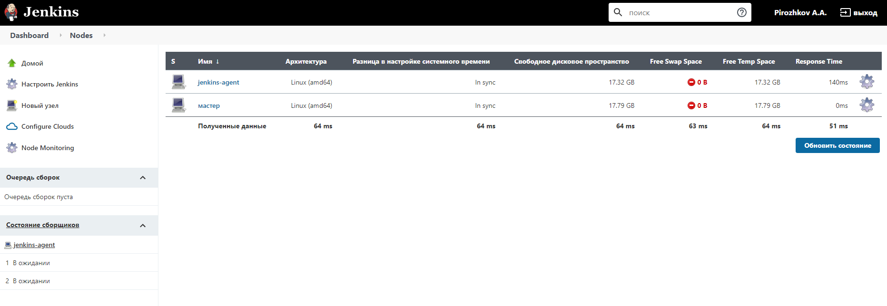
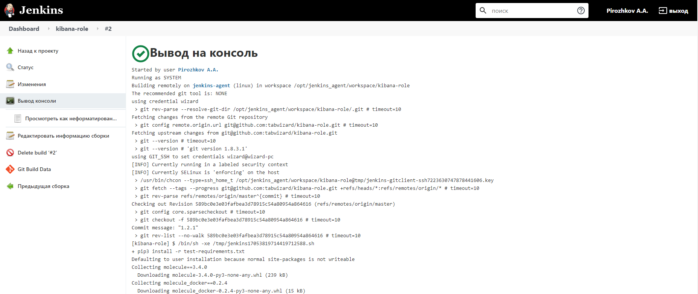
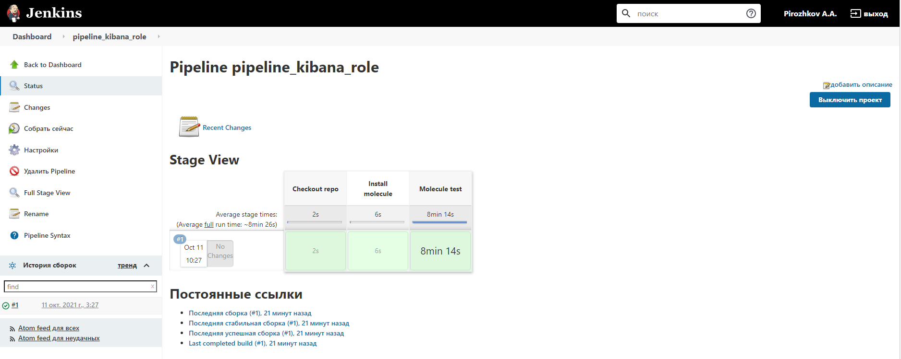
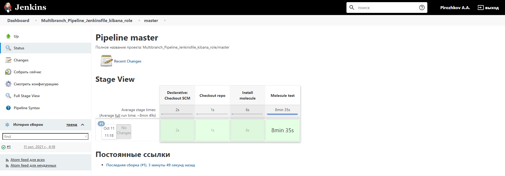
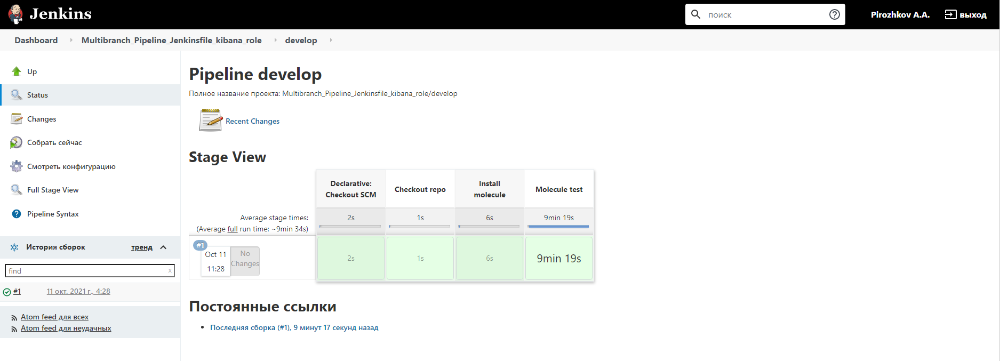
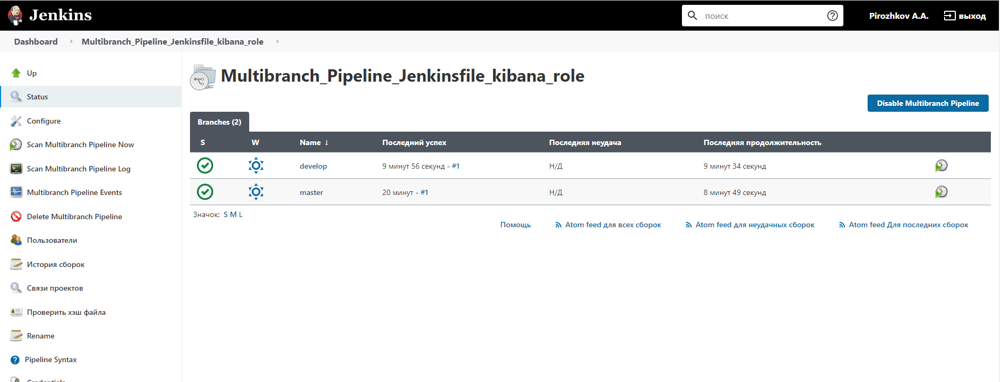
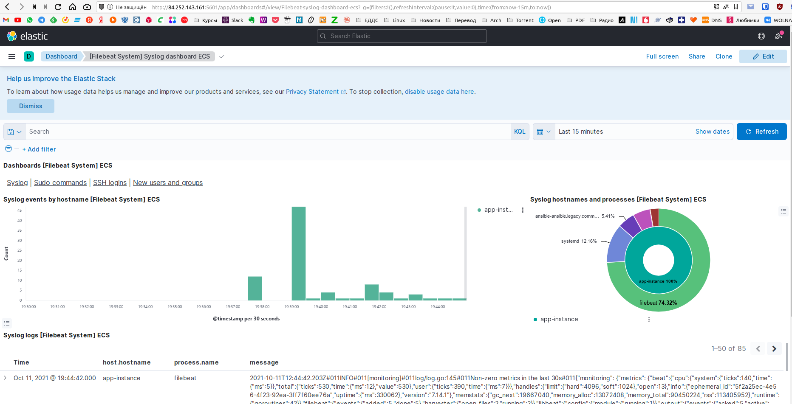
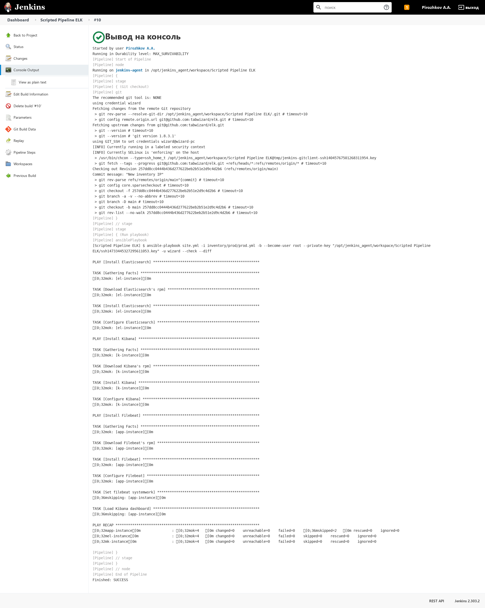

# Домашняя работа к занятию "09.04 Jenkins"

## Подготовка к выполнению

1. Создать 2 VM: для jenkins-master и jenkins-agent.
2. Установить jenkins при помощи playbook'a.
3. Запустить и проверить работоспособность.
4. Сделать первоначальную настройку.

**ОТВЕТ:** Создал в Ya.Cloud 2 ВМ, запустил на них playbook с Jenkins
<details>
<summary>развернуть</summary>

```bash
wizard:infrastructure/ (MNT-7) $ ansible-playbook site.yml -i ./inventory/cicd/hosts.yml

PLAY [Preapre all hosts] *******************************************************************************************************************************

TASK [Gathering Facts] *********************************************************************************************************************************
ok: [jenkins-master-01]
ok: [jenkins-agent-01]

TASK [Create group] ************************************************************************************************************************************
changed: [jenkins-master-01]
changed: [jenkins-agent-01]

TASK [Create user] *************************************************************************************************************************************
changed: [jenkins-master-01]
changed: [jenkins-agent-01]

TASK [Install JDK] *************************************************************************************************************************************
changed: [jenkins-master-01]
changed: [jenkins-agent-01]

PLAY [Get Jenkins master installed] ********************************************************************************************************************

TASK [Gathering Facts] *********************************************************************************************************************************
ok: [jenkins-master-01]

TASK [Get repo Jenkins] ********************************************************************************************************************************
changed: [jenkins-master-01]

TASK [Add Jenkins key] *********************************************************************************************************************************
changed: [jenkins-master-01]

TASK [Install epel-release] ****************************************************************************************************************************
changed: [jenkins-master-01]

TASK [Install Jenkins and requirements] ****************************************************************************************************************
changed: [jenkins-master-01]

TASK [Ensure jenkins agents are present in known_hosts file] *******************************************************************************************
# 62.84.122.124:22 SSH-2.0-OpenSSH_7.4
# 62.84.122.124:22 SSH-2.0-OpenSSH_7.4
# 62.84.122.124:22 SSH-2.0-OpenSSH_7.4
# 62.84.122.124:22 SSH-2.0-OpenSSH_7.4
# 62.84.122.124:22 SSH-2.0-OpenSSH_7.4
changed: [jenkins-master-01] => (item=jenkins-agent-01)
[WARNING]: Module remote_tmp /home/jenkins/.ansible/tmp did not exist and was created with a mode of 0700, this may cause issues when running as
another user. To avoid this, create the remote_tmp dir with the correct permissions manually

TASK [Start Jenkins] ***********************************************************************************************************************************
changed: [jenkins-master-01]

PLAY [Prepare jenkins agent] ***************************************************************************************************************************

TASK [Gathering Facts] *********************************************************************************************************************************
ok: [jenkins-agent-01]

TASK [Add master publickey into authorized_key] ********************************************************************************************************
changed: [jenkins-agent-01]

TASK [Create agent_dir] ********************************************************************************************************************************
changed: [jenkins-agent-01]

TASK [Add docker repo] *********************************************************************************************************************************
changed: [jenkins-agent-01]

TASK [Install some required] ***************************************************************************************************************************
changed: [jenkins-agent-01]

TASK [Update pip] **************************************************************************************************************************************
changed: [jenkins-agent-01]

TASK [Install Ansible] *********************************************************************************************************************************
changed: [jenkins-agent-01]

TASK [Reinstall Selinux] *******************************************************************************************************************************
changed: [jenkins-agent-01]

TASK [Add local to PATH] *******************************************************************************************************************************
changed: [jenkins-agent-01]

TASK [Create docker group] *****************************************************************************************************************************
ok: [jenkins-agent-01]

TASK [Add jenkinsuser to dockergroup] ******************************************************************************************************************
changed: [jenkins-agent-01]

TASK [Restart docker] **********************************************************************************************************************************
changed: [jenkins-agent-01]

TASK [Install agent.jar] *******************************************************************************************************************************
changed: [jenkins-agent-01]

PLAY RECAP *********************************************************************************************************************************************
jenkins-agent-01           : ok=17   changed=14   unreachable=0    failed=0    skipped=0    rescued=0    ignored=0   
jenkins-master-01          : ok=11   changed=9    unreachable=0    failed=0    skipped=0    rescued=0    ignored=0   

wizard:infrastructure/ (MNT-7) $ ssh 84.201.143.76
[wizard@jenkins-master ~]$ sudo cat /var/lib/jenkins/secrets/initialAdminPassword
43e689d6aea94d2280a2799536ddea9
```

[](./Screenshot_20211011_090723.png)

</details>

## Основная часть

1. Сделать Freestyle Job, который будет запускать `molecule test` из любого вашего репозитория с ролью.  
   **ОТВЕТ:**
   [](./Screenshot_20211011_103539.png)
2. Сделать Declarative Pipeline Job, который будет запускать `molecule test` из любого вашего репозитория с ролью.  
   **ОТВЕТ:**
   [](./Screenshot_20211011_105007.png)
3. Перенести Declarative Pipeline в репозиторий в файл `Jenkinsfile`.  
  **ОТВЕТ:**  

    ```bash
    pipeline{
        agent {
        label 'linux'
        }
        stages{
            stage('Checkout repo'){
                steps{
                    git credentialsId: 'wizard', url: 'git@github.com:tabwizard/kibana-role.git'
                }
            }
            stage('Install molecule'){
                steps{
                    sh 'pip3 install -r test-requirements.txt'
                }
            }
            stage('Molecule test'){
                steps{
                    sh 'molecule test'
                }
            }
        }
    }
    ```

4. Создать Multibranch Pipeline на запуск `Jenkinsfile` из репозитория.  
   **ОТВЕТ:**
   [](./Screenshot_20211011_112714.png)
   [](./Screenshot_20211011_113837.png)
   [](./Screenshot_20211011_113853.png)
   [Репозиторий Kibana-role](https://github.com/tabwizard/kibana-role)  

5. Создать Scripted Pipeline, наполнить его скриптом из [pipeline](./pipeline).
6. Внести необходимые изменения, чтобы Pipeline запускал `ansible-playbook` без флагов `--check --diff`, если не установлен параметр при запуске джобы (prod_run = True), по умолчанию параметр имеет значение False и запускает прогон с флагами `--check --diff`.
7. Проверить работоспособность, исправить ошибки, исправленный Pipeline вложить в репозиторий в файл `ScriptedJenkinsfile`. Цель: получить собранный стек ELK в Ya.Cloud.
8. Отправить ссылку на репозиторий в ответе.

  **ОТВЕТ:**  Создал 3 ВМ в Ya.Cloud, прописал их IP в inventory для elk. Создал в Jenkins Pipeline с параметром prod_run. Запустил, исправил ошибки:  
  <details>
  <summary>развернуть</summary>

  [](./Screenshot_20211011_194543.png)  
  [](./Screenshot_20211011_194653.png)  

  </details>

  [ScriptedJenkinsfile](./ScriptedJenkinsfile)

  ```bash
    node("linux"){
        stage("Git checkout"){
            git branch: 'main', credentialsId: 'wizard', url: 'git@github.com:tabwizard/elk.git'
        }
        stage("Run playbook"){
            if (params.prod_run){
                ansiblePlaybook become: true, becomeUser: 'root', colorized: true, credentialsId: 'wizard', disableHostKeyChecking: true, inventory: 'inventory/prod/prod.yml', playbook: 'site.yml'
            }
            else{
                ansiblePlaybook become: true, becomeUser: 'root', colorized: true, credentialsId: 'wizard', disableHostKeyChecking: true, extras: '--check --diff', inventory: 'inventory/prod/prod.yml', playbook: 'site.yml'
            }
        }
    } 
  ```

  [репозиторий с ELK](https://github.com/tabwizard/elk)

## Необязательная часть

1. Создать скрипт на groovy, который будет собирать все Job, которые завершились хотя бы раз неуспешно. Добавить скрипт в репозиторий с решеним с названием `AllJobFailure.groovy`.
2. Дополнить Scripted Pipeline таким образом, чтобы он мог сначала запустить через Ya.Cloud CLI необходимое количество инстансов, прописать их в инвентори плейбука и после этого запускать плейбук. Тем самым, мы должны по нажатию кнопки получить готовую к использованию систему.

---

### Как оформить ДЗ?

Выполненное домашнее задание пришлите ссылкой на .md-файл в вашем репозитории.

---
