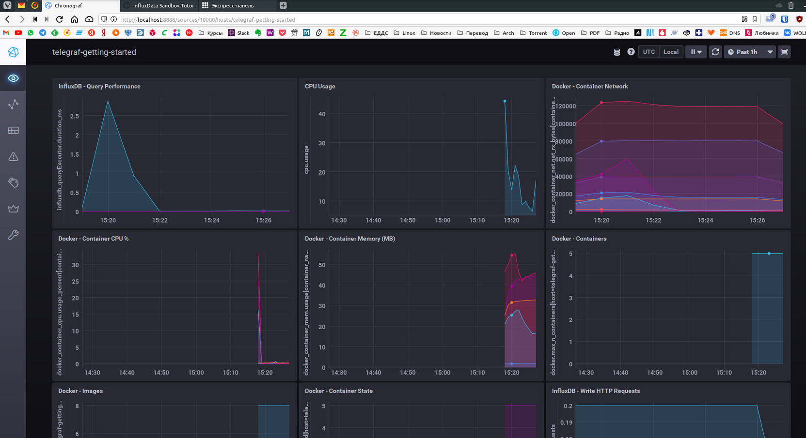
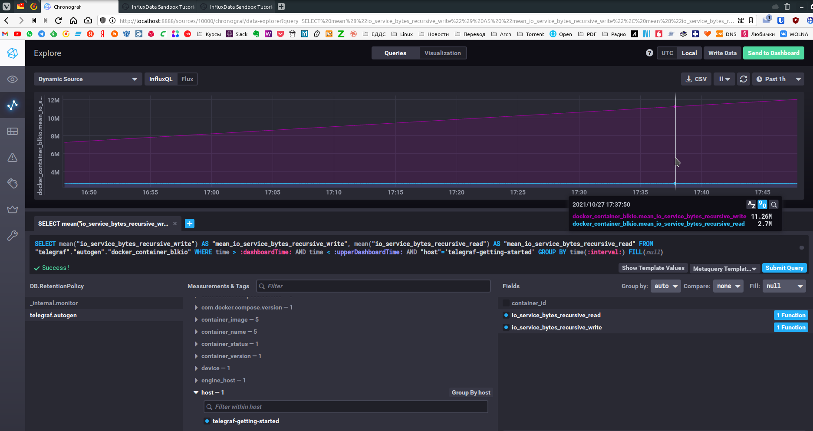
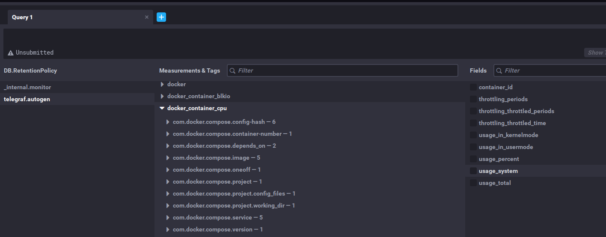
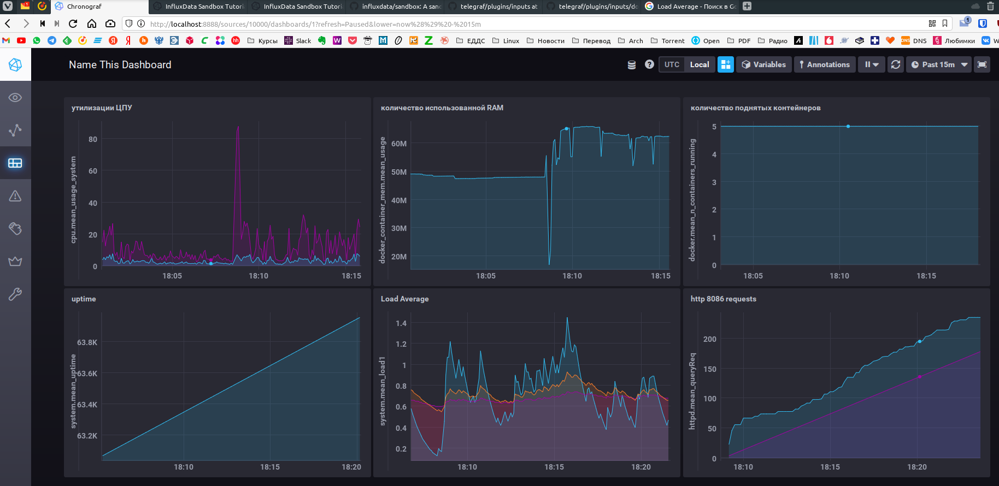

# Домашняя работа к занятию "10.02. Системы мониторинга"

## Обязательные задания

1. Опишите основные плюсы и минусы pull и push систем мониторинга.  

    **ОТВЕТ:**  
    ***Плюсы Push-модели***:
    - Упрощение репликации данных в разные системы мониторинга или их резервные копии (на клиенте настраивается конечная точка отправки или набор таких точек)
    - Более гибкая настройка отправки пакетов данных с метриками (на каждом клиенте задается объем данных и частоту отправки)
    - UDP является менее затратным способом передачи данных, в следствии чего может вырости производительность сбора метрик (обратной стороной медали является гарантия доставки пакетов)
    - возможность отправки бинарных данных

    ***Плюсы Pull-модели***:
    - Легче контролировать подлинность данных (гарантия опроса только тех агентов, которые настроены в системе мониторинга)
    - Можно настроить единый proxy-server до всех агентов с TLS (таким образом мы можем разнести систему мониторинга и агенты, с гарантией безопасности их взаимодействия)
    - Упрощенная отладка получения данных с агентов (так как данные запрашиваются посредством HTTP, можно самостоятельно запрашивать эти данные, используя ПО вне системы мониторинга)

2. Какие из ниже перечисленных систем относятся к push модели, а какие к pull? А может есть гибридные?

    - Prometheus
    - TICK
    - Zabbix
    - VictoriaMetrics
    - Nagios

    **ОТВЕТ:**  
    - Сбор метрик в `Prometheus` осуществляется с помощью механизма `pull`. Имеется также возможность сбора метрик с помощью механизма `push` (для этого используется специальный компонент `pushgateway`, который устанавливается отдельно).  
    - `TICK` работает в соответствии с `push`-моделью. Но Telegraf (агент для сборки метрик с хост-машин и отправки в TSDB) можно настроить для работы в соответствии с `pull`-моделью.  
    - `Zabbix` работает в соответствии с `push` и `pull` моделью. Механизм дуализма `pull` и `push` моделей в `Zabbix` заключается в настраиваемых “`Активных` и `Пассивных`” проверках.`Активные проверки` - указываются данные для непрерывного наблюдения, которые перенаправляются агентом серверу. `Пассивные проверки` - набор данных, которые собираются и хранятся на агенте, но отправляются на сервер только по запросу.  
    - Сначала была `VictoriaMetrics`, это быстрая и простая в установке БД для временных рядов. Она принимала данные в себя из Prometheus по remote_write-протоколу (`push`-модель). Затем был разработан `vmagent` который может собирать метрики по `pull`-модели,а так же умеет получать метрики по `push`-модели, когда разнообразные клиенты (Telegraf, statsd и проч.) могут отправлять в него метрики.  
    - `Nagios` использует агенты, которые установлены как на сетевых элементах, так и на компонентах, которые он контролирует, они собирают данные, используя `pull` модель. `Nagios` также может использовать простой протокол управления сетью (SNMP) для связи с сетевыми коммутаторами или другими компонентами, используя протокол SNMP для запроса их статуса. Для инструментов на базе Windows Nagios использует протокол Windows Management Instrumentation (WMI) для связи и сбора данных. Всё это так же соответствует `pull` модели.

3. Клонируйте себе [репозиторий](https://github.com/influxdata/sandbox/tree/master) и запустите TICK-стек, используя технологии docker и docker-compose.  
В виде решения на это упражнение приведите выводы команд с вашего компьютера (виртуальной машины):

    - `curl http://localhost:8086/ping`
    - `curl http://localhost:8888`
    - `curl http://localhost:9092/kapacitor/v1/ping`  

    А также скриншот веб-интерфейса ПО chronograf (`http://localhost:8888`).  
    P.S.: если при запуске некоторые контейнеры будут падать с ошибкой - проставьте им режим `Z`, например `./data:/var/lib:Z`  

    **ОТВЕТ:**  

    ```bash
    wizard:sandbox/ (master) $ curl -v http://localhost:8086/ping
    *   Trying 127.0.0.1:8086...
    * Connected to localhost (127.0.0.1) port 8086 (#0)
    > GET /ping HTTP/1.1
    > Host: localhost:8086
    > User-Agent: curl/7.79.1
    > Accept: */*
    > 
    * Mark bundle as not supporting multiuse
    < HTTP/1.1 204 No Content
    < Content-Type: application/json
    < Request-Id: b64b92e6-3712-11ec-8b54-0242ac140004
    < X-Influxdb-Build: OSS
    < X-Influxdb-Version: 1.8.10
    < X-Request-Id: b64b92e6-3712-11ec-8b54-0242ac140004
    < Date: Wed, 27 Oct 2021 10:43:24 GMT
    < 
    * Connection #0 to host localhost left intact
    
    wizard:sandbox/ (master) $ curl http://localhost:8888
    <!DOCTYPE html><html><head><meta http-equiv="Content-type" content="text/html; charset=utf-8"><title>Chronograf</title><link rel="icon shortcut" href="/favicon.fa749080.ico"><link rel="stylesheet" href="/src.3dbae016.css"></head><body> <div id="react-root" data-basepath=""></div> <script src="/src.fab22342.js"></script> </body></html>%

    wizard:sandbox/ (master) $ curl -v http://localhost:9092/kapacitor/v1/ping   
    *   Trying 127.0.0.1:9092...
    * Connected to localhost (127.0.0.1) port 9092 (#0)
    > GET /kapacitor/v1/ping HTTP/1.1
    > Host: localhost:9092
    > User-Agent: curl/7.79.1
    > Accept: */*
    > 
    * Mark bundle as not supporting multiuse
    < HTTP/1.1 204 No Content
    < Content-Type: application/json; charset=utf-8
    < Request-Id: 1d99cac5-3705-11ec-835c-000000000000
    < X-Kapacitor-Version: 1.6.2
    < Date: Wed, 27 Oct 2021 09:06:05 GMT
    < 
    * Connection #0 to host localhost left intact
    wizard:sandbox/ (master) $
    ```

    [](./Screenshot_20211027_152852.png)  

1. Перейдите в веб-интерфейс Chronograf (`http://localhost:8888`) и откройте вкладку `Data explorer`.

    - Нажмите на кнопку `Add a query`
    - Изучите вывод интерфейса и выберите БД `telegraf.autogen`
    - В `measurements` выберите mem->host->telegraf_container_id , а в `fields` выберите used_percent.
    Внизу появится график утилизации оперативной памяти в контейнере telegraf.
    - Вверху вы можете увидеть запрос, аналогичный SQL-синтаксису.
    Поэкспериментируйте с запросом, попробуйте изменить группировку и интервал наблюдений.

    Для выполнения задания приведите скриншот с отображением метрик утилизации места на диске (disk->host->telegraf_container_id) из веб-интерфейса.

    **ОТВЕТ:**  
    [](./Screenshot_20211027_175140.png)

5. Изучите список [telegraf inputs](https://github.com/influxdata/telegraf/tree/master/plugins/inputs).
Добавьте в конфигурацию telegraf следующий плагин - [docker](https://github.com/influxdata/telegraf/tree/master/plugins/inputs/docker):  

    ```ini
    [[inputs.docker]]
    endpoint = "unix:///var/run/docker.sock"
    ```

    Дополнительно вам может потребоваться донастройка контейнера telegraf в `docker-compose.yml` дополнительного volume и режима privileged:

    ```yaml
    telegraf:
    image: telegraf:1.4.0
    privileged: true
    volumes:
        - ./etc/telegraf.conf:/etc/telegraf/telegraf.conf:Z
        - /var/run/docker.sock:/var/run/docker.sock:Z
    links:
        - influxdb
    ports:
        - "8092:8092/udp"
        - "8094:8094"
        - "8125:8125/udp"
    ```

    После настройке перезапустите telegraf, обновите веб интерфейс и приведите скриншотом список `measurements` в веб-интерфейсе базы telegraf.autogen . Там должны появиться метрики, связанные с docker.

    Факультативно можете изучить какие метрики собирает telegraf после выполнения данного задания.

    **ОТВЕТ:**  
    [](./Screenshot_20211027_181154.png)

## Дополнительное задание (со звездочкой*) - необязательно к выполнению

В веб-интерфейсе откройте вкладку `Dashboards`. Попробуйте создать свой dashboard с отображением:

    - утилизации ЦПУ
    - количества использованного RAM
    - утилизации пространства на дисках
    - количество поднятых контейнеров
    - аптайм
    - ...
    - фантазируйте)
    
    ---  

**ОТВЕТ:**  
[](./Screenshot_20211027_182406.png)

### Как оформить ДЗ?

Выполненное домашнее задание пришлите ссылкой на .md-файл в вашем репозитории.

---
