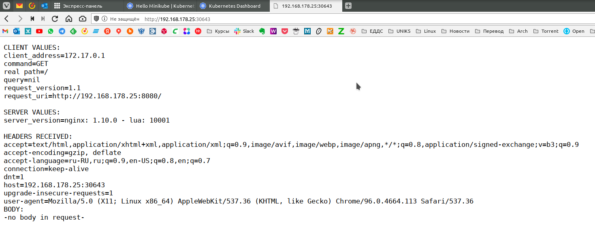
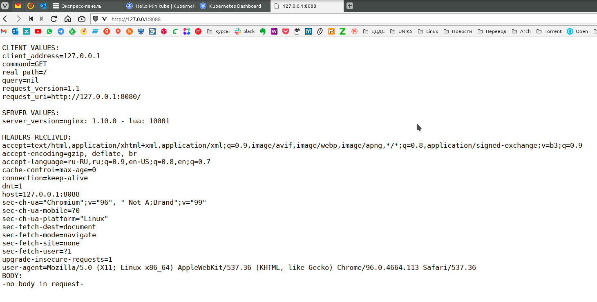

# Домашняя работа к занятию "12.1 Компоненты Kubernetes"

Вы DevOps инженер в крупной компании с большим парком сервисов. Ваша задача — разворачивать эти продукты в корпоративном кластере.

## Задача 1: Установить Minikube

Для экспериментов и валидации ваших решений вам нужно подготовить тестовую среду для работы с Kubernetes. Оптимальное решение — развернуть на рабочей машине Minikube.

### Как поставить на AWS

- создать EC2 виртуальную машину (Ubuntu Server 20.04 LTS (HVM), SSD Volume Type) с типом **t3.small**. Для работы потребуется настроить Security Group для доступа по ssh. Не забудьте указать keypair, он потребуется для подключения.
- подключитесь к серверу по ssh (ssh ubuntu@<ipv4_public_ip> -i <keypair>.pem)
- установите миникуб и докер следующими командами:
  - curl -LO <https://storage.googleapis.com/kubernetes-release/release/>`curl -s https://storage.googleapis.com/kubernetes-release/release/stable.txt`/bin/linux/amd64/kubectl
  - chmod +x ./kubectl
  - sudo mv ./kubectl /usr/local/bin/kubectl
  - sudo apt-get update && sudo apt-get install docker.io conntrack -y
  - curl -Lo minikube <https://storage.googleapis.com/minikube/releases/latest/minikube-linux-amd64> && chmod +x minikube && sudo mv minikube /usr/local/bin/
- проверить версию можно командой minikube version
- переключаемся на root и запускаем миникуб: minikube start --vm-driver=none
- после запуска стоит проверить статус: minikube status
- запущенные служебные компоненты можно увидеть командой: kubectl get pods --namespace=kube-system

### Для сброса кластера стоит удалить кластер и создать заново

- minikube delete
- minikube start --vm-driver=none

Возможно, для повторного запуска потребуется выполнить команду: sudo sysctl fs.protected_regular=0

Инструкция по установке Minikube - [ссылка](https://kubernetes.io/ru/docs/tasks/tools/install-minikube/)

**Важно**: t3.small не входит во free tier, следите за бюджетом аккаунта и удаляйте виртуалку.

**ОТВЕТ:** Устанавливать `minikube` и `kubectl` будем на домашней машине с ArchLinux на борту.

```bash
wizard:~/ $ sudo pacman -S minikube kubectl
разрешение зависимостей...
проверка конфликтов...

Пакет (2)           Новая версия  Изменение размера

community/kubectl   1.22.4-1              65,11 MiB
community/minikube  1.24.0-1              60,83 MiB

Будет установлено:  125,94 MiB

:: Приступить к установке? [Y/n]
(2/2) проверка ключей                 [########################################################] 100%
(2/2) проверка целостности пакета     [########################################################] 100%
(2/2) загрузка файлов пакетов         [########################################################] 100%
(2/2) проверка конфликтов файлов      [########################################################] 100%
(2/2) проверка доступного места       [########################################################] 100%
:: Обработка изменений пакета...
(1/2) установка minikube              [########################################################] 100%
Дополнительные зависимости для 'minikube'
    kubectl: to manage the cluster [ожидание]
    virtualbox: to use --vm-driver=virtualbox [установлено]
(2/2) установка kubectl               [########################################################] 100%
:: Запуск post-transaction hooks...
(1/1) Arming ConditionNeedsUpdate...

wizard:~/ $ minikube version
minikube version: v1.24.0
commit: 76b94fb3c4e8ac5062daf70d60cf03ddcc0a741b-dirty

wizard:~/ $ sudo sysctl fs.protected_regular=0
fs.protected_regular = 0

wizard:~/ $ sudo minikube start --vm-driver=none
😄  minikube v1.24.0 on Arch rolling
✨  Using the none driver based on user configuration
👍  Starting control plane node minikube in cluster minikube
🤹  Running on localhost (CPUs=4, Memory=7896MB, Disk=111868MB) ...
ℹ️  OS release is Arch Linux
    > kubeadm: 43.71 MiB / 43.71 MiB [-------------] 100.00% 12.27 MiB p/s 3.8s
    > kubelet: 115.57 MiB / 115.57 MiB [-----------] 100.00% 18.07 MiB p/s 6.6s
    ▪ Generating certificates and keys ...
💢  initialization failed, will try again: wait: /bin/bash -c "sudo env PATH="/var/lib/minikube/binaries/v1.22.3:$PATH" kubeadm init --config /var/tmp/minikube/kubeadm.yaml  --ignore-preflight-errors=DirAvailable--etc-kubernetes-manifests,DirAvailable--var-lib-minikube,DirAvailable--var-lib-minikube-etcd,FileAvailable--etc-kubernetes-manifests-kube-scheduler.yaml,FileAvailable--etc-kubernetes-manifests-kube-apiserver.yaml,FileAvailable--etc-kubernetes-manifests-kube-controller-manager.yaml,FileAvailable--etc-kubernetes-manifests-etcd.yaml,Port-10250,Swap,Mem": exit status 1
stdout:
[init] Using Kubernetes version: v1.22.3
[preflight] Running pre-flight checks
[preflight] Pulling images required for setting up a Kubernetes cluster
[preflight] This might take a minute or two, depending on the speed of your internet connection
[preflight] You can also perform this action in beforehand using 'kubeadm config images pull'
[certs] Using certificateDir folder "/var/lib/minikube/certs"
[certs] Using existing ca certificate authority
[certs] Using existing apiserver certificate and key on disk
[certs] Generating "apiserver-kubelet-client" certificate and key
[certs] Generating "front-proxy-ca" certificate and key
[certs] Generating "front-proxy-client" certificate and key
[certs] Generating "etcd/ca" certificate and key
[certs] Generating "etcd/server" certificate and key
[certs] etcd/server serving cert is signed for DNS names [localhost wizard-pc] and IPs [192.168.178.25 127.0.0.1 ::1]
[certs] Generating "etcd/peer" certificate and key
[certs] etcd/peer serving cert is signed for DNS names [localhost wizard-pc] and IPs [192.168.178.25 127.0.0.1 ::1]
[certs] Generating "etcd/healthcheck-client" certificate and key
[certs] Generating "apiserver-etcd-client" certificate and key
[certs] Generating "sa" key and public key
[kubeconfig] Using kubeconfig folder "/etc/kubernetes"

stderr:
        [WARNING Swap]: running with swap on is not supported. Please disable swap
        [WARNING FileExisting-ebtables]: ebtables not found in system path
        [WARNING FileExisting-ethtool]: ethtool not found in system path
        [WARNING Service-Kubelet]: kubelet service is not enabled, please run 'systemctl enable kubelet.service'
error execution phase kubeconfig/admin: a kubeconfig file "/etc/kubernetes/admin.conf" exists already but has got the wrong CA cert
To see the stack trace of this error execute with --v=5 or higher

    ▪ Generating certificates and keys ...
    ▪ Booting up control plane ...
    ▪ Configuring RBAC rules ...
🤹  Configuring local host environment ...

❗  The 'none' driver is designed for experts who need to integrate with an existing VM
💡  Most users should use the newer 'docker' driver instead, which does not require root!
📘  For more information, see: https://minikube.sigs.k8s.io/docs/reference/drivers/none/

❗  kubectl and minikube configuration will be stored in /root
❗  To use kubectl or minikube commands as your own user, you may need to relocate them. For example, to overwrite your own settings, run:

    ▪ sudo mv /root/.kube /root/.minikube $HOME
    ▪ sudo chown -R $USER $HOME/.kube $HOME/.minikube

💡  This can also be done automatically by setting the env var CHANGE_MINIKUBE_NONE_USER=true
🔎  Verifying Kubernetes components...
    ▪ Using image gcr.io/k8s-minikube/storage-provisioner:v5
🌟  Enabled addons: default-storageclass, storage-provisioner
🏄  Done! kubectl is now configured to use "minikube" cluster and "default" namespace by default

wizard:~/ $ sudo mv /root/.kube /root/.minikube $HOME
wizard:~/ $ sudo chown -R $USER $HOME/.kube $HOME/.minikube

wizard:~/ $ minikube status
minikube
type: Control Plane
host: Running
kubelet: Running
apiserver: Running
kubeconfig: Configured

wizard:~/ $ kubectl get pods --namespace=kube-system
NAME                                READY   STATUS    RESTARTS   AGE
coredns-78fcd69978-tmghx            1/1     Running   0          7m1s
etcd-wizard-pc                      1/1     Running   1          7m13s
kube-apiserver-wizard-pc            1/1     Running   1          7m14s
kube-controller-manager-wizard-pc   1/1     Running   1          7m13s
kube-proxy-q8kwx                    1/1     Running   0          7m1s
kube-scheduler-wizard-pc            1/1     Running   1          7m13s
storage-provisioner                 1/1     Running   0          7m12s

```

## Задача 2: Запуск Hello World

После установки Minikube требуется его проверить. Для этого подойдет стандартное приложение hello world. А для доступа к нему потребуется ingress.

- развернуть через Minikube тестовое приложение по [туториалу](https://kubernetes.io/ru/docs/tutorials/hello-minikube/#%D1%81%D0%BE%D0%B7%D0%B4%D0%B0%D0%BD%D0%B8%D0%B5-%D0%BA%D0%BB%D0%B0%D1%81%D1%82%D0%B5%D1%80%D0%B0-minikube)
- установить аддоны ingress и dashboard

**ОТВЕТ** В предложенном туториале теперь предлагается запускать деплоймент из образа `k8s.gcr.io/echoserver:1.4` а не `Hello World` соответственно вывод будет другой.

```bash
wizard:~/ $ kubectl create deployment hello-node --image=k8s.gcr.io/echoserver:1.4
deployment.apps/hello-node created

wizard:~/ $ kubectl get deployments
NAME         READY   UP-TO-DATE   AVAILABLE   AGE
hello-node   0/1     1            0           11s

wizard:~/ $ kubectl get deployments
NAME         READY   UP-TO-DATE   AVAILABLE   AGE
hello-node   1/1     1            1           6m32s

wizard:~/ $ kubectl get pods
NAME                          READY   STATUS    RESTARTS   AGE
hello-node-7567d9fdc9-gpfwn   1/1     Running   0          6m50s

wizard:~/ $ kubectl expose deployment hello-node --type=LoadBalancer --port=8080
service/hello-node exposed

wizard:~/ $ kubectl get services
NAME         TYPE           CLUSTER-IP      EXTERNAL-IP   PORT(S)          AGE
hello-node   LoadBalancer   10.96.236.179   <pending>     8080:30643/TCP   9s
kubernetes   ClusterIP      10.96.0.1       <none>        443/TCP          6h30m

wizard:~/ $ minikube service hello-node
[sudo] пароль для wizard: 
|-----------|------------|-------------|-----------------------------|
| NAMESPACE |    NAME    | TARGET PORT |             URL             |
|-----------|------------|-------------|-----------------------------|
| default   | hello-node |        8080 | http://192.168.178.25:30643 |
|-----------|------------|-------------|-----------------------------|
🎉  Opening service default/hello-node in default browser...

wizard:~/ $ minikube addons enable ingress
[sudo] пароль для wizard: 
    ▪ Using image k8s.gcr.io/ingress-nginx/controller:v1.0.4
    ▪ Using image k8s.gcr.io/ingress-nginx/kube-webhook-certgen:v1.1.1
    ▪ Using image k8s.gcr.io/ingress-nginx/kube-webhook-certgen:v1.1.1
🔎  Verifying ingress addon...
🌟  The 'ingress' addon is enabled
wizard:~/ $ minikube addons enable dashboard
    ▪ Using image kubernetesui/dashboard:v2.3.1
    ▪ Using image kubernetesui/metrics-scraper:v1.0.7
💡  Some dashboard features require the metrics-server addon. To enable all features please run:

        minikube addons enable metrics-server

🌟  The 'dashboard' addon is enabled

wizard:~/ $ minikube dashboard
🤔  Verifying dashboard health ...
🚀  Launching proxy ...
🤔  Verifying proxy health ...
🎉  Opening http://127.0.0.1:40017/api/v1/namespaces/kubernetes-dashboard/services/http:kubernetes-dashboard:/proxy/ in your default browser...
Окно или вкладка откроются в текущем сеансе браузера.
```

[](./Screenshot_20211221_212423.png)  
[](./Screenshot_20211221_212948.png)

## Задача 3: Установить kubectl

Подготовить рабочую машину для управления корпоративным кластером. Установить клиентское приложение kubectl.

- подключиться к minikube
- проверить работу приложения из задания 2, запустив port-forward до кластера

**ОТВЕТ** Так как `minikube` устанавливал на свою домашнюю машину и `kubectl` на неё же, то настраивать больше ничего не пришлось. Если бы пытался управлять с другого компьютера, то нужно было бы файл `~/.kube/config` привести к виду:

```yaml
apiVersion: v1 
clusters:    
- cluster:
    server: http://<master-ip>:<port>
  name: test 
contexts:
- context:
    cluster: test
    user: test
  name: test
```

А затем установить контекст, выполнив:

```bash
kubectl config use-context test
```

Проверяем работу кластера и port-forward

```bash
wizard:~/ $ kubectl get pods
NAME                          READY   STATUS    RESTARTS   AGE
hello-node-7567d9fdc9-gpfwn   1/1     Running   0          35m

wizard:~/ $ kubectl get services
NAME         TYPE           CLUSTER-IP      EXTERNAL-IP   PORT(S)          AGE
hello-node   LoadBalancer   10.96.236.179   <pending>     8080:30643/TCP   29m
kubernetes   ClusterIP      10.96.0.1       <none>        443/TCP          6h59m

wizard:~/ $ kubectl port-forward hello-node-7567d9fdc9-gpfwn 8088:8080
Forwarding from 127.0.0.1:8088 -> 8080
Forwarding from [::1]:8088 -> 8080
Handling connection for 8088

```

[](./Screenshot_20211221_213703.png)

## Задача 4 (*): собрать через ansible (необязательное)

Профессионалы не делают одну и ту же задачу два раза. Давайте закрепим полученные навыки, автоматизировав выполнение заданий  ansible-скриптами. При выполнении задания обратите внимание на доступные модули для k8s под ansible.

- собрать роль для установки minikube на aws сервисе (с установкой ingress)
- собрать роль для запуска в кластере hello world
  
  ---

### Как оформить ДЗ?

Выполненное домашнее задание пришлите ссылкой на .md-файл в вашем репозитории.

---
