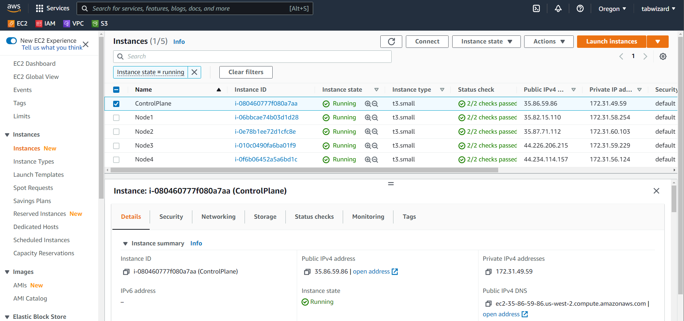
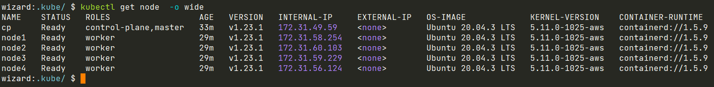

# Домашняя работа к занятию "12.4 Развертывание кластера на собственных серверах, лекция 2"

Новые проекты пошли стабильным потоком. Каждый проект требует себе несколько кластеров: под тесты и продуктив. Делать все руками — не вариант, поэтому стоит автоматизировать подготовку новых кластеров.

## Задание 1: Подготовить инвентарь kubespray

Новые тестовые кластеры требуют типичных простых настроек. Нужно подготовить инвентарь и проверить его работу. Требования к инвентарю:

- подготовка работы кластера из 5 нод: 1 мастер и 4 рабочие ноды;
- в качестве CRI — containerd;
- запуск etcd производить на мастере.

**ОТВЕТ:**

- Действуем по инструкции:

  - `git clone git@github.com:kubernetes-sigs/kubespray.git`
  - `sudo pip3 install -r requirements.txt`
  - `cp -rfp inventory/sample inventory/mycluster`
  - `declare -a IPS=(10.10.1.1 10.10.1.2 10.10.1.3 10.10.1.4 10.10.1.5)`
  - `CONFIG_FILE=inventory/mycluster/hosts.yaml python3 contrib/inventory_builder/inventory.py ${IPS[@]}`
  - правим `inventory/mycluster/hosts.yaml`

- В файле `/kubespray/inventory/mycluster/group_vars/k8s_cluster.yml` устанавливаем CRI: `container_manager: containerd`
- `inventory/mycluster/hosts.yaml`:

  ```yaml
  all:
    hosts:
      control_plane:
        ansible_host: 10.10.1.1
        ip: 10.10.1.1
      node1:
        ansible_host: 10.10.1.2
        ip: 10.10.1.2
      node2:
        ansible_host: 10.10.1.3
        ip: 10.10.1.3
      node3:
        ansible_host: 10.10.1.4
        ip: 10.10.1.4
      node4:
        ansible_host: 10.10.1.5
        ip: 10.10.1.5
    children:
      kube_control_plane:
        hosts:
          control_plane:
      kube_node:
        hosts:
          node1:
          node2:
          node3:
          node4:
      etcd:
        hosts:
          control_plane:
      k8s_cluster:
        children:
          kube_control_plane:
          kube_node:
  ```

  Проверять работу будем на AWS во втором задании

## Задание 2 (\*): подготовить и проверить инвентарь для кластера в AWS

Часть новых проектов хотят запускать на мощностях AWS. Требования похожи:

- разворачивать 5 нод: 1 мастер и 4 рабочие ноды;
- работать должны на минимально допустимых EC2 — t3.small.

**ОТВЕТ** Готовим [файл для Terraform](./main.tf), чтобы подготовить ВМ на AWS для запуска кластера Kubernetes.

```bash
wizard:12-kubernetes-04-install-part-2/ (main✗) $ terraform apply

Terraform used the selected providers to generate the following execution plan. Resource actions are indicated with the following symbols:
+ create

Terraform will perform the following actions:

# aws_instance.wizard_control_plane[0] will be created
+ resource "aws_instance" "wizard_control_plane" {
    + ami                                  = "ami-02da538d84c7792a9"
    + arn                                  = (known after apply)
    + associate_public_ip_address          = (known after apply)
    + availability_zone                    = (known after apply)
    + cpu_core_count                       = (known after apply)
    + cpu_threads_per_core                 = (known after apply)
    + disable_api_termination              = (known after apply)
    + ebs_optimized                        = (known after apply)
    + get_password_data                    = false
    + host_id                              = (known after apply)
    + id                                   = (known after apply)
    + instance_initiated_shutdown_behavior = (known after apply)
    + instance_state                       = (known after apply)
    + instance_type                        = "t3.small"
    + ipv6_address_count                   = (known after apply)
    + ipv6_addresses                       = (known after apply)
    + key_name                             = "aws"
    + monitoring                           = (known after apply)

...
...
...

# aws_key_pair.tabwizard will be created
+ resource "aws_key_pair" "tabwizard" {
    + arn             = (known after apply)
    + fingerprint     = (known after apply)
    + id              = (known after apply)
    + key_name        = "aws"
    + key_name_prefix = (known after apply)
    + key_pair_id     = (known after apply)
    + public_key      = "ssh-rsa AAAAB3NzaC1yc2EAAAADAQABAAABgQDRnZP+ce+ZHHY3jFEoAL1NV+YcslUSzTarbbtDHWXgWuvEIhX9MVvY9T1srydMdalK2BqIqtVwlgoGz/MVXDFOl3ejiGDUOtU1qJXDPxM+zlzbgN0lK/VJmWnUXbmlIwAsYiw7wYcef+LfnxNgqjVWIbtFg6q2UG6iS7SmW+Y+p9JnnMQvTSrK2wac1YOiCXcUU3NXUd2FeDwsNqYWWQ65sB2N+X4/bL8GXeWMyjighyKIbu3d7csdDwp00YNrF/w5JNhOgDUzGheL+Rsk7t9VqYER050V9mWlSGMPizFh7XTb6/gOzpNhhLuyxlLYxXTkHknzj0iG19cjKKDqjb+NK/p9mzisAmNXHhrIH33alGNeNYKBByLXX6QF7v4+IHL2t8kC9CM9HNB5jOdEkWjXNhyKnlBmZuAUXp6y8I89YAIUhFdp12++yjNa9zjpqzs2/8Qb+J2My3WwWx6Yh84Q2kaKyGO2g4D/qOwJLgSJNjyvBJNtRg+xG0S4DQYT85s= wizard@wizard-pc"
    + tags_all        = (known after apply)
    }

Plan: 6 to add, 0 to change, 0 to destroy.

Do you want to perform these actions?
Terraform will perform the actions described above.
Only 'yes' will be accepted to approve.

Enter a value: yes

aws_key_pair.tabwizard: Creating...
aws_key_pair.tabwizard: Creation complete after 2s [id=aws]
aws_instance.wizard_node[2]: Creating...
aws_instance.wizard_control_plane[0]: Creating...
aws_instance.wizard_node[1]: Creating...
aws_instance.wizard_node[3]: Creating...
aws_instance.wizard_node[0]: Creating...
aws_instance.wizard_control_plane[0]: Still creating... [10s elapsed]
aws_instance.wizard_node[2]: Still creating... [10s elapsed]
aws_instance.wizard_node[1]: Still creating... [10s elapsed]
aws_instance.wizard_node[3]: Still creating... [10s elapsed]
aws_instance.wizard_node[0]: Still creating... [10s elapsed]
aws_instance.wizard_control_plane[0]: Still creating... [20s elapsed]
aws_instance.wizard_node[2]: Still creating... [20s elapsed]
aws_instance.wizard_node[1]: Still creating... [20s elapsed]
aws_instance.wizard_node[3]: Still creating... [20s elapsed]
aws_instance.wizard_node[0]: Still creating... [20s elapsed]
aws_instance.wizard_node[2]: Creation complete after 22s [id=i-07dadbdb63bbfe703]
aws_instance.wizard_node[0]: Creation complete after 22s [id=i-0130d56023fc7dc3f]
aws_instance.wizard_control_plane[0]: Creation complete after 22s [id=i-0e612b266c6e0f3af]
aws_instance.wizard_node[1]: Creation complete after 22s [id=i-01e447a69b2a71e0b]
aws_instance.wizard_node[3]: Creation complete after 23s [id=i-0aa14da4e5df11990]

Apply complete! Resources: 6 added, 0 changed, 0 destroyed.
```

[](./Screenshot_20220117_145806.png)  
В настройках Security group в AWS добавим правила доступа снаружи к портам `22` и `6443` по `TCP`.  
Правим [inventory/mycluster/hosts.yaml](./mycluster/hosts.yaml) в соответствии с данными AWS.  
В [group_vars/all/all.yml](./mycluster/group_vars/all/all.yml) добавляем пользователя `ansible_user: ubuntu` и ключ для ssh `ansible_ssh_private_key_file: /home/wizard/.ssh/aws/aws` и для последующего доступа `kubectl` снаружи раскомментируем и пропишем секцию `loadbalancer_apiserver`:

```yaml
loadbalancer_apiserver:
  address: 35.86.59.86
  port: 6443
```

Затем запускаем playbook и мучаемся в томительном ожидании:

```bash
wizard:kubespray/ (master✗) $ ansible-playbook -i inventory/mycluster/hosts.yaml  --become --become-user=root cluster.yml
[WARNING]: ansible.utils.display.initialize_locale has not been called, this may result in incorrectly calculated text widths that can cause Display to print
incorrect line lengths

PLAY [localhost] *********************************************************************************************************************************************
Monday 17 January 2022  15:01:31 +0700 (0:00:00.017)       0:00:00.017 ********

TASK [Check 2.9.0 <= Ansible version < 2.12.2] ***************************************************************************************************************
ok: [localhost] => {
    "changed": false,
    "msg": "All assertions passed"
}
Monday 17 January 2022  15:01:31 +0700 (0:00:00.029)       0:00:00.046 ********
...
...
...
...
RUNNING HANDLER [kubernetes/preinstall : Preinstall | wait for the apiserver to be running] ******************************************************************
ok: [cp]
Monday 17 January 2022  15:50:51 +0700 (0:00:06.013)       0:49:19.734 ********
Monday 17 January 2022  15:50:51 +0700 (0:00:00.101)       0:49:19.836 ********
Monday 17 January 2022  15:50:51 +0700 (0:00:00.092)       0:49:19.928 ********
Monday 17 January 2022  15:50:51 +0700 (0:00:00.102)       0:49:20.031 ********
Monday 17 January 2022  15:50:51 +0700 (0:00:00.101)       0:49:20.132 ********
Monday 17 January 2022  15:50:51 +0700 (0:00:00.097)       0:49:20.230 ********
Monday 17 January 2022  15:50:51 +0700 (0:00:00.099)       0:49:20.329 ********
Monday 17 January 2022  15:50:51 +0700 (0:00:00.100)       0:49:20.430 ********

PLAY RECAP ***************************************************************************************************************************************************
cp                         : ok=679  changed=143  unreachable=0    failed=0    skipped=1142 rescued=0    ignored=3
localhost                  : ok=4    changed=0    unreachable=0    failed=0    skipped=0    rescued=0    ignored=0
node1                      : ok=448  changed=87   unreachable=0    failed=0    skipped=646  rescued=0    ignored=1
node2                      : ok=448  changed=87   unreachable=0    failed=0    skipped=646  rescued=0    ignored=1
node3                      : ok=448  changed=87   unreachable=0    failed=0    skipped=646  rescued=0    ignored=1
node4                      : ok=448  changed=87   unreachable=0    failed=0    skipped=646  rescued=0    ignored=1

Monday 17 January 2022  15:50:52 +0700 (0:00:00.131)       0:49:20.562 ********
===============================================================================
kubernetes-apps/ansible : Kubernetes Apps | Lay Down CoreDNS templates ------------------------------------------------------------------------------ 120.63s
kubernetes-apps/ansible : Kubernetes Apps | Start Resources ------------------------------------------------------------------------------------------ 76.64s
network_plugin/calico : Calico | Create calico manifests --------------------------------------------------------------------------------------------- 70.98s
policy_controller/calico : Create calico-kube-controllers manifests ---------------------------------------------------------------------------------- 47.73s
network_plugin/calico : Start Calico resources ------------------------------------------------------------------------------------------------------- 35.81s
kubernetes-apps/ansible : Kubernetes Apps | Lay Down nodelocaldns Template --------------------------------------------------------------------------- 35.25s
kubernetes/preinstall : Install packages requirements ------------------------------------------------------------------------------------------------ 32.78s
kubernetes/preinstall : Create kubernetes directories ------------------------------------------------------------------------------------------------ 29.40s
container-engine/containerd : containerd | Remove orphaned binary ------------------------------------------------------------------------------------ 27.89s
etcd : Check certs | Register ca and etcd admin/member certs on etcd hosts --------------------------------------------------------------------------- 26.55s
etcd : Check certs | Register ca and etcd admin/member certs on etcd hosts --------------------------------------------------------------------------- 25.90s
container-engine/containerd : containerd | Ensure containerd directories exist ----------------------------------------------------------------------- 23.88s
kubernetes/control-plane : kubeadm | Initialize first master ----------------------------------------------------------------------------------------- 22.64s
kubernetes/node : Modprobe Kernel Module for IPVS ---------------------------------------------------------------------------------------------------- 22.25s
policy_controller/calico : Start of Calico kube controllers ------------------------------------------------------------------------------------------ 22.02s
kubernetes/preinstall : Get current calico cluster version ------------------------------------------------------------------------------------------- 21.93s
kubernetes/control-plane : Update server field in component kubeconfigs ------------------------------------------------------------------------------ 21.08s
etcd : Check certs | Register ca and etcd node certs on kubernetes hosts ----------------------------------------------------------------------------- 18.95s
kubernetes/preinstall : Ensure kube-bench parameters are set ----------------------------------------------------------------------------------------- 16.63s
kubernetes/preinstall : Create cni directories ------------------------------------------------------------------------------------------------------- 16.61s
```

Подключимся по ssh на Control Plane и перенесем с него конфиг для доступа к кластеру на локальную машину, поменяем в нем адрес сервера и подключимся для проверки:

```bash
wizard:~/ $ ssh -i "~/.ssh/aws/aws" ubuntu@35.86.59.86
The authenticity of host '35.86.59.86 (35.86.59.86)' can't be established.
ED25519 key fingerprint is SHA256:gLu22EIiSw3Ssp4M5ydvRYEt3hoNsraktXvb7WykYMw.
This key is not known by any other names
Are you sure you want to continue connecting (yes/no/[fingerprint])? yes
Warning: Permanently added '35.86.59.86' (ED25519) to the list of known hosts.
Welcome to Ubuntu 20.04.3 LTS (GNU/Linux 5.11.0-1025-aws x86_64)

 * Documentation:  https://help.ubuntu.com
 * Management:     https://landscape.canonical.com
 * Support:        https://ubuntu.com/advantage

  System information as of Mon Jan 17 08:53:13 UTC 2022

  System load:  1.91              Processes:              167
  Usage of /:   4.5% of 96.88GB   Users logged in:        0
  Memory usage: 47%               IPv4 address for ens5:  172.31.49.59
  Swap usage:   0%                IPv4 address for tunl0: 10.233.116.0

10 updates can be applied immediately.
8 of these updates are standard security updates.
To see these additional updates run: apt list --upgradable

*** System restart required ***
Last login: Mon Jan 17 08:50:49 2022 from 109.105.90.107

ubuntu@cp:~$ sudo cat /root/.kube/config
apiVersion: v1
clusters:
- cluster:
    certificate-authority-data: LS0tLS1CRUdJTiBDRVJUSUZJQ0FURS0tLS0tCk1JSUMvakNDQWVhZ0F3SUJBZ0lCQURBTkJna3Foa2lHOXcwQkFRc0ZBREFWTVJNd0VRWURWUVFERXdwcmRXSmwKY201bGRHVnpNQjRYRFRJeU1ERXhOekE0TXpReU0xb1hEVE15TURFeE5UQTRNelF5TTFvd0ZURVRNQkVHQTFVRQpBeE1LYTNWaVpYSnVaWFJsY3pDQ0FTSXdEUVlKS29aSWh2Y05BUUVCQlFBRGdnRVBBRENDQVFvQ2dnRUJBTndzCkpEc2tWMUtxcXhOM0xVOGJLSzZBMlRlT0IvSVVvNVVzVUdwZG9ITWYrM2xnbGE0cFhEeGJTaVNMTXNCbC9ubFkKek80cUpVbnc1c0xtZ2xtUmhJTmozTk9HTEIrTkVrSlZqUDFlSnZSWHo0cmhHdk80UzVmV2lPL0FFYUxzdHJBVApNTzY3MDB1Z3dmeURTS05BRy9UZWxqSW5yamdjcW90MGxtTnQydUUzcHNRckU2QmJZTmtSblNLdXVQb2o3dkVrCkM1V05ZcDhHRzI3aktTVi9abStHeDdITVIvTmVlcnh4aW56b001Qm8yZHo5Vk9IT3hJOW4yMFl6M2hWWGdUWG8KeGMyKys5OGxvMTBRUUtFUkFnMHQvOEdWNnd6WEU1NTk3ZVk2V3JGRjg4RkZRaGVDOWxISEU0czlDMjlPQjdsVApFdG81UzRrMzBHMm1Ua2V1QmRzQ0F3RUFBYU5aTUZjd0RnWURWUjBQQVFIL0JBUURBZ0trTUE4R0ExVWRFd0VCCi93UUZNQU1CQWY4d0hRWURWUjBPQkJZRUZGNDJybHhMYTB4b012b0NpdkwwWENMdTNxZXRNQlVHQTFVZEVRUU8KTUF5Q0NtdDFZbVZ5Ym1WMFpYTXdEUVlKS29aSWh2Y05BUUVMQlFBRGdnRUJBTWtZeGVJaHRKK2tvOHdvUkhBRAphQ0VnKytEMHJkazhyOCtsMHVtVkg2WE83eURJQWJDK2JEKzdocTRTUG05VGk5RERqMzdyNDdoYzdhOFJ0OStNClNiQ1FaMi80N1U4TVIyNnVoNzhtQWVRZnFHMEZDWUNubGxNYUlSY1dna2cwVGRxWEsxY2VwUzVEei9NMUwxUGEKWVdLT3RQQ1BSa0Y1NGdybFNDOWdOaUtaTndDaHIxQW9tVHFhRHNHSHluMjlRbzlTMUI2STBWMnZackxua21QWApjNm9BTmxybjZiOXJnakY3S2lCRWlpMHB2UmlMdkpyYXowNXp3ZG11OHdCTmIvenkwd1lzOWt1VDNRTXVYYmZhCnJzOHRNajNPY2lqZkZ6K0t2Ky9SMktLOUJBTHNiekRKcTVwd2J5Qk5yYmJXVWwrNzVCdEFHbUdEVXRNblFBZVYKd2NzPQotLS0tLUVORCBDRVJUSUZJQ0FURS0tLS0tCg==
    server: https://lb-apiserver.kubernetes.local:6443
  name: cluster.local
contexts:
- context:
    cluster: cluster.local
    user: kubernetes-admin
  name: kubernetes-admin@cluster.local
current-context: kubernetes-admin@cluster.local
kind: Config
preferences: {}
users:
- name: kubernetes-admin
  user:
    client-certificate-data: LS0tLS1CRUdJTiBDRVJUSUZJQ0FURS0tLS0tCk1JSURJVENDQWdtZ0F3SUJBZ0lJWCtuTW1URkQ5MFl3RFFZSktvWklodmNOQVFFTEJRQXdGVEVUTUJFR0ExVUUKQXhNS2EzVmlaWEp1WlhSbGN6QWVGdzB5TWpBeE1UY3dPRE0wTWpOYUZ3MHlNekF4TVRjd09ETTBNalJhTURReApGekFWQmdOVkJBb1REbk41YzNSbGJUcHRZWE4wWlhKek1Sa3dGd1lEVlFRREV4QnJkV0psY201bGRHVnpMV0ZrCmJXbHVNSUlCSWpBTkJna3Foa2lHOXcwQkFRRUZBQU9DQVE4QU1JSUJDZ0tDQVFFQXQ5RHR6Y1F3V2dHYlIzdEIKYkJiOExUQWNYdkZjbU92VE03a3dHc05FT1I2aGlJZTBCVlBUZXhwQUZoM09PSThXY0d0Y1VtQzBaS2VQSzJnegpsK05XVi8rMmJsWEVkTE1VbUp2QndMQ3BGOE9OUVNYcDM4cHAxM0FFWW5saTVpNGVublh0SjFESnJSM1ROVGpoCnVlYWVxTllnSVI2TDhWRlc4NjZja2k3OXB5eklFZjYrMllZK0VpeFdzKzRBcU05Mm9veFQ4MWlJbVVuaFI4TXkKTlk5S0F6b1Y0bzluSEw2eHRSNXdqbHFDUXJER0psTXhQT3hsQ3JwNnNPRElqNTVRcXJQOTdPSE5CODB4bGJLTgpBWHJJOTRpTHhBL0VUNm9oQnVWNHVvSWc4cHhja0ZTYWh3d0MwVkNIRlVQNkVBRTJpTGtMSWU1dExFTjdvZkFrCndOdFhpd0lEQVFBQm8xWXdWREFPQmdOVkhROEJBZjhFQkFNQ0JhQXdFd1lEVlIwbEJBd3dDZ1lJS3dZQkJRVUgKQXdJd0RBWURWUjBUQVFIL0JBSXdBREFmQmdOVkhTTUVHREFXZ0JSZU5xNWNTMnRNYURMNkFvcnk5RndpN3Q2bgpyVEFOQmdrcWhraUc5dzBCQVFzRkFBT0NBUUVBSXgvbFJraWFCT0IrTjA1SWEyQjBUd2cycWgwNnhWVFRaVHRRCjVnbnc1ZXk2UkZjdEhBNFZkb28xOUpubXNpWlZ4MUhWTUVqL0ZpTDZUQ25YenFzeEtmcnR4UnpCelRqZXpheFUKOEJZRUMwc1V6eHpEbG5ndFZkYTU1Z2R0ZEJVVHR0cytFU0VGb0dqWnZDTisyaDFWTHZYbkdxQWQ3WVBseEQxRgo4bXdaTGpRc2FBK3ptcEk3cHcyd09laDF3cm56b0drcTdMVXh1TkJCbmpoZWVEMVU0RTdpSkJNRWpvaFl3MFE5CmNtazFIamhtZ3FQMnpRdWxwZ1VMK1hYbDNqNTdmNkd5bTdGa2ZuUVZKd1hQbE9JbVAzYmVUdEN6WForekIyMkIKNHN3ZitsN0RocEwzUjRwd0pYVW1TdVBMcEVoTGpNOWxidGplbThIeTVuQWJnN1JobFE9PQotLS0tLUVORCBDRVJUSUZJQ0FURS0tLS0tCg==
    client-key-data: LS0tLS1CRUdJTiBSU0EgUFJJVkFURSBLRVktLS0tLQpNSUlFb2dJQkFBS0NBUUVBdDlEdHpjUXdXZ0diUjN0QmJCYjhMVEFjWHZGY21PdlRNN2t3R3NORU9SNmhpSWUwCkJWUFRleHBBRmgzT09JOFdjR3RjVW1DMFpLZVBLMmd6bCtOV1YvKzJibFhFZExNVW1KdkJ3TENwRjhPTlFTWHAKMzhwcDEzQUVZbmxpNWk0ZW5uWHRKMURKclIzVE5Uamh1ZWFlcU5ZZ0lSNkw4VkZXODY2Y2tpNzlweXpJRWY2KwoyWVkrRWl4V3MrNEFxTTkyb294VDgxaUltVW5oUjhNeU5ZOUtBem9WNG85bkhMNnh0UjV3amxxQ1FyREdKbE14ClBPeGxDcnA2c09ESWo1NVFxclA5N09ITkI4MHhsYktOQVhySTk0aUx4QS9FVDZvaEJ1VjR1b0lnOHB4Y2tGU2EKaHd3QzBWQ0hGVVA2RUFFMmlMa0xJZTV0TEVON29mQWt3TnRYaXdJREFRQUJBb0lCQUFiUzhkRWV4SERDK0lISgoySjdycDRjQjd6dXpHQzN4SzFFVFFlN3NhdDczL1NVMWJJQjZJVExEd2JkUWVmUnRrM2F1OWFsMVA1MHcvMGFzClFxWVQ0WU80MFl2OUVTTUg5dTdIY1lUMnlnQkEyVUNlNkxUUExlaTZsdDhWQkkvcERHZnpsczlMMTREZXg1V0YKUEJRTHRMNHQzTmw5NmRJV28vUzkrY0FQa0lraE4wbnFzdWNOUkJaVHRBQndBQnlDOFJEMWxkOGlOR1dWNVB0bAo2M3Rnanc4dEI2blNJaFhKRFVjZlB6WmF0U0lKMGNtSjE0by9meTVtZ3NwdzBPcldWOVNnaWpqMzlic1o0SUlpCllqLzVBc1RTSzRCbXlyaEFVcnA2eGJ5RWRtaitSR21CQ0luZGt3anNSNlBnS2lnZ0Vhd3RvQThYaGlsRTAwRVIKaU8rVXBxa0NnWUVBeFJCYnF1UGxHS0YzbEpkRzErRG9CL0t3citTbFRwTnNYL0tzR0pEUzBvaUkrN2tDMlE2TApaUDRTYmRQNW94K1dMSzg0RGI0d0ZIRkRFMEFxMVZaSGRPMDVQTUpkMFVOWUQ0bDcyQitud3MwWVRuVDBlUVQ4CjVpNkJaZXFTSmQ4bi9ZMjZNa3lMWGFneG1CeHBZMEVSQ0VzNUxtMkFETEtpVDQrZU80a1BsRWNDZ1lFQTdzcEsKN0RadFhRb0lsWHZnY2thVlRORUo5SlNJSXNxWWhzWGxjdkdsekd0czc4WStMUTBpUDFWejdzYzVRZmNnZ3BoSwpEdmU4RHluY1NqRzVzMGxwR0twbFRqWmkzdTVGWjMzY3p2QnNKVzhNV2hSQ0FKUy9PWCtJV2dRQUZrZXRkbitPCnVTYzhRMEQ0L3IwY0NFOWpULzFqbzJQRmVPaHRkRU42MTFHRFdKMENnWUFFUjJHbUtVS2RNVXhXWnA1OEszNysKUlMrKzhma0E1c1NRcE1WRjEwY3NtUmhZVnVFUDgzZmxYbnJwOVpOVERtbUZXTnlmdDhSMWZTd1dxK3NDTE5ocQpXb2hHb0hYSENHNU9FQThuVnpDZVV6TzI2R1V5aDRBeVEwbzkrMFRuRzV4VHJoTWY2bmVRTmdtMW90QksvbXV2ClFXcmhiakU4bFZoZTMrQndySDR4R3dLQmdEV0dQcGtIOGllaXNoM2ZzSVdzOEpaUlhPdm54MFFWS1c4OE9KdzEKTWpiSjlaY2hWcHAra1NpbEhPRnU0cFM0c2g3VHgvWG03YzV3VWFLSDF0b3JJRldaRERBbDNLK2Z0UXJubVhFQgpUeHhzOGRYWEtKdzh1MGhHSCtnZGNXK05EWUs4UU4rYnZkUk5ZZ0tublByMzRJanpnVHdFaHlUODVGdmxMRW5MClNhZTVBb0dBUVpvVEo2a0tWU1JNODhxb2pObmUyOGs1bWRPakhaSmsweUloblFrR1h5MjRpVWN3RVJnYUt6Y1UKeFVDSXErbEVEQmNWRkJqV0FxN1RuQ0lsSDJLdmt5MVlERDJWUW9TVHl4MXlXSmF0S0RLT3VWOG9iRVRPdVQrawpwdmZNdkxYb3dKK0FLRmR6YXhudVRZM3dTY3pTMGtkWWg4Mm4wNEZiQ1JBdTFlMFV2NjQ9Ci0tLS0tRU5EIFJTQSBQUklWQVRFIEtFWS0tLS0tCg==

wizard:.kube/ $ cat ./config
apiVersion: v1
clusters:
- cluster:
    certificate-authority-data: LS0tLS1CRUdJTiBDRVJUSUZJQ0FURS0tLS0tCk1JSUMvakNDQWVhZ0F3SUJBZ0lCQURBTkJna3Foa2lHOXcwQkFRc0ZBREFWTVJNd0VRWURWUVFERXdwcmRXSmwKY201bGRHVnpNQjRYRFRJeU1ERXhOekE0TXpReU0xb1hEVE15TURFeE5UQTRNelF5TTFvd0ZURVRNQkVHQTFVRQpBeE1LYTNWaVpYSnVaWFJsY3pDQ0FTSXdEUVlKS29aSWh2Y05BUUVCQlFBRGdnRVBBRENDQVFvQ2dnRUJBTndzCkpEc2tWMUtxcXhOM0xVOGJLSzZBMlRlT0IvSVVvNVVzVUdwZG9ITWYrM2xnbGE0cFhEeGJTaVNMTXNCbC9ubFkKek80cUpVbnc1c0xtZ2xtUmhJTmozTk9HTEIrTkVrSlZqUDFlSnZSWHo0cmhHdk80UzVmV2lPL0FFYUxzdHJBVApNTzY3MDB1Z3dmeURTS05BRy9UZWxqSW5yamdjcW90MGxtTnQydUUzcHNRckU2QmJZTmtSblNLdXVQb2o3dkVrCkM1V05ZcDhHRzI3aktTVi9abStHeDdITVIvTmVlcnh4aW56b001Qm8yZHo5Vk9IT3hJOW4yMFl6M2hWWGdUWG8KeGMyKys5OGxvMTBRUUtFUkFnMHQvOEdWNnd6WEU1NTk3ZVk2V3JGRjg4RkZRaGVDOWxISEU0czlDMjlPQjdsVApFdG81UzRrMzBHMm1Ua2V1QmRzQ0F3RUFBYU5aTUZjd0RnWURWUjBQQVFIL0JBUURBZ0trTUE4R0ExVWRFd0VCCi93UUZNQU1CQWY4d0hRWURWUjBPQkJZRUZGNDJybHhMYTB4b012b0NpdkwwWENMdTNxZXRNQlVHQTFVZEVRUU8KTUF5Q0NtdDFZbVZ5Ym1WMFpYTXdEUVlKS29aSWh2Y05BUUVMQlFBRGdnRUJBTWtZeGVJaHRKK2tvOHdvUkhBRAphQ0VnKytEMHJkazhyOCtsMHVtVkg2WE83eURJQWJDK2JEKzdocTRTUG05VGk5RERqMzdyNDdoYzdhOFJ0OStNClNiQ1FaMi80N1U4TVIyNnVoNzhtQWVRZnFHMEZDWUNubGxNYUlSY1dna2cwVGRxWEsxY2VwUzVEei9NMUwxUGEKWVdLT3RQQ1BSa0Y1NGdybFNDOWdOaUtaTndDaHIxQW9tVHFhRHNHSHluMjlRbzlTMUI2STBWMnZackxua21QWApjNm9BTmxybjZiOXJnakY3S2lCRWlpMHB2UmlMdkpyYXowNXp3ZG11OHdCTmIvenkwd1lzOWt1VDNRTXVYYmZhCnJzOHRNajNPY2lqZkZ6K0t2Ky9SMktLOUJBTHNiekRKcTVwd2J5Qk5yYmJXVWwrNzVCdEFHbUdEVXRNblFBZVYKd2NzPQotLS0tLUVORCBDRVJUSUZJQ0FURS0tLS0tCg==
    server: https://35.86.59.86:6443
  name: cluster.local
contexts:
- context:
    cluster: cluster.local
    user: kubernetes-admin
  name: kubernetes-admin@cluster.local
current-context: kubernetes-admin@cluster.local
kind: Config
preferences: {}
users:
- name: kubernetes-admin
  user:
    client-certificate-data: LS0tLS1CRUdJTiBDRVJUSUZJQ0FURS0tLS0tCk1JSURJVENDQWdtZ0F3SUJBZ0lJWCtuTW1URkQ5MFl3RFFZSktvWklodmNOQVFFTEJRQXdGVEVUTUJFR0ExVUUKQXhNS2EzVmlaWEp1WlhSbGN6QWVGdzB5TWpBeE1UY3dPRE0wTWpOYUZ3MHlNekF4TVRjd09ETTBNalJhTURReApGekFWQmdOVkJBb1REbk41YzNSbGJUcHRZWE4wWlhKek1Sa3dGd1lEVlFRREV4QnJkV0psY201bGRHVnpMV0ZrCmJXbHVNSUlCSWpBTkJna3Foa2lHOXcwQkFRRUZBQU9DQVE4QU1JSUJDZ0tDQVFFQXQ5RHR6Y1F3V2dHYlIzdEIKYkJiOExUQWNYdkZjbU92VE03a3dHc05FT1I2aGlJZTBCVlBUZXhwQUZoM09PSThXY0d0Y1VtQzBaS2VQSzJnegpsK05XVi8rMmJsWEVkTE1VbUp2QndMQ3BGOE9OUVNYcDM4cHAxM0FFWW5saTVpNGVublh0SjFESnJSM1ROVGpoCnVlYWVxTllnSVI2TDhWRlc4NjZja2k3OXB5eklFZjYrMllZK0VpeFdzKzRBcU05Mm9veFQ4MWlJbVVuaFI4TXkKTlk5S0F6b1Y0bzluSEw2eHRSNXdqbHFDUXJER0psTXhQT3hsQ3JwNnNPRElqNTVRcXJQOTdPSE5CODB4bGJLTgpBWHJJOTRpTHhBL0VUNm9oQnVWNHVvSWc4cHhja0ZTYWh3d0MwVkNIRlVQNkVBRTJpTGtMSWU1dExFTjdvZkFrCndOdFhpd0lEQVFBQm8xWXdWREFPQmdOVkhROEJBZjhFQkFNQ0JhQXdFd1lEVlIwbEJBd3dDZ1lJS3dZQkJRVUgKQXdJd0RBWURWUjBUQVFIL0JBSXdBREFmQmdOVkhTTUVHREFXZ0JSZU5xNWNTMnRNYURMNkFvcnk5RndpN3Q2bgpyVEFOQmdrcWhraUc5dzBCQVFzRkFBT0NBUUVBSXgvbFJraWFCT0IrTjA1SWEyQjBUd2cycWgwNnhWVFRaVHRRCjVnbnc1ZXk2UkZjdEhBNFZkb28xOUpubXNpWlZ4MUhWTUVqL0ZpTDZUQ25YenFzeEtmcnR4UnpCelRqZXpheFUKOEJZRUMwc1V6eHpEbG5ndFZkYTU1Z2R0ZEJVVHR0cytFU0VGb0dqWnZDTisyaDFWTHZYbkdxQWQ3WVBseEQxRgo4bXdaTGpRc2FBK3ptcEk3cHcyd09laDF3cm56b0drcTdMVXh1TkJCbmpoZWVEMVU0RTdpSkJNRWpvaFl3MFE5CmNtazFIamhtZ3FQMnpRdWxwZ1VMK1hYbDNqNTdmNkd5bTdGa2ZuUVZKd1hQbE9JbVAzYmVUdEN6WForekIyMkIKNHN3ZitsN0RocEwzUjRwd0pYVW1TdVBMcEVoTGpNOWxidGplbThIeTVuQWJnN1JobFE9PQotLS0tLUVORCBDRVJUSUZJQ0FURS0tLS0tCg==
    client-key-data: LS0tLS1CRUdJTiBSU0EgUFJJVkFURSBLRVktLS0tLQpNSUlFb2dJQkFBS0NBUUVBdDlEdHpjUXdXZ0diUjN0QmJCYjhMVEFjWHZGY21PdlRNN2t3R3NORU9SNmhpSWUwCkJWUFRleHBBRmgzT09JOFdjR3RjVW1DMFpLZVBLMmd6bCtOV1YvKzJibFhFZExNVW1KdkJ3TENwRjhPTlFTWHAKMzhwcDEzQUVZbmxpNWk0ZW5uWHRKMURKclIzVE5Uamh1ZWFlcU5ZZ0lSNkw4VkZXODY2Y2tpNzlweXpJRWY2KwoyWVkrRWl4V3MrNEFxTTkyb294VDgxaUltVW5oUjhNeU5ZOUtBem9WNG85bkhMNnh0UjV3amxxQ1FyREdKbE14ClBPeGxDcnA2c09ESWo1NVFxclA5N09ITkI4MHhsYktOQVhySTk0aUx4QS9FVDZvaEJ1VjR1b0lnOHB4Y2tGU2EKaHd3QzBWQ0hGVVA2RUFFMmlMa0xJZTV0TEVON29mQWt3TnRYaXdJREFRQUJBb0lCQUFiUzhkRWV4SERDK0lISgoySjdycDRjQjd6dXpHQzN4SzFFVFFlN3NhdDczL1NVMWJJQjZJVExEd2JkUWVmUnRrM2F1OWFsMVA1MHcvMGFzClFxWVQ0WU80MFl2OUVTTUg5dTdIY1lUMnlnQkEyVUNlNkxUUExlaTZsdDhWQkkvcERHZnpsczlMMTREZXg1V0YKUEJRTHRMNHQzTmw5NmRJV28vUzkrY0FQa0lraE4wbnFzdWNOUkJaVHRBQndBQnlDOFJEMWxkOGlOR1dWNVB0bAo2M3Rnanc4dEI2blNJaFhKRFVjZlB6WmF0U0lKMGNtSjE0by9meTVtZ3NwdzBPcldWOVNnaWpqMzlic1o0SUlpCllqLzVBc1RTSzRCbXlyaEFVcnA2eGJ5RWRtaitSR21CQ0luZGt3anNSNlBnS2lnZ0Vhd3RvQThYaGlsRTAwRVIKaU8rVXBxa0NnWUVBeFJCYnF1UGxHS0YzbEpkRzErRG9CL0t3citTbFRwTnNYL0tzR0pEUzBvaUkrN2tDMlE2TApaUDRTYmRQNW94K1dMSzg0RGI0d0ZIRkRFMEFxMVZaSGRPMDVQTUpkMFVOWUQ0bDcyQitud3MwWVRuVDBlUVQ4CjVpNkJaZXFTSmQ4bi9ZMjZNa3lMWGFneG1CeHBZMEVSQ0VzNUxtMkFETEtpVDQrZU80a1BsRWNDZ1lFQTdzcEsKN0RadFhRb0lsWHZnY2thVlRORUo5SlNJSXNxWWhzWGxjdkdsekd0czc4WStMUTBpUDFWejdzYzVRZmNnZ3BoSwpEdmU4RHluY1NqRzVzMGxwR0twbFRqWmkzdTVGWjMzY3p2QnNKVzhNV2hSQ0FKUy9PWCtJV2dRQUZrZXRkbitPCnVTYzhRMEQ0L3IwY0NFOWpULzFqbzJQRmVPaHRkRU42MTFHRFdKMENnWUFFUjJHbUtVS2RNVXhXWnA1OEszNysKUlMrKzhma0E1c1NRcE1WRjEwY3NtUmhZVnVFUDgzZmxYbnJwOVpOVERtbUZXTnlmdDhSMWZTd1dxK3NDTE5ocQpXb2hHb0hYSENHNU9FQThuVnpDZVV6TzI2R1V5aDRBeVEwbzkrMFRuRzV4VHJoTWY2bmVRTmdtMW90QksvbXV2ClFXcmhiakU4bFZoZTMrQndySDR4R3dLQmdEV0dQcGtIOGllaXNoM2ZzSVdzOEpaUlhPdm54MFFWS1c4OE9KdzEKTWpiSjlaY2hWcHAra1NpbEhPRnU0cFM0c2g3VHgvWG03YzV3VWFLSDF0b3JJRldaRERBbDNLK2Z0UXJubVhFQgpUeHhzOGRYWEtKdzh1MGhHSCtnZGNXK05EWUs4UU4rYnZkUk5ZZ0tublByMzRJanpnVHdFaHlUODVGdmxMRW5MClNhZTVBb0dBUVpvVEo2a0tWU1JNODhxb2pObmUyOGs1bWRPakhaSmsweUloblFrR1h5MjRpVWN3RVJnYUt6Y1UKeFVDSXErbEVEQmNWRkJqV0FxN1RuQ0lsSDJLdmt5MVlERDJWUW9TVHl4MXlXSmF0S0RLT3VWOG9iRVRPdVQrawpwdmZNdkxYb3dKK0FLRmR6YXhudVRZM3dTY3pTMGtkWWg4Mm4wNEZiQ1JBdTFlMFV2NjQ9Ci0tLS0tRU5EIFJTQSBQUklWQVRFIEtFWS0tLS0tCg==

wizard:.kube/ $ kubectl get node  -o wide
NAME    STATUS   ROLES                  AGE   VERSION   INTERNAL-IP     EXTERNAL-IP   OS-IMAGE             KERNEL-VERSION    CONTAINER-RUNTIME
cp      Ready    control-plane,master   29m   v1.23.1   172.31.49.59    <none>        Ubuntu 20.04.3 LTS   5.11.0-1025-aws   containerd://1.5.9
node1   Ready    <none>                 24m   v1.23.1   172.31.58.254   <none>        Ubuntu 20.04.3 LTS   5.11.0-1025-aws   containerd://1.5.9
node2   Ready    <none>                 24m   v1.23.1   172.31.60.103   <none>        Ubuntu 20.04.3 LTS   5.11.0-1025-aws   containerd://1.5.9
node3   Ready    <none>                 24m   v1.23.1   172.31.59.229   <none>        Ubuntu 20.04.3 LTS   5.11.0-1025-aws   containerd://1.5.9
node4   Ready    <none>                 24m   v1.23.1   172.31.56.124   <none>        Ubuntu 20.04.3 LTS   5.11.0-1025-aws   containerd://1.5.9

wizard:.kube/ $ kubectl label node node1 node2 node3 node4 node-role.kubernetes.io/worker=
node/node1 labeled
node/node2 labeled
node/node3 labeled
node/node4 labeled

wizard:.kube/ $ kubectl get node  -o wide
NAME    STATUS   ROLES                  AGE   VERSION   INTERNAL-IP     EXTERNAL-IP   OS-IMAGE             KERNEL-VERSION    CONTAINER-RUNTIME
cp      Ready    control-plane,master   32m   v1.23.1   172.31.49.59    <none>        Ubuntu 20.04.3 LTS   5.11.0-1025-aws   containerd://1.5.9
node1   Ready    worker                 27m   v1.23.1   172.31.58.254   <none>        Ubuntu 20.04.3 LTS   5.11.0-1025-aws   containerd://1.5.9
node2   Ready    worker                 27m   v1.23.1   172.31.60.103   <none>        Ubuntu 20.04.3 LTS   5.11.0-1025-aws   containerd://1.5.9
node3   Ready    worker                 27m   v1.23.1   172.31.59.229   <none>        Ubuntu 20.04.3 LTS   5.11.0-1025-aws   containerd://1.5.9
node4   Ready    worker                 27m   v1.23.1   172.31.56.124   <none>        Ubuntu 20.04.3 LTS   5.11.0-1025-aws   containerd://1.5.9
```

[](./Screenshot_20220117_160852.png)

---

### Как оформить ДЗ?

Выполненное домашнее задание пришлите ссылкой на .md-файл в вашем репозитории.

---
