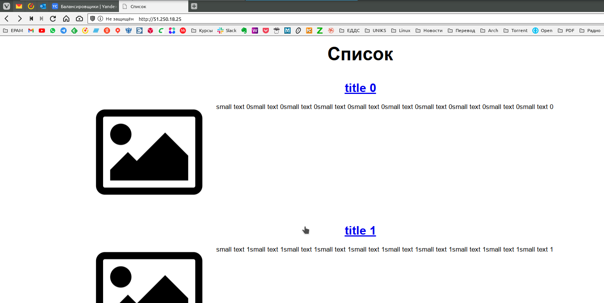

# Домашняя работа к занятию "13.1 контейнеры, поды, deployment, statefulset, services, endpoints"

Настроив кластер, подготовьте приложение к запуску в нём. Приложение стандартное: бекенд, фронтенд, база данных. Его можно найти в папке 13-kubernetes-config.

## Задание 1: подготовить тестовый конфиг для запуска приложения

Для начала следует подготовить запуск приложения в stage окружении с простыми настройками. Требования:

* под содержит в себе 2 контейнера — фронтенд, бекенд;
* регулируется с помощью deployment фронтенд и бекенд;
* база данных — через statefulset.

**ОТВЕТ:** Попробуем выполнить домашнюю работу на кластере Kubernetes, предлагаемом Яндекс.Облаком:  

[](./Screenshot_20220201_140200.png)  
[](./Screenshot_20220201_140342.png)  

Для начала подготовим образы для запуска и их будем потом использовать в kubernetes:  

```bash
wizard:backend/ (main) $ docker build -t tabwizard/backend:latest .

wizard:backend/ (main) $ docker push tabwizard/backend

wizard:frontend/ (main) $ docker build -t tabwizard/frontend:latest .

wizard:frontend/ (main) $ docker push tabwizard/frontend
```

Подготовим **[конфиг для deployment и statefulset](./task_1.yml)**:  

```yaml
---
apiVersion: apps/v1
kind: Deployment
metadata:
  name: backfront-deployment
  labels:
    app: backfront
spec:
  replicas: 1
  selector:
    matchLabels:
      app: backfront
  template:
    metadata:
      name: backfront
      labels:
        app: backfront
    spec:
      containers:
      - name: backend
        image: tabwizard/backend:latest
        ports:
        - containerPort: 9000
      - name: frontend
        image: tabwizard/frontend:latest
        ports:
        - containerPort: 80
---
apiVersion: apps/v1
kind: StatefulSet
metadata:
  name: db-app
spec:
  selector:
    matchLabels:
      app: db-app
  serviceName: "db"
  replicas: 1
  template:
    metadata:
      labels:
        app: db-app
    spec:
      containers:
      - name: db-app
        image: postgres:13-alpine
        ports:
        - containerPort: 5432
        env:
          - name: POSTGRES_PASSWORD
            value: postgres
          - name: POSTGRES_USER
            value: postgres
          - name: POSTGRES_DB
            value: news
          - name: PGDATA
            value: "/data/pgdata"
```

Применим созданный файл:  

[](./Screenshot_20220201_140626.png)  

## Задание 2: подготовить конфиг для production окружения

Следующим шагом будет запуск приложения в production окружении. Требования сложнее:

* каждый компонент (база, бекенд, фронтенд) запускаются в своем поде, регулируются отдельными deployment’ами;
* для связи используются service (у каждого компонента свой);
* в окружении фронта прописан адрес сервиса бекенда;
* в окружении бекенда прописан адрес сервиса базы данных.

**ОТВЕТ:** Создадим в Яндекс.Облаке балансировщик для доступа к нашим сервисам снаружи:  
[](./Screenshot_20220201_200630.png)
Поправим файл `.env` у фронтенда, поместим туда адрес нашего балансировщика и пересоберем образ для фронта.  

```bash
wizard:frontend/ (main✗) $ docker build -t tabwizard/front .

wizard:frontend/ (main✗) $ docker push tabwizard/front
```

Создадим **[конфиг](./task_2.yml)** с манифестами deployment`ов, service, statefulset и т.д., сделаем в сервисах фронта и бэка ноде-порт для доступа снаружи через балансировщик:  

```yaml
---
apiVersion: v1
kind: Service
metadata:
  labels:
    app: db
  name: db
spec:
  ports:
    - name: "5432"
      port: 5432
      targetPort: 5432
  selector:
    app: db-app
    
---
apiVersion: apps/v1
kind: StatefulSet
metadata:
  name: db-app
spec:
  selector:
    matchLabels:
      app: db-app
  serviceName: "db"
  replicas: 1
  template:
    metadata:
      labels:
        app: db-app
    spec:
      containers:
      - name: db-app
        image: postgres:13-alpine
        ports:
        - containerPort: 5432
        env:
          - name: POSTGRES_PASSWORD
            value: postgres
          - name: POSTGRES_USER
            value: postgres
          - name: POSTGRES_DB
            value: news
          - name: PGDATA
            value: "/data/pgdata"
            
---
apiVersion: v1
kind: Service
metadata:
  labels:
    app: backend
  name: backend
spec:
  ports:
    - name: "9000"
      port: 9000
      targetPort: 9000
      nodePort: 30090
  type: NodePort
  selector:
    app: backend-app
            
---          
apiVersion: apps/v1
kind: Deployment
metadata:
  labels:
    app: backend-app
  name: backend-app
spec:
  replicas: 1
  selector:
    matchLabels:
      app: backend-app
  template:
    metadata:
      labels:
        app: backend-app
    spec:
      containers:
        - image: tabwizard/backend
          name: backend-app
          ports:
            - containerPort: 9000
          env:
            - name: DATABASE_URL
              value: postgres://postgres:postgres@db:5432/news  
              
---              
apiVersion: v1
kind: Service
metadata:
  labels:
    app: frontend
  name: frontend
spec:
  ports:
    - name: "8000"
      port: 8000
      targetPort: 80
      nodePort: 30080
  type: NodePort
  selector:
    app: frontend-app              
              
---              
apiVersion: apps/v1
kind: Deployment
metadata:
  labels:
    app: frontend-app
  name: frontend-app
spec:
  replicas: 1
  selector:
    matchLabels:
      app: frontend-app
  template:
    metadata:
      labels:
        app: frontend-app
    spec:
      containers:
        - image: tabwizard/front
          name: frontend-app
          ports:
            - containerPort: 80
          env:
            - name: BASE_URL
              value: http://51.250.18.25:9000              

```

Применим созданный файл:  

[](./Screenshot_20220201_200457.png)  

Проверим работу приложения в браузере:  

[](./Screenshot_20220201_200553.png)  

## Задание 3 (*): добавить endpoint на внешний ресурс api

Приложению потребовалось внешнее api, и для его использования лучше добавить endpoint в кластер, направленный на это api. Требования:

* добавлен endpoint до внешнего api (например, геокодер).

**ОТВЕТ:** Добавим endpoint на другой сервер бэкенда (**[task_3.yml](./task_3.yml)**):

```yaml
---
apiVersion: v1
kind: Endpoints
metadata:
  name: backend-app
subsets: 
  - addresses:
      - ip: 209.191.122.70
    ports:
      - port: 9000
        name: backend
```

[](./Screenshot_20220201_151235.png)  

---

### Как оформить ДЗ?

Выполненное домашнее задание пришлите ссылкой на .md-файл в вашем репозитории.

В качестве решения прикрепите к ДЗ конфиг файлы для деплоя. Прикрепите скриншоты вывода команды kubectl со списком запущенных объектов каждого типа (pods, deployments, statefulset, service) или скриншот из самого Kubernetes, что сервисы подняты и работают.

---
