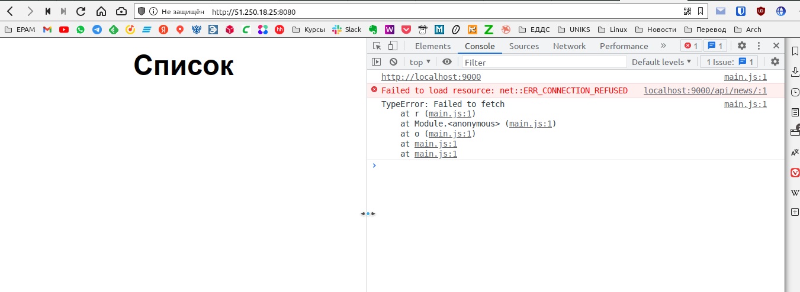
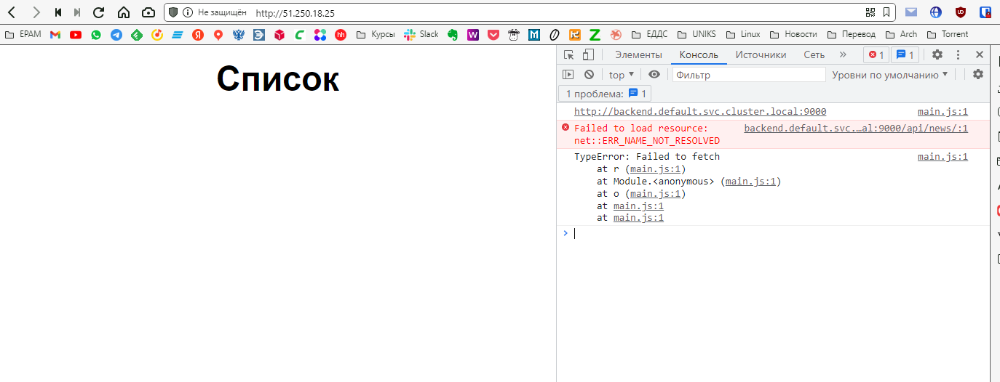

# Доработка по домашней работе к занятию "13.1 контейнеры, поды, deployment, statefulset, services, endpoints"

## Преподаватель Андрей Копылов:

### Добрый день

Все выглядит отлично. Но есть два замечания:

1. В первом задании не определены сервисы. Как вы будете обращаться к БД?
2. Во втором задании используются сервисы типа NodePort. Вы точно хотите эти сервисы вытащить за пределы кластера? Особенно БД.

### ОТВЕТ

 1. В первом задании ни слова не сказано о сервисах, я думал нужно ***подготовить*** конфиг в соответствии с требованиями. Не обратил внимание на требование к `окружению`, исправляюсь, создадим для начала неймспейсы (**[ns.yml](./ns.yml)**). Если в первое задание добавить сервисы, оно превратится во второе (ну разве что деплоймент для фронта и бэка будет 1, а не 2), но хорошо (**[task_1_1.yml](./task_1_1.yml)**). Данная конструкция не работает, нет связи фронта с бэком (см п. 2):  

```yaml
---              
apiVersion: v1
kind: Service
metadata:
  name: frontend
  namespace: stage
  labels:
    app: frontend
spec:
  ports:
    - name: "8000"
      port: 8000
      targetPort: 80
      nodePort: 30088
  type: NodePort
  selector:
    app: backfront   
    
---              
apiVersion: v1
kind: Service
metadata:
  name: backend
  namespace: stage
  labels:
    app: backend
spec:
  ports:
    - name: "9000"
      port: 9000
      targetPort: 9000
  selector:
    app: backfront   
    
---
apiVersion: apps/v1
kind: Deployment
metadata:
  name: backfront-deployment
  namespace: stage
  labels:
    app: backfront
spec:
  replicas: 1
  selector:
    matchLabels:
      app: backfront
  template:
    metadata:
      name: backfront
      labels:
        app: backfront
    spec:
      containers:
      - name: backend
        image: tabwizard/backend:latest
        ports:
        - containerPort: 9000
      - name: frontend
        image: tabwizard/frontend:latest
        ports:
        - containerPort: 80

---
apiVersion: v1
kind: Service
metadata:
  name: db
  namespace: stage
  labels:
    app: db
spec:
  ports:
    - name: "5432"
      port: 5432
      targetPort: 5432
  selector:
    app: db-app        
---
apiVersion: apps/v1
kind: StatefulSet
metadata:
  name: db-app
  namespace: stage
  labels:
    app: db-app
spec:
  selector:
    matchLabels:
      app: db-app
  serviceName: "db"
  replicas: 1
  template:
    metadata:
      labels:
        app: db-app
    spec:
      containers:
      - name: db-app
        image: postgres:13-alpine
        ports:
        - containerPort: 5432
        env:
          - name: POSTGRES_PASSWORD
            value: postgres
          - name: POSTGRES_USER
            value: postgres
          - name: POSTGRES_DB
            value: news
          - name: PGDATA
            value: "/data/pgdata"
```  

[](./Screenshot_20220202_071533.png)  

 2. Во-первых **БД** за пределы кластера я **НЕ** вытаскивал (бэкенд прекрасно работает с базой внутри кластера по имени сервиса), я вытащил фронт, потому что нужно как-то на проде открывать приложение с обычных пользовательских компьютеров, а так же вытащил бэк, потому что не придумал как по другому заставить фронт, выполняющийся в браузере на пользовательском компьютере, обратиться к бэку внутри кластера. Первой мыслью ([task_2_1.yml](./task_2_1.yml)) было сделать сервис для бэка "backend" и указать в env фронта BASE_URL=<http://backend:9000>, но эта конструкция не работает, фронт на пользовательском компьютере не может во-первых отрезолвить `backend:9000`, а во-вторых попасть с пользовательского компьютера внутрь кластера к бэку. Внутри кластера, кстати, сервис `backend` нормально резолвится, я заходил внутрь пода фронтенда и там команда `curl http://backend:9000` прекрасно работает.  
   
   Я не веб-программист (чему несказанно рад) и не знаю как принято решать проблеммы доступа с фронтэнда к бэкенду. Научите меня, как нужно настроить кластер kubernetes в данной ситуации, если не переписывать приложения для использования относительных путей для api вместо base_url и не проксировать эти запросы внутрь на сервис бэкенда, это всё точно не относится к настройке кластера и теме занятия.  
   Ещё один момент, почему-то ENV передаваемые в манифесте в контейнер фронтенда (env:   - name: BASE_URL      value: http://backend:9000) абсолютно не влияют на выполнение приложения фронтенда, с каким содержимым файла `.ENV` был скомпилирован образ фронтенда, то значение и используется в приложении. Хотя если зайти внутрь пода фронтенда и посмотреть, то переменная передается правильно, например в `.ENV` файле образа было `BASE_URL=http://backend.default.svc.cluster.local:9000` а в манифесте `env:   - name: BASE_URL      value: http://backend:9000`:

```bash
root@frontend-app-866b46d959-pdnvp:/app# env
KUBERNETES_SERVICE_PORT_HTTPS=443
KUBERNETES_SERVICE_PORT=443
BASE_URL=http://backend:9000
HOSTNAME=frontend-app-866b46d959-pdnvp
DB_PORT_5432_TCP_ADDR=10.233.58.253
BACKEND_PORT_9000_TCP_ADDR=10.233.38.2
FRONTEND_PORT_8000_TCP_PORT=8000
FRONTEND_SERVICE_PORT_8000=8000


root@frontend-app-866b46d959-pdnvp:/app# curl http://backend:9000/api/news/1
{"id":1,"title":"title 0","short_description":"small text 0small text 0small text 0small text 0small text 0small text 0small text 0small text 0small text 0small text 0","description":"0 some more text, 0 some more text, 0 some more text, 0 some more text, 0 some more text, 0 some more text, 0 some more text, 0 some more text, 0 some more text, 0 some more text, 0 some more text, 0 some more text, 0 some more text, 0 some more text, 0 some more text, 0 some more text, 0 some more text, 0 some more text, 0 some more text, 0 some more text, 0 some more text, 0 some more text, 0 some more text, 0 some more text, 0 some more text, 0 some more text, 0 some more text, 0 some more text, 0 some more text, 0 some more text, 0 some more text, 0 some more text, 0 some more text, 0 some more text, 0 some more text, 0 some more text, 0 some more text, 0 some more text, 0 some more text, 0 some more text, 0 some more text, 0 some more text, 0 some more text, 0 some more text, 0 some more text, 0 some more text, 0 some more text, 0 some more text, 0 some more text, 0 some more text, 0 some more text, 0 some more text, 0 some more text, 0 some more text, 0 some more text, 0 some more text, 0 some more text, 0 some more text, 0 some more text, 0 some more text, 0 some more text, 0 some more text, 0 some more text, 0 some more text, 0 some more text, 0 some more text, 0 some more text, 0 some more text, 0 some more text, 0 some more text, 0 some more text, 0 some more text, 0 some more text, 0 some more text, 0 some more text, 0 some more text, 0 some more text, 0 some more text, 0 some more text, 0 some more text, 0 some more text, 0 some more text, 0 some more text, 0 some more text, 0 some more text, 0 some more text, 0 some more text, 0 some more text, 0 some more text, 0 some more text, 0 some more text, 0 some more text, 0 some more text, 0 some more text, 0 some more text, 0 some more text, 0 some more text, 0 some more text, 0 some more text, 0 some more text, ","preview":"/static/image.png"}
```
[](./Screenshot_20220202_085540.png)

P.S.: И, предупреждая вопросы, я всё это делал и проверял в дефротном неймспейса, это не из-за неймспейса.
