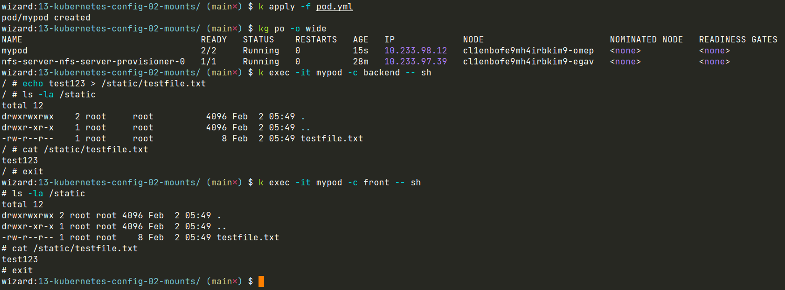
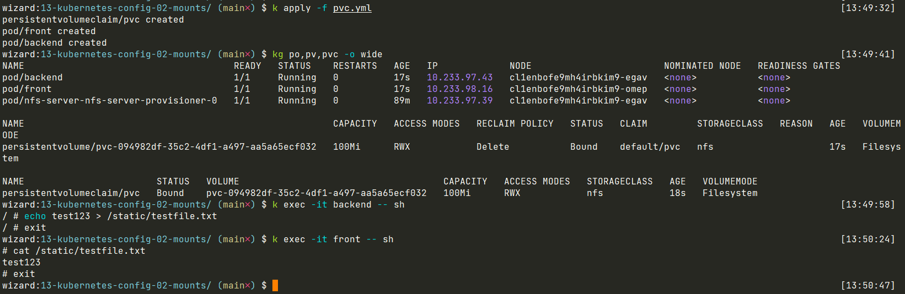

# Домашняя работа к занятию "13.2 разделы и монтирование"

Приложение запущено и работает, но время от времени появляется необходимость передавать между бекендами данные. А сам бекенд генерирует статику для фронта. Нужно оптимизировать это.
Для настройки NFS сервера можно воспользоваться следующей инструкцией (производить под пользователем на сервере, у которого есть доступ до kubectl):

* установить helm: curl <https://raw.githubusercontent.com/helm/helm/master/scripts/get-helm-3> | bash
* добавить репозиторий чартов: helm repo add stable <https://charts.helm.sh/stable> && helm repo update
* установить nfs-server через helm: helm install nfs-server stable/nfs-server-provisioner

В конце установки будет выдан пример создания PVC для этого сервера.

## Задание 1: подключить для тестового конфига общую папку

В stage окружении часто возникает необходимость отдавать статику бекенда сразу фронтом. Проще всего сделать это через общую папку. Требования:

* в поде подключена общая папка между контейнерами (например, /static);
* после записи чего-либо в контейнере с беком файлы можно получить из контейнера с фронтом.

**ОТВЕТ:** Создали **[конфиг для пода](./pod.yml)** и проверили работу общей папки:  

```yaml
apiVersion: v1
kind: Pod
metadata:
  name: mypod
spec:
  volumes:
  - name: shared
    emptyDir: {}
  containers:
  - name: front
    image: nginx
    volumeMounts:
    - name: shared
      mountPath: /static
  - name: backend
    image: alpine
    volumeMounts:
    - name: shared
      mountPath: /static
    command: [ "/bin/sh", "-c", "--" ]
    args: [ "while true; do sleep 30; done;" ]
```  

[](./Screenshot_20220202_125120.png)  

## Задание 2: подключить общую папку для прода

Поработав на stage, доработки нужно отправить на прод. В продуктиве у нас контейнеры крутятся в разных подах, поэтому потребуется PV и связь через PVC. Сам PV должен быть связан с NFS сервером. Требования:

* все бекенды подключаются к одному PV в режиме ReadWriteMany;
* фронтенды тоже подключаются к этому же PV с таким же режимом;
* файлы, созданные бекендом, должны быть доступны фронту.

**ОТВЕТ:** Воспользуемся способностью `nfs-server` создавать `pv` "по требованию" и напишем следующий файл (**[pvc.yml](./pvc.yml)**) и проверим работу общего доступа к файлам между разными подами на разных нодах:  

```yaml
---
apiVersion: v1
kind: PersistentVolumeClaim
metadata:
  name: pvc
spec:
  storageClassName: "nfs"
  accessModes:
    - ReadWriteMany
  resources:
    requests:
      storage: 100Mi

---
apiVersion: v1
kind: Pod
metadata:
  name: front
spec:
  containers:
    - name: front
      image: nginx
      volumeMounts:
        - mountPath: "/static"
          name: front-volume
  volumes:
    - name: front-volume
      persistentVolumeClaim:
        claimName: pvc

---
apiVersion: v1
kind: Pod
metadata:
  name: backend
spec:
  containers:
    - name: backend
      image: alpine
      volumeMounts:
        - mountPath: "/static"
          name: backend-volume
      command: [ "/bin/sh", "-c", "--" ]
      args: [ "while true; do sleep 30; done;" ]
  volumes:
    - name: backend-volume
      persistentVolumeClaim:
        claimName: pvc
```  

[](./Screenshot_20220202_135205.png)  

---

### Как оформить ДЗ?

Выполненное домашнее задание пришлите ссылкой на .md-файл в вашем репозитории.

---
