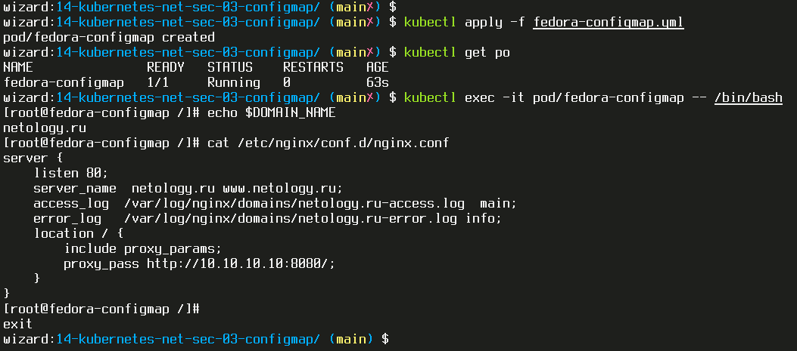

# Домашняя работа к занятию "14.3 Карты конфигураций"

## Задача 1: Работа с картами конфигураций через утилиту kubectl в установленном minikube

Выполните приведённые команды в консоли. Получите вывод команд. Сохраните
задачу 1 как справочный материал.

**Как создать карту конфигураций?**

```bash
kubectl create configmap nginx-config --from-file=nginx.conf
kubectl create configmap domain --from-literal=name=netology.ru
```

**Как просмотреть список карт конфигураций?**

```bash
kubectl get configmaps
kubectl get configmap
```

**Как просмотреть карту конфигурации?**

```bash
kubectl get configmap nginx-config
kubectl describe configmap domain
```

**Как получить информацию в формате YAML и/или JSON?**

```bash
kubectl get configmap nginx-config -o yaml
kubectl get configmap domain -o json
```

**Как выгрузить карту конфигурации и сохранить его в файл?**

```bash
kubectl get configmaps -o json > configmaps.json
kubectl get configmap nginx-config -o yaml > nginx-config.yml
```

**Как удалить карту конфигурации?**

```bash
kubectl delete configmap nginx-config
```

**Как загрузить карту конфигурации из файла?**

```bash
kubectl apply -f nginx-config.yml
```  

**ОТВЕТ:**  
Создаем карту конфигураций:

```bash
wizard:14-kubernetes-net-sec-03-configmap/ (main✗) $ kubectl create configmap nginx-config --from-file=nginx.conf
configmap/nginx-config created

wizard:14-kubernetes-net-sec-03-configmap/ (main✗) $ kubectl create configmap domain --from-literal=name=netology.ru
configmap/domain created
```

Смотрим список карт конфигураций:

```bash
wizard:14-kubernetes-net-sec-03-configmap/ (main✗) $ kubectl get configmaps
NAME               DATA   AGE
domain             1      110s
kube-root-ca.crt   1      5d22h
nginx-config       1      2m3s

wizard:14-kubernetes-net-sec-03-configmap/ (main✗) $ kubectl get configmap
NAME               DATA   AGE
domain             1      113s
kube-root-ca.crt   1      5d22h
nginx-config       1      2m6s

```

Смотрим карту конфигураций:

```bash
wizard:14-kubernetes-net-sec-03-configmap/ (main✗) $ kubectl get configmap nginx-config
NAME           DATA   AGE
nginx-config   1      3m21s

wizard:14-kubernetes-net-sec-03-configmap/ (main✗) $ kubectl describe configmap domain
Name:         domain
Namespace:    default
Labels:       <none>
Annotations:  <none>

Data
====
name:
----
netology.ru

BinaryData
====

Events:  <none>
```

Получаем информацию в формате YAML и/или JSON:

```bash
wizard:14-kubernetes-net-sec-03-configmap/ (main✗) $ kubectl get configmap nginx-config -o yaml
apiVersion: v1
data:
  nginx.conf: |
    server {
        listen 80;
        server_name  netology.ru www.netology.ru;
        access_log  /var/log/nginx/domains/netology.ru-access.log  main;
        error_log   /var/log/nginx/domains/netology.ru-error.log info;
        location / {
            include proxy_params;
            proxy_pass http://10.10.10.10:8080/;
        }
    }
kind: ConfigMap
metadata:
  creationTimestamp: "2022-03-18T02:40:01Z"
  name: nginx-config
  namespace: default
  resourceVersion: "153833"
  uid: e283f9b4-4014-4d86-9188-290d4aef9533

wizard:14-kubernetes-net-sec-03-configmap/ (main✗) $ kubectl get configmap domain -o json
{
    "apiVersion": "v1",
    "data": {
        "name": "netology.ru"
    },
    "kind": "ConfigMap",
    "metadata": {
        "creationTimestamp": "2022-03-18T02:40:14Z",
        "name": "domain",
        "namespace": "default",
        "resourceVersion": "153845",
        "uid": "1d6527b5-bbb8-435b-a41c-89cf2adc0834"
    }
}
```

Выгружаем карту конфигурации и сохраняем его в файл:

```bash
wizard:14-kubernetes-net-sec-03-configmap/ (main✗) $ kubectl get configmaps -o json > configmaps.json

wizard:14-kubernetes-net-sec-03-configmap/ (main✗) $ cat configmaps.json
{
    "apiVersion": "v1",
    "items": [
        {
            "apiVersion": "v1",
            "data": {
                "name": "netology.ru"
            },
            "kind": "ConfigMap",
            "metadata": {
                "creationTimestamp": "2022-03-18T02:40:14Z",
                "name": "domain",
                "namespace": "default",
                "resourceVersion": "153845",
                "uid": "1d6527b5-bbb8-435b-a41c-89cf2adc0834"
            }
        },
        {
            "apiVersion": "v1",
            "data": {
                "ca.crt": "-----BEGIN CERTIFICATE-----\nMIIDBjCCAe6gAwIBAgIBATANBgkqhkiG9w0BAQsFADAVMRMwEQYDVQQDEwptaW5p\na3ViZUNBMB4XDTIxMTIyMDA3MzM0NVoXDTMxMTIxOTA3MzM0NVowFTETMBEGA1UE\nAxMKbWluaWt1YmVDQTCCASIwDQYJKoZIhvcNAQEBBQADggEPADCCAQoCggEBAOez\n5/ZQzVXEUm3OpB8OU5XbuFKKM8HtTKOD6F/oZDOyg8Dp4cuE4Kx2eP4stZXILAx1\n5uc7Z6yo6YvyyQHuJ0DvvlqofGJZr3ITqUDgdQdaes2h3thagX0xRBM3oNExXXd2\nqsfHk6svU10w4WZ7A5I6S6DvhKapwvFp0RvHaIo3ZWMszYKvRm82CKRk8ylS3KJq\nOtt55eoBw3/cmOCkWvfCVLKkDMsINnS1eNdQVeOGwY1nKtQ1KhJ+rK398WFnff/j\na5NSEjmX6+Seo50V6Ob4BWWixlMCJJdAI/ftDQdv9u160wyo0bB2NJ7jILc5KjIf\nUoXxwdvVYw0P+6kwxjMCAwEAAaNhMF8wDgYDVR0PAQH/BAQDAgKkMB0GA1UdJQQW\nMBQGCCsGAQUFBwMCBggrBgEFBQcDATAPBgNVHRMBAf8EBTADAQH/MB0GA1UdDgQW\nBBRu2SnNic+FtYTe7jQWidKBEzNWUDANBgkqhkiG9w0BAQsFAAOCAQEAtOOWH1s0\n+lphiE6zRVj38k1QuaeI0sKwE5/BW8V3tJolF1G6+Lb99gw5AV2CWb18jU7lNkB6\nzIeO37QAxlQniwWDTsceZlM7dMxsFrfymJ8kY4ArCljqMMPDsTGnttCfqxHMSjoN\n5QHFzDIXHggT3AxyhCDd1vexaecDZ5whRqBE6JRfH2Gv2k2JxRoYVRCgLPzMgj1G\neftgtJFcxtxbvI9J3y4YbfZENuR1F2HESQ/uLSBbQ0g8rlIBLnQFAeYOq45dydIg\nxCyvXh3npHioK99+qKbWhpJtyZDJWr2q/p7TqPYegFxuXdrE3BHdqpD1xlQIt+om\nisKT9UUYAYVC6g==\n-----END CERTIFICATE-----\n"
            },
            "kind": "ConfigMap",
            "metadata": {
                "annotations": {
                    "kubernetes.io/description": "Contains a CA bundle that can be used to verify the kube-apiserver when using internal endpoints such as the internal service IP or kubernetes.default.svc. No other usage is guaranteed across distributions of Kubernetes clusters."
                },
                "creationTimestamp": "2022-03-12T03:52:35Z",
                "name": "kube-root-ca.crt",
                "namespace": "default",
                "resourceVersion": "397",
                "uid": "a8ddd1a1-9c58-4591-ac02-c8d3be3c9ec8"
            }
        },
        {
            "apiVersion": "v1",
            "data": {
                "nginx.conf": "server {\n    listen 80;\n    server_name  netology.ru www.netology.ru;\n    access_log  /var/log/nginx/domains/netology.ru-access.log  main;\n    error_log   /var/log/nginx/domains/netology.ru-error.log info;\n    location / {\n        include proxy_params;\n        proxy_pass http://10.10.10.10:8080/;\n    }\n}\n"
            },
            "kind": "ConfigMap",
            "metadata": {
                "creationTimestamp": "2022-03-18T02:40:01Z",
                "name": "nginx-config",
                "namespace": "default",
                "resourceVersion": "153833",
                "uid": "e283f9b4-4014-4d86-9188-290d4aef9533"
            }
        }
    ],
    "kind": "List",
    "metadata": {
        "resourceVersion": "",
        "selfLink": ""
    }
}

wizard:14-kubernetes-net-sec-03-configmap/ (main✗) $ kubectl get configmap nginx-config -o yaml > nginx-config.yml

wizard:14-kubernetes-net-sec-03-configmap/ (main✗) $ cat nginx-config.yml
apiVersion: v1
data:
  nginx.conf: |
    server {
        listen 80;
        server_name  netology.ru www.netology.ru;
        access_log  /var/log/nginx/domains/netology.ru-access.log  main;
        error_log   /var/log/nginx/domains/netology.ru-error.log info;
        location / {
            include proxy_params;
            proxy_pass http://10.10.10.10:8080/;
        }
    }
kind: ConfigMap
metadata:
  creationTimestamp: "2022-03-18T02:40:01Z"
  name: nginx-config
  namespace: default
  resourceVersion: "153833"
  uid: e283f9b4-4014-4d86-9188-290d4aef9533
```

Удаляем карту конфигураций:

```bash
wizard:14-kubernetes-net-sec-03-configmap/ (main✗) $ kubectl delete configmap nginx-config
configmap "nginx-config" deleted

wizard:14-kubernetes-net-sec-03-configmap/ (main✗) $ kubectl get configmap
NAME               DATA   AGE
domain             1      9m9s
kube-root-ca.crt   1      5d22h
```

Загружаем карту конфигураций из файла:

```bash
wizard:14-kubernetes-net-sec-03-configmap/ (main✗) $ kubectl apply -f nginx-config.yml
configmap/nginx-config created

wizard:14-kubernetes-net-sec-03-configmap/ (main✗) $ kubectl get configmap
NAME               DATA   AGE
domain             1      10m
kube-root-ca.crt   1      5d22h
nginx-config       1      2s

```

## Задача 2 (*): Работа с картами конфигураций внутри модуля

Выбрать любимый образ контейнера, подключить карты конфигураций и проверить их доступность как в виде переменных окружения, так и в виде примонтированного тома

**ОТВЕТ:**  
Будем использовать уже существующие карты конфигураций:

```bash
wizard:14-kubernetes-net-sec-03-configmap/ (main✗) $ kubectl get configmap
NAME               DATA   AGE
domain             1      25m
kube-root-ca.crt   1      5d23h
nginx-config       1      15m
```  

Значение из карты конфигураций `domain` подключим как переменную окружения `DOMAIN_NAME`, а `nginx-config` как примонтированный том.  

Создадим **[манифест](./fedora-configmap.yml)** для проверки:

```yaml
apiVersion: v1
kind: Pod
metadata:
  name: fedora-configmap
spec:
  containers:
  - name: fedora-configmap
    image: fedora:latest
    command: ['/bin/bash', '-c']
    args: ["sleep 60000"]
    env:
    - name: DOMAIN_NAME
      valueFrom:
        configMapKeyRef:
          name: domain
          key: name
    envFrom:
    - configMapRef:
        name: domain
    volumeMounts:
    - name: config
      mountPath: /etc/nginx/conf.d
      readOnly: true
  restartPolicy: Never
  volumes:
  - name: config
    configMap:
      name: nginx-config
```  

Запустим наш под с fedor-ой и проверим что получилось:

```bash
wizard:14-kubernetes-net-sec-03-configmap/ (main✗) $ kubectl apply -f fedora-configmap.yml
pod/fedora-configmap created

wizard:14-kubernetes-net-sec-03-configmap/ (main✗) $ kubectl get po
NAME               READY   STATUS    RESTARTS   AGE
fedora-configmap   1/1     Running   0          63s

wizard:14-kubernetes-net-sec-03-configmap/ (main✗) $ kubectl exec -it pod/fedora-configmap -- /bin/bash

[root@fedora-configmap /]# echo $DOMAIN_NAME
netology.ru

[root@fedora-configmap /]# cat /etc/nginx/conf.d/nginx.conf 
server {
    listen 80;
    server_name  netology.ru www.netology.ru;
    access_log  /var/log/nginx/domains/netology.ru-access.log  main;
    error_log   /var/log/nginx/domains/netology.ru-error.log info;
    location / {
        include proxy_params;
        proxy_pass http://10.10.10.10:8080/;
    }
}
```  

  

---

### Как оформить ДЗ?

Выполненное домашнее задание пришлите ссылкой на .md-файл в вашем репозитории.

В качестве решения прикрепите к ДЗ конфиг файлы для деплоя. Прикрепите скриншоты вывода команды kubectl со списком запущенных объектов каждого типа (pods, deployments, configmaps) или скриншот из самого Kubernetes, что сервисы подняты и работают, а также вывод из CLI.

---
