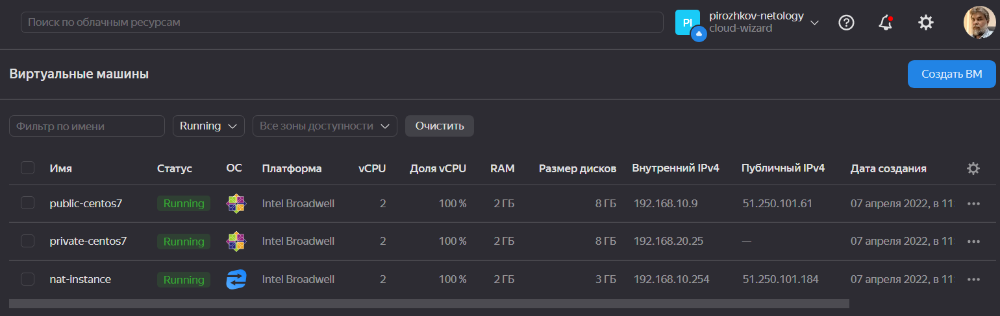
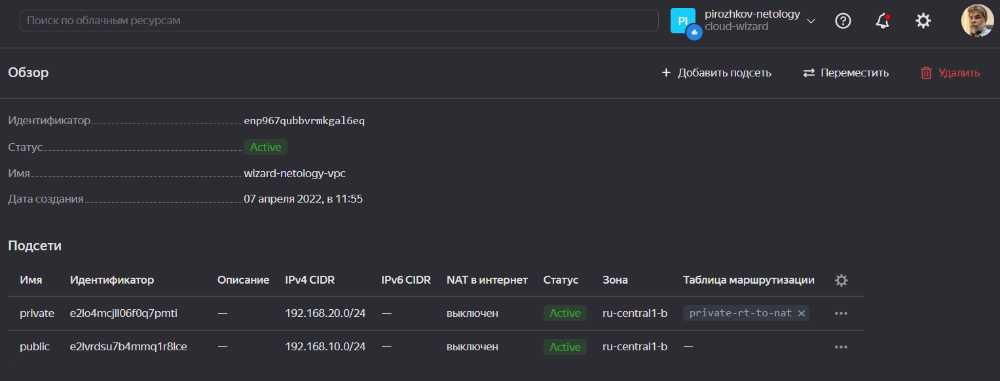

# Домашнее задание к занятию "15.1. Организация сети"

Домашнее задание будет состоять из обязательной части, которую необходимо выполнить на провайдере Яндекс.Облако и дополнительной части в AWS по желанию. Все домашние задания в 15 блоке связаны друг с другом и в конце представляют пример законченной инфраструктуры.  
Все задания требуется выполнить с помощью Terraform, результатом выполненного домашнего задания будет код в репозитории.

Перед началом работ следует настроить доступ до облачных ресурсов из Terraform используя материалы прошлых лекций и [ДЗ](https://github.com/netology-code/virt-homeworks/tree/master/07-terraform-02-syntax ). А также заранее выбрать регион (в случае AWS) и зону.

---

## Задание 1. Яндекс.Облако (обязательное к выполнению)

1. Создать VPC.

- Создать пустую VPC. Выбрать зону.

2. Публичная подсеть.

- Создать в vpc subnet с названием public, сетью 192.168.10.0/24.
- Создать в этой подсети NAT-инстанс, присвоив ему адрес 192.168.10.254. В качестве image_id использовать fd80mrhj8fl2oe87o4e1
- Создать в этой публичной подсети виртуалку с публичным IP и подключиться к ней, убедиться что есть доступ к интернету.

3. Приватная подсеть.

- Создать в vpc subnet с названием private, сетью 192.168.20.0/24.
- Создать route table. Добавить статический маршрут, направляющий весь исходящий трафик private сети в NAT-инстанс
- Создать в этой приватной подсети виртуалку с внутренним IP, подключиться к ней через виртуалку, созданную ранее и убедиться что есть доступ к интернету

Resource terraform для ЯО

- [VPC subnet](https://registry.terraform.io/providers/yandex-cloud/yandex/latest/docs/resources/vpc_subnet)
- [Route table](https://registry.terraform.io/providers/yandex-cloud/yandex/latest/docs/resources/vpc_route_table)
- [Compute Instance](https://registry.terraform.io/providers/yandex-cloud/yandex/latest/docs/resources/compute_instance)

**ОТВЕТ:** Создадим **[манифест terraform](./main.tf)** и применим его:

```bash
wizard:15-cloud-service-providers-01-networks/ (main✗) $ terraform apply

Terraform used the selected providers to generate the following execution plan. Resource actions are indicated with the following symbols:
  + create

Terraform will perform the following actions:

  # yandex_compute_instance.nat-instance will be created
  + resource "yandex_compute_instance" "nat-instance" {
      + created_at                = (known after apply)
      + folder_id                 = (known after apply)
      + fqdn                      = (known after apply)
      + hostname                  = "nat-instance"
      + id                        = (known after apply)
      + metadata                  = {
          + "user-data" = <<-EOT
                #cloud-config
                users:
                  - name: wizard
                    groups: sudo
                    shell: /bin/bash
                    sudo: ['ALL=(ALL) NOPASSWD:ALL']
                    ssh-authorized-keys:
                      - ssh-rsa AAAAB3NzaC1yc2EAAAADAQABAAABgQC+v4xsQEddhyezXEasbSWpzTBcyrFGuc+cIikz+2g1/jAAbAFbZesovuGN/L4kC57idYyUUWziUzUnvq3Uu3oBeLZTBbSfxqBVC9FPV2B/T2HwKgu7sOWZytdoWtjiXWPcPdkQiY1+jS5+JK9lcgh7fRnqI7z6XDYeGKH9XXzP+2fM7CmVz0CmjM0sXWxDc8C1Gguy3cJ9HV+zGDeUjiooPRzxm7Tz4OQ3ipv+SxxVKjAjaDlCnqaj5uGtF2xg6vkR7ot+W8PfvALzbWtIjBJE4a25jp0eWFiGrMMOOIrqP5g7DnZaM1zSpMa0j5UAFejK9p/rhFJAHfBzUz20HSKJViLY8cGs0DCuDlkguJFQboa1LDV8rVicWBvYmzaHWFlF0EBUI50cpSklMMktKrWGJ+OfGxS6/AJ4Neu/OrBvZ6XerDHR6sTPRQsXvA3n2kB72FTi3RWT7QHsPAMaAt12TO0chHEn5u1zm85mOAnTWhYHxYbM0Q0NJSTYKONJHuE= wizard@wizard-pc
            EOT
        }
      + name                      = "nat-instance"
      + network_acceleration_type = "standard"
      + platform_id               = "standard-v1"
      + service_account_id        = (known after apply)
      + status                    = (known after apply)
      + zone                      = (known after apply)

      + boot_disk {
          + auto_delete = true
          + device_name = (known after apply)
          + disk_id     = (known after apply)
          + mode        = (known after apply)

          + initialize_params {
              + block_size  = (known after apply)
              + description = (known after apply)
              + image_id    = "fd80mrhj8fl2oe87o4e1"
              + name        = (known after apply)
              + size        = (known after apply)
              + snapshot_id = (known after apply)
              + type        = "network-hdd"
            }
        }

. . .
. . .
. . .

  # yandex_vpc_subnet.public will be created
  + resource "yandex_vpc_subnet" "public" {
      + created_at     = (known after apply)
      + folder_id      = (known after apply)
      + id             = (known after apply)
      + labels         = (known after apply)
      + name           = "public"
      + network_id     = (known after apply)
      + v4_cidr_blocks = [
          + "192.168.10.0/24",
        ]
      + v6_cidr_blocks = (known after apply)
      + zone           = "ru-central1-b"
    }

Plan: 7 to add, 0 to change, 0 to destroy.

Do you want to perform these actions?
  Terraform will perform the actions described above.
  Only 'yes' will be accepted to approve.

  Enter a value: yes

yandex_vpc_network.wizard-netology-vpc: Creating...
yandex_vpc_network.wizard-netology-vpc: Creation complete after 1s [id=enp967qubbvrmkgal6eq]
yandex_vpc_subnet.public: Creating...
yandex_vpc_route_table.private-rt-to-nat: Creating...
yandex_vpc_subnet.public: Creation complete after 1s [id=e2lvrdsu7b4mmq1r8lce]
yandex_compute_instance.nat-instance: Creating...
yandex_compute_instance.public-centos7: Creating...
yandex_vpc_route_table.private-rt-to-nat: Creation complete after 2s [id=enpsdacoqcp0s93gsj8k]
yandex_vpc_subnet.private: Creating...
yandex_vpc_subnet.private: Creation complete after 1s [id=e2lo4mcjll06f0q7pmti]
yandex_compute_instance.private-centos7: Creating...
yandex_compute_instance.public-centos7: Still creating... [10s elapsed]
yandex_compute_instance.nat-instance: Still creating... [10s elapsed]
yandex_compute_instance.private-centos7: Still creating... [10s elapsed]
yandex_compute_instance.public-centos7: Still creating... [20s elapsed]
yandex_compute_instance.nat-instance: Still creating... [20s elapsed]
yandex_compute_instance.private-centos7: Still creating... [20s elapsed]
yandex_compute_instance.private-centos7: Creation complete after 26s [id=epddq7aahl63sg858pst]
yandex_compute_instance.public-centos7: Still creating... [30s elapsed]
yandex_compute_instance.nat-instance: Still creating... [30s elapsed]
yandex_compute_instance.public-centos7: Creation complete after 30s [id=epdahpa4dnpalgg8ctje]
yandex_compute_instance.nat-instance: Still creating... [40s elapsed]
yandex_compute_instance.nat-instance: Still creating... [50s elapsed]
yandex_compute_instance.nat-instance: Creation complete after 50s [id=epdu4ohef6kq0tu84og6]

Apply complete! Resources: 7 added, 0 changed, 0 destroyed.
```  

Подключимся к ВМ в публичной подсети проверим доступность интернет. Затем создадим там закрытый ключ для подключения к ВМ в приватной сети. Подключимся к ВМ в приватной сети и проверим доступность интернет:

```bash
wizard:15-cloud-service-providers-01-networks/ (main✗) $ ssh 51.250.101.61 -i ~/.ssh/yc/yc
The authenticity of host '51.250.101.61 (51.250.101.61)' can't be established.
ED25519 key fingerprint is SHA256:Rsop/v9yvDqVaun2OX8vtKyT+A7rn6R1JYgT6JKbkLU.
This key is not known by any other names
Are you sure you want to continue connecting (yes/no/[fingerprint])? yes
Warning: Permanently added '51.250.101.61' (ED25519) to the list of known hosts.

[wizard@public-centos7 ~]$ ping ya.ru
PING ya.ru (87.250.250.242) 56(84) bytes of data.
64 bytes from ya.ru (87.250.250.242): icmp_seq=1 ttl=251 time=0.790 ms
64 bytes from ya.ru (87.250.250.242): icmp_seq=2 ttl=251 time=0.372 ms
^C
--- ya.ru ping statistics ---
2 packets transmitted, 2 received, 0% packet loss, time 1001ms
rtt min/avg/max/mdev = 0.372/0.581/0.790/0.209 ms

[wizard@public-centos7 ~]$ vi ~/.ssh/yc

[wizard@public-centos7 ~]$ chmod 0600 ~/.ssh/yc

[wizard@public-centos7 ~]$ ssh 192.168.20.25 -i ~/.ssh/yc
The authenticity of host '192.168.20.25 (192.168.20.25)' can't be established.
ECDSA key fingerprint is SHA256:8ReWlDPojVp6cpW9daJiCpg6AvRgoNeC4ChGz7xMae4.
ECDSA key fingerprint is MD5:3c:62:71:fa:75:76:4b:3a:40:5e:4b:94:96:84:bc:1c.
Are you sure you want to continue connecting (yes/no)? yes
Warning: Permanently added '192.168.20.25' (ECDSA) to the list of known hosts.

[wizard@private-centos7 ~]$ ping google.com
PING google.com (74.125.131.139) 56(84) bytes of data.
64 bytes from lu-in-f139.1e100.net (74.125.131.139): icmp_seq=1 ttl=59 time=24.2 ms
64 bytes from lu-in-f139.1e100.net (74.125.131.139): icmp_seq=2 ttl=59 time=23.4 ms
64 bytes from lu-in-f139.1e100.net (74.125.131.139): icmp_seq=3 ttl=59 time=23.4 ms
^C
--- google.com ping statistics ---
3 packets transmitted, 3 received, 0% packet loss, time 2002ms
rtt min/avg/max/mdev = 23.423/23.730/24.297/0.438 ms
```

  


---

## Задание 2*. AWS (необязательное к выполнению)

1. Создать VPC.

- Cоздать пустую VPC с подсетью 10.10.0.0/16.

2. Публичная подсеть.

- Создать в vpc subnet с названием public, сетью 10.10.1.0/24
- Разрешить в данной subnet присвоение public IP по-умолчанию.
- Создать Internet gateway
- Добавить в таблицу маршрутизации маршрут, направляющий весь исходящий трафик в Internet gateway.
- Создать security group с разрешающими правилами на SSH и ICMP. Привязать данную security-group на все создаваемые в данном ДЗ виртуалки
- Создать в этой подсети виртуалку и убедиться, что инстанс имеет публичный IP. Подключиться к ней, убедиться что есть доступ к интернету.
- Добавить NAT gateway в public subnet.

3. Приватная подсеть.

- Создать в vpc subnet с названием private, сетью 10.10.2.0/24
- Создать отдельную таблицу маршрутизации и привязать ее к private-подсети
- Добавить Route, направляющий весь исходящий трафик private сети в NAT.
- Создать виртуалку в приватной сети.
- Подключиться к ней по SSH по приватному IP через виртуалку, созданную ранее в публичной подсети и убедиться, что с виртуалки есть выход в интернет.

Resource terraform

- [VPC](https://registry.terraform.io/providers/hashicorp/aws/latest/docs/resources/vpc)
- [Subnet](https://registry.terraform.io/providers/hashicorp/aws/latest/docs/resources/subnet)
- [Internet Gateway](https://registry.terraform.io/providers/hashicorp/aws/latest/docs/resources/internet_gateway)
