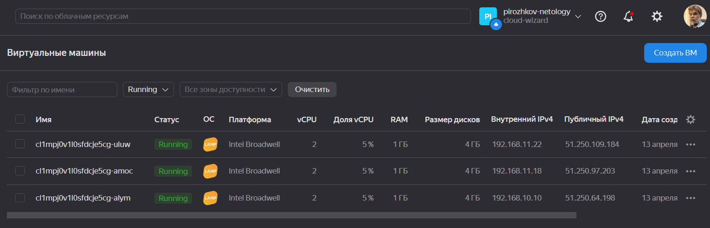
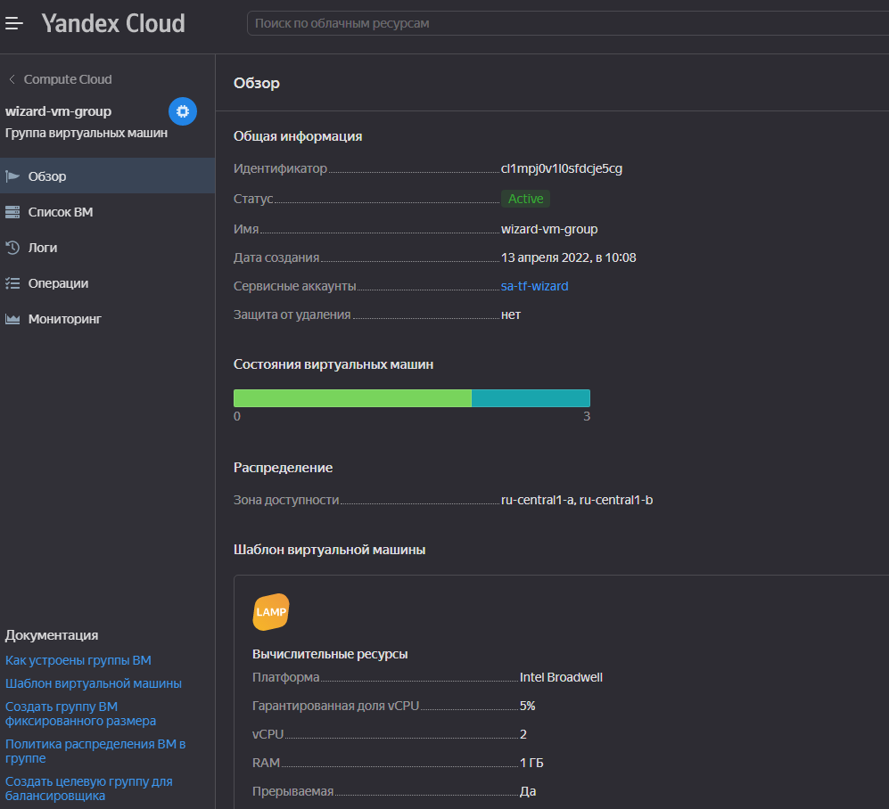
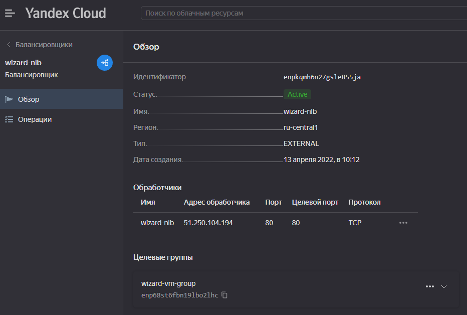
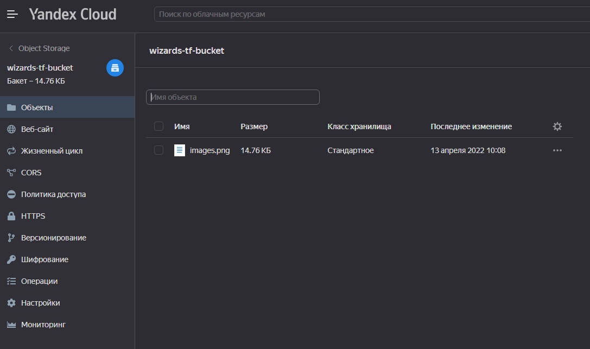
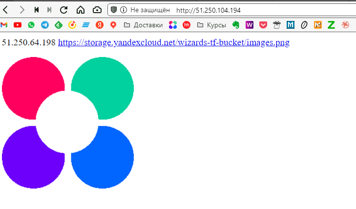
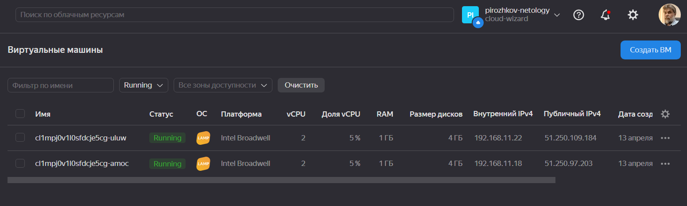
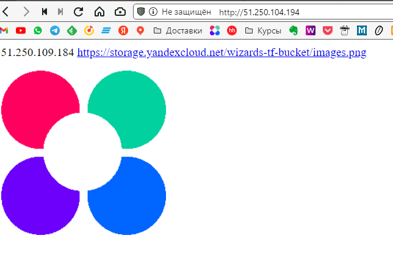

# Домашняя работа к занятию 15.2 "Вычислительные мощности. Балансировщики нагрузки"

Домашнее задание будет состоять из обязательной части, которую необходимо выполнить на провайдере Яндекс.Облако, и дополнительной части в AWS (можно выполнить по желанию). Все домашние задания в 15 блоке связаны друг с другом и в конце представляют пример законченной инфраструктуры.
Все задания требуется выполнить с помощью Terraform, результатом выполненного домашнего задания будет код в репозитории. Перед началом работ следует настроить доступ до облачных ресурсов из Terraform, используя материалы прошлых лекций и ДЗ.

---

## Задание 1. Яндекс.Облако (обязательное к выполнению)

1. Создать bucket Object Storage и разместить там файл с картинкой:

- Создать bucket в Object Storage с произвольным именем (например, _имя_студента_дата_);
- Положить в bucket файл с картинкой;
- Сделать файл доступным из Интернет.

2. Создать группу ВМ в public подсети фиксированного размера с шаблоном LAMP и web-страничкой, содержащей ссылку на картинку из bucket:

- Создать Instance Group с 3 ВМ и шаблоном LAMP. Для LAMP рекомендуется использовать `image_id = fd827b91d99psvq5fjit`;
- Для создания стартовой веб-страницы рекомендуется использовать раздел `user_data` в [meta_data](https://cloud.yandex.ru/docs/compute/concepts/vm-metadata);
- Разместить в стартовой веб-странице шаблонной ВМ ссылку на картинку из bucket;
- Настроить проверку состояния ВМ.

3. Подключить группу к сетевому балансировщику:

- Создать сетевой балансировщик;
- Проверить работоспособность, удалив одну или несколько ВМ.

4. *Создать Application Load Balancer с использованием Instance group и проверкой состояния.

Документация

- [Compute instance group](https://registry.terraform.io/providers/yandex-cloud/yandex/latest/docs/resources/compute_instance_group)
- [Network Load Balancer](https://registry.terraform.io/providers/yandex-cloud/yandex/latest/docs/resources/lb_network_load_balancer)
- [Группа ВМ с сетевым балансировщиком](https://cloud.yandex.ru/docs/compute/operations/instance-groups/create-with-balancer)

**ОТВЕТ:**  
Создадим манифесты terraform (**[main.tf](./main.tf)**, **[versions.tf](./versions.tf)**, **[variables.tf](./variables.tf)**, **[vpc.tf](./vpc.tf)**, **[s3.tf](./s3.tf)**, **[vm.tf](./vm.tf)**, **[lb.tf](./lb.tf)**, **[outputs.tf](./outputs.tf)**) и файл **[bootstrap.sh](./bootstrap.sh)**.  
Запустим всё это хозяйство:  

```bash
wizard:15-cloud-service-providers-02-compute-instance-lb/ (main✗) $ terraform apply

Terraform used the selected providers to generate the following execution plan. Resource actions are indicated with the following symbols:
  + create

Terraform will perform the following actions:

  # yandex_compute_instance_group.wizard-vm-group will be created
  + resource "yandex_compute_instance_group" "wizard-vm-group" {
      + created_at          = (known after apply)
      + deletion_protection = false
      + folder_id           = "b1gtnhq0jsadaquuvpi6"
      + id                  = (known after apply)
      + instances           = (known after apply)
      + name                = "wizard-vm-group"
      + service_account_id  = (known after apply)
      + status              = (known after apply)

      + allocation_policy {
          + zones = [
              + "ru-central1-a",
              + "ru-central1-b",
            ]
        }

      + deploy_policy {
          + max_creating     = 3
          + max_deleting     = 1
          + max_expansion    = 1
          + max_unavailable  = 1
          + startup_duration = 0
          + strategy         = (known after apply)
        }

      + health_check {
          + healthy_threshold   = 2
          + interval            = 60
          + timeout             = 2
          + unhealthy_threshold = 2

          + tcp_options {
              + port = 80
            }
        }

      + instance_template {
          + labels             = (known after apply)
          + metadata           = {
              + "ssh-keys"  = <<-EOT
                    ubuntu:ssh-rsa AAAAB3NzaC1yc2EAAAADAQABAAABgQC+v4xsQEddhyezXEasbSWpzTBcyrFGuc+cIikz+2g1/jAAbAFbZesovuGN/L4kC57idYyUUWziUzUnvq3Uu3oBeLZTBbSfxqBVC9FPV2B/T2HwKgu7sOWZytdoWtjiXWPcPdkQiY1+jS5+JK9lcgh7fRnqI7z6XDYeGKH9XXzP+2fM7CmVz0CmjM0sXWxDc8C1Gguy3cJ9HV+zGDeUjiooPRzxm7Tz4OQ3ipv+SxxVKjAjaDlCnqaj5uGtF2xg6vkR7ot+W8PfvALzbWtIjBJE4a25jp0eWFiGrMMOOIrqP5g7DnZaM1zSpMa0j5UAFejK9p/rhFJAHfBzUz20HSKJViLY8cGs0DCuDlkguJFQboa1LDV8rVicWBvYmzaHWFlF0EBUI50cpSklMMktKrWGJ+OfGxS6/AJ4Neu/OrBvZ6XerDHR6sTPRQsXvA3n2kB72FTi3RWT7QHsPAMaAt12TO0chHEn5u1zm85mOAnTWhYHxYbM0Q0NJSTYKONJHuE= wizard@wizard-pc
                EOT
              + "user-data" = <<-EOT
                    #!/bin/bash
                    yum install httpd -y
                    service httpd start
                    chkconfig httpd on
                    cd /var/www/html
                    echo "<html>" > index.html
                    echo $(curl -4 icanhazip.com) >> index.html
                    echo "<a href="https://storage.yandexcloud.net/wizards-tf-bucket/images.png" allign=center>https://storage.yandexcloud.net/wizards-tf-bucket/images.png</a><p allign=center> </html>" >> index.html
                EOT
            }
          + platform_id        = "standard-v1"
          + service_account_id = (known after apply)

          + boot_disk {
              + device_name = (known after apply)
              + mode        = "READ_WRITE"

              + initialize_params {
                  + image_id    = "fd827b91d99psvq5fjit"
                  + size        = 4
                  + snapshot_id = (known after apply)
                  + type        = "network-hdd"
                }
            }

          + network_interface {
              + ip_address   = (known after apply)
              + ipv4         = true
              + ipv6         = (known after apply)
              + ipv6_address = (known after apply)
              + nat          = true
              + network_id   = (known after apply)
              + subnet_ids   = (known after apply)
            }

. . .
. . .
. . .

  # yandex_vpc_subnet.public-b will be created
  + resource "yandex_vpc_subnet" "public-b" {
      + created_at     = (known after apply)
      + folder_id      = (known after apply)
      + id             = (known after apply)
      + labels         = (known after apply)
      + name           = "public-b"
      + network_id     = (known after apply)
      + v4_cidr_blocks = [
          + "192.168.11.0/24",
        ]
      + v6_cidr_blocks = (known after apply)
      + zone           = "ru-central1-b"
    }

Plan: 10 to add, 0 to change, 0 to destroy.

Changes to Outputs:
  + wizard-nlb_ip_address = [
      + (known after apply),
    ]

Do you want to perform these actions?
  Terraform will perform the actions described above.
  Only 'yes' will be accepted to approve.

  Enter a value: yes

yandex_vpc_network.wizard-netology-vpc: Creating...
yandex_iam_service_account.sa-tf-wizard: Creating...
yandex_vpc_network.wizard-netology-vpc: Creation complete after 2s [id=enpub2mtia0m7vpaemje]
yandex_iam_service_account.sa-tf-wizard: Creation complete after 2s [id=ajequv2uc9dfe2k6685o]
yandex_vpc_subnet.public-b: Creating...
yandex_vpc_subnet.public-a: Creating...
yandex_resourcemanager_folder_iam_member.sa-tf-editor: Creating...
yandex_iam_service_account_static_access_key.sa-tf-wizard-key: Creating...
yandex_vpc_subnet.public-b: Creation complete after 1s [id=e2l6k7h4mak2ckut0b8e]
yandex_iam_service_account_static_access_key.sa-tf-wizard-key: Creation complete after 1s [id=ajevacq99aku3j5t9a7t]
yandex_storage_bucket.wizards-tf-bucket: Creating...
yandex_vpc_subnet.public-a: Creation complete after 1s [id=e9b4rs6v6edq27ftlia0]
yandex_resourcemanager_folder_iam_member.sa-tf-editor: Creation complete after 2s [id=b1gtnhq0jsadaquuvpi6/editor/serviceAccount:ajequv2uc9dfe2k6685o]
yandex_compute_instance_group.wizard-vm-group: Creating...
yandex_storage_bucket.wizards-tf-bucket: Creation complete after 1s [id=wizards-tf-bucket]
yandex_storage_object.netology-picture: Creating...
yandex_storage_object.netology-picture: Creation complete after 1s [id=images.png]
yandex_compute_instance_group.wizard-vm-group: Still creating... [10s elapsed]
yandex_compute_instance_group.wizard-vm-group: Still creating... [20s elapsed]
yandex_compute_instance_group.wizard-vm-group: Still creating... [30s elapsed]
yandex_compute_instance_group.wizard-vm-group: Still creating... [40s elapsed]
yandex_compute_instance_group.wizard-vm-group: Still creating... [50s elapsed]
yandex_compute_instance_group.wizard-vm-group: Still creating... [1m0s elapsed]
yandex_compute_instance_group.wizard-vm-group: Still creating... [1m10s elapsed]
yandex_compute_instance_group.wizard-vm-group: Still creating... [1m20s elapsed]
yandex_compute_instance_group.wizard-vm-group: Still creating... [1m30s elapsed]
yandex_compute_instance_group.wizard-vm-group: Still creating... [1m40s elapsed]
yandex_compute_instance_group.wizard-vm-group: Still creating... [1m50s elapsed]
yandex_compute_instance_group.wizard-vm-group: Still creating... [2m0s elapsed]
yandex_compute_instance_group.wizard-vm-group: Still creating... [2m10s elapsed]
yandex_compute_instance_group.wizard-vm-group: Still creating... [2m20s elapsed]
yandex_compute_instance_group.wizard-vm-group: Still creating... [2m30s elapsed]
yandex_compute_instance_group.wizard-vm-group: Still creating... [2m40s elapsed]
yandex_compute_instance_group.wizard-vm-group: Still creating... [2m50s elapsed]
yandex_compute_instance_group.wizard-vm-group: Still creating... [3m0s elapsed]
yandex_compute_instance_group.wizard-vm-group: Still creating... [3m11s elapsed]
yandex_compute_instance_group.wizard-vm-group: Still creating... [3m21s elapsed]
yandex_compute_instance_group.wizard-vm-group: Still creating... [3m31s elapsed]
yandex_compute_instance_group.wizard-vm-group: Still creating... [3m41s elapsed]
yandex_compute_instance_group.wizard-vm-group: Creation complete after 3m41s [id=cl1mpj0v1l0sfdcje5cg]
yandex_lb_network_load_balancer.wizard-nlb: Creating...
yandex_lb_network_load_balancer.wizard-nlb: Creation complete after 3s [id=enpkqmh6n27gsle855ja]

Apply complete! Resources: 10 added, 0 changed, 0 destroyed.

Outputs:

wizard-nlb_ip_address = tolist([
  "51.250.104.194",
])
```  

Проверим, что получилось, посмотрим на ресурсы и проверим что отдает load-balancer:

  
  
  
  
  

Теперь удалим ту ВМ с которой отдавался контент и убедимся, что отдает другой сервер:  

  
  

---

## Задание 2*. AWS (необязательное к выполнению)

Используя конфигурации, выполненные в рамках ДЗ на предыдущем занятии, добавить к Production like сети Autoscaling group из 3 EC2-инстансов с  автоматической установкой web-сервера в private домен.

1. Создать bucket S3 и разместить там файл с картинкой:

- Создать bucket в S3 с произвольным именем (например, _имя_студента_дата_);
- Положить в bucket файл с картинкой;
- Сделать доступным из Интернета.

2. Сделать Launch configurations с использованием bootstrap скрипта с созданием веб-странички на которой будет ссылка на картинку в S3.
3. Загрузить 3 ЕС2-инстанса и настроить LB с помощью Autoscaling Group.

Resource terraform

- [S3 bucket](https://registry.terraform.io/providers/hashicorp/aws/latest/docs/resources/s3_bucket)
- [Launch Template](https://registry.terraform.io/providers/hashicorp/aws/latest/docs/resources/launch_template)
- [Autoscaling group](https://registry.terraform.io/providers/hashicorp/aws/latest/docs/resources/autoscaling_group)
- [Launch configuration](https://registry.terraform.io/providers/hashicorp/aws/latest/docs/resources/launch_configuration)

Пример bootstrap-скрипта:

```bash
#!/bin/bash
yum install httpd -y
service httpd start
chkconfig httpd on
cd /var/www/html
echo "<html><h1>My cool web-server</h1></html>" > index.html
```
