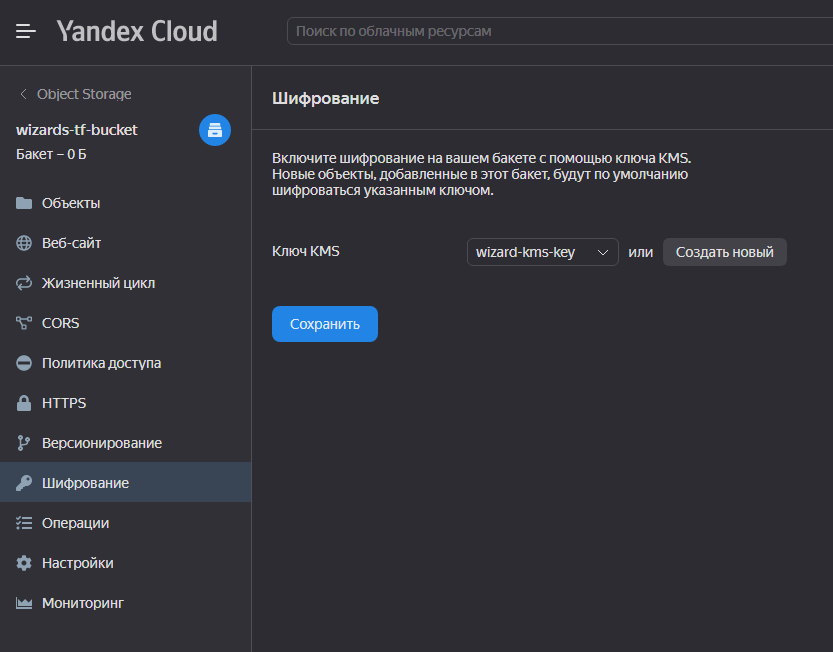
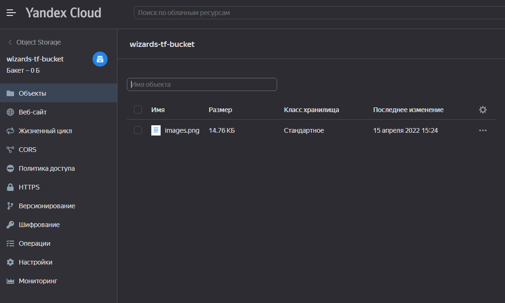
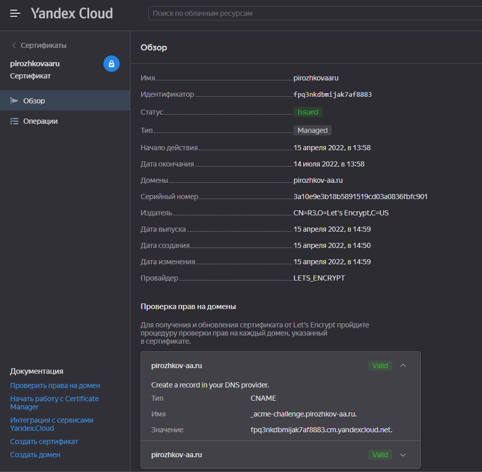
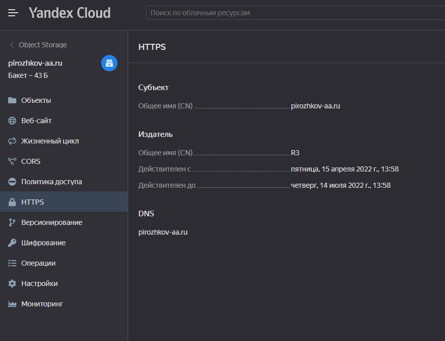
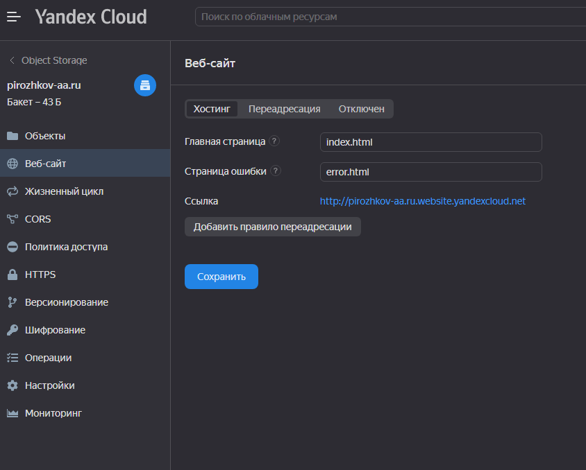
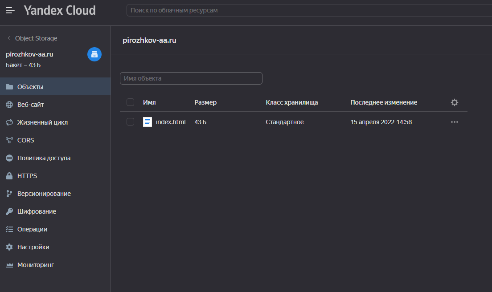
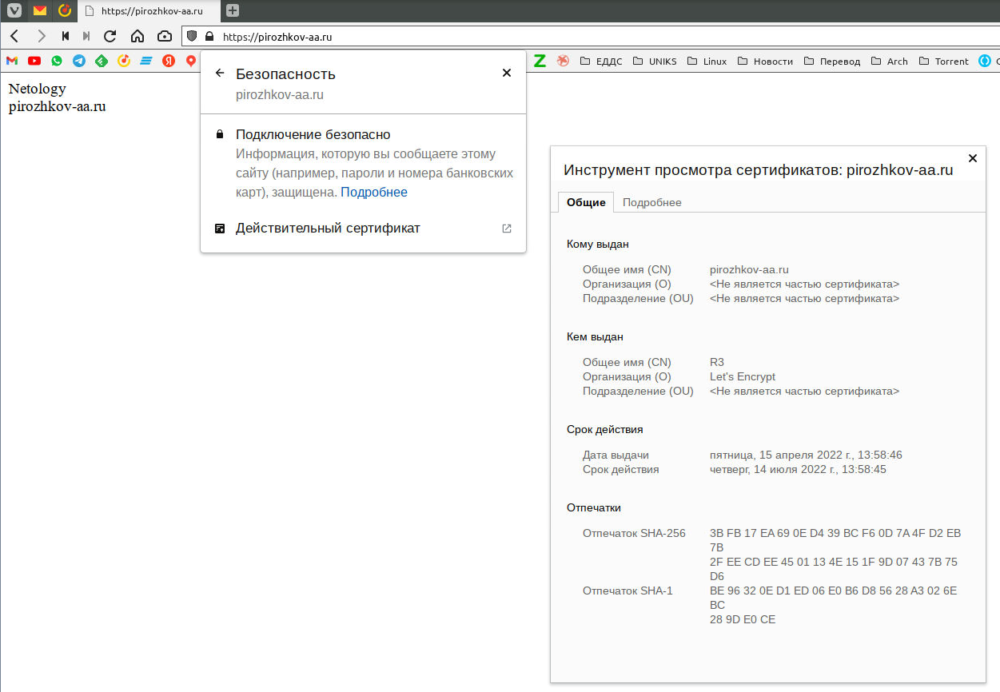

# Домашняя работа к занятию 15.3 "Безопасность в облачных провайдерах"

Используя конфигурации, выполненные в рамках предыдущих домашних заданиях, нужно добавить возможность шифрования бакета.

---

## Задание 1. Яндекс.Облако (обязательное к выполнению)

1. С помощью ключа в KMS необходимо зашифровать содержимое бакета:

- Создать ключ в KMS,
- С помощью ключа зашифровать содержимое бакета, созданного ранее.

2. (Выполняется НЕ в terraform) \*Создать статический сайт в Object Storage c собственным публичным адресом и сделать доступным по HTTPS

- Создать сертификат,
- Создать статическую страницу в Object Storage и применить сертификат HTTPS,
- В качестве результата предоставить скриншот на страницу с сертификатом в заголовке ("замочек").

Документация

- [Настройка HTTPS статичного сайта](https://cloud.yandex.ru/docs/storage/operations/hosting/certificate)
- [Object storage bucket](https://registry.terraform.io/providers/yandex-cloud/yandex/latest/docs/resources/storage_bucket)
- [KMS key](https://registry.terraform.io/providers/yandex-cloud/yandex/latest/docs/resources/kms_symmetric_key)

**ОТВЕТ:**

1. Создадим манифесты terraform (**[main.tf](./main.tf)**, **[versions.tf](./versions.tf)**, **[variables.tf](./variables.tf)**, **[s3.tf](./s3.tf)**) и запустим:

```bash
wizard:15-cloud-service-providers-03-security/ (main✗) $ terraform apply                                                                              [15:24:20]

Terraform used the selected providers to generate the following execution plan. Resource actions are indicated with the following symbols:
  + create

Terraform will perform the following actions:

  # yandex_iam_service_account.sa-tf-wizard will be created
  + resource "yandex_iam_service_account" "sa-tf-wizard" {
      + created_at = (known after apply)
      + folder_id  = "b1gtnhq0jsadaquuvpi6"
      + id         = (known after apply)
      + name       = "sa-tf-wizard"
    }

  # yandex_iam_service_account_static_access_key.sa-tf-wizard-key will be created
  + resource "yandex_iam_service_account_static_access_key" "sa-tf-wizard-key" {
      + access_key           = (known after apply)
      + created_at           = (known after apply)
      + encrypted_secret_key = (known after apply)
      + id                   = (known after apply)
      + key_fingerprint      = (known after apply)
      + secret_key           = (sensitive value)
      + service_account_id   = (known after apply)
    }

  # yandex_kms_symmetric_key.wizard-kms-key will be created
  + resource "yandex_kms_symmetric_key" "wizard-kms-key" {
      + created_at        = (known after apply)
      + default_algorithm = "AES_128"
      + folder_id         = (known after apply)
      + id                = (known after apply)
      + name              = "wizard-kms-key"
      + rotated_at        = (known after apply)
      + rotation_period   = "8760h"
      + status            = (known after apply)
    }

  # yandex_resourcemanager_folder_iam_member.sa-tf-editor will be created
  + resource "yandex_resourcemanager_folder_iam_member" "sa-tf-editor" {
      + folder_id = "b1gtnhq0jsadaquuvpi6"
      + id        = (known after apply)
      + member    = (known after apply)
      + role      = "editor"
    }

  # yandex_storage_bucket.wizards-tf-bucket will be created
  + resource "yandex_storage_bucket" "wizards-tf-bucket" {
      + access_key         = (known after apply)
      + acl                = "private"
      + bucket             = "wizards-tf-bucket"
      + bucket_domain_name = (known after apply)
      + force_destroy      = false
      + id                 = (known after apply)
      + secret_key         = (sensitive value)
      + website_domain     = (known after apply)
      + website_endpoint   = (known after apply)

      + server_side_encryption_configuration {
          + rule {
              + apply_server_side_encryption_by_default {
                  + kms_master_key_id = (known after apply)
                  + sse_algorithm     = "aws:kms"
                }
            }
        }

      + versioning {
          + enabled = (known after apply)
        }
    }

  # yandex_storage_object.netology-picture will be created
  + resource "yandex_storage_object" "netology-picture" {
      + access_key   = (known after apply)
      + acl          = "public-read"
      + bucket       = (known after apply)
      + content_type = (known after apply)
      + id           = (known after apply)
      + key          = "images.png"
      + secret_key   = (sensitive value)
      + source       = "~/Netology/images.png"
    }

Plan: 6 to add, 0 to change, 0 to destroy.

Do you want to perform these actions?
  Terraform will perform the actions described above.
  Only 'yes' will be accepted to approve.

  Enter a value: yes

yandex_iam_service_account.sa-tf-wizard: Creating...
yandex_kms_symmetric_key.wizard-kms-key: Creating...
yandex_iam_service_account.sa-tf-wizard: Creation complete after 2s [id=aje0em6e3e24mei5t3f9]
yandex_resourcemanager_folder_iam_member.sa-tf-editor: Creating...
yandex_iam_service_account_static_access_key.sa-tf-wizard-key: Creating...
yandex_iam_service_account_static_access_key.sa-tf-wizard-key: Creation complete after 1s [id=ajejm9v5rthjdhnec8md]
yandex_resourcemanager_folder_iam_member.sa-tf-editor: Creation complete after 2s [id=b1gtnhq0jsadaquuvpi6/editor/serviceAccount:aje0em6e3e24mei5t3f9]
yandex_kms_symmetric_key.wizard-kms-key: Creation complete after 6s [id=abj6tkkbbkhqfj67a3mc]
yandex_storage_bucket.wizards-tf-bucket: Creating...
yandex_storage_bucket.wizards-tf-bucket: Creation complete after 2s [id=wizards-tf-bucket]
yandex_storage_object.netology-picture: Creating...
yandex_storage_object.netology-picture: Creation complete after 0s [id=images.png]

Apply complete! Resources: 6 added, 0 changed, 0 destroyed.
```

  


2. Выполним задания руками в Yandex Cloud:

  
  
  


Откроем наш сайт **[https://pirozhkov-aa.ru](https://pirozhkov-aa.ru)**, и убедимся, что сертификат рабочий:



---

## Задание 2\*. AWS (необязательное к выполнению)

1. С помощью роли IAM записать файлы ЕС2 в S3-бакет:

- Создать роль в IAM для возможности записи в S3 бакет;
- Применить роль к ЕС2-инстансу;
- С помощью бутстрап скрипта записать в бакет файл web-страницы.

2. Организация шифрования содержимого S3-бакета:

- Используя конфигурации, выполненные в рамках ДЗ на предыдущем занятии, добавить к созданному ранее bucket S3 возможность шифрования Server-Side, используя общий ключ;
- Включить шифрование SSE-S3 bucket S3 для шифрования всех вновь добавляемых объектов в данный bucket.

3. \*Создание сертификата SSL и применение его к ALB:

- Создать сертификат с подтверждением по email;
- Сделать запись в Route53 на собственный поддомен, указав адрес LB;
- Применить к HTTPS запросам на LB созданный ранее сертификат.

Resource terraform

- [IAM Role](https://registry.terraform.io/providers/hashicorp/aws/latest/docs/resources/iam_role)
- [AWS KMS](https://registry.terraform.io/providers/hashicorp/aws/latest/docs/resources/kms_key)
- [S3 encrypt with KMS key](https://registry.terraform.io/providers/hashicorp/aws/latest/docs/resources/s3_bucket_object#encrypting-with-kms-key)

Пример bootstrap-скрипта:

```bash
#!/bin/bash
yum install httpd -y
service httpd start
chkconfig httpd on
cd /var/www/html
echo "<html><h1>My cool web-server</h1></html>" > index.html
aws s3 mb s3://mysuperbacketname2021
aws s3 cp index.html s3://mysuperbacketname2021
```
